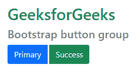
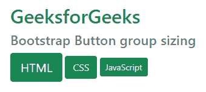
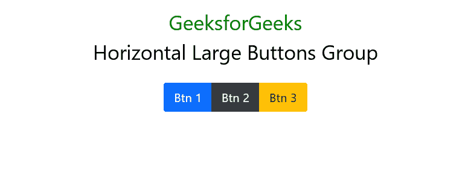
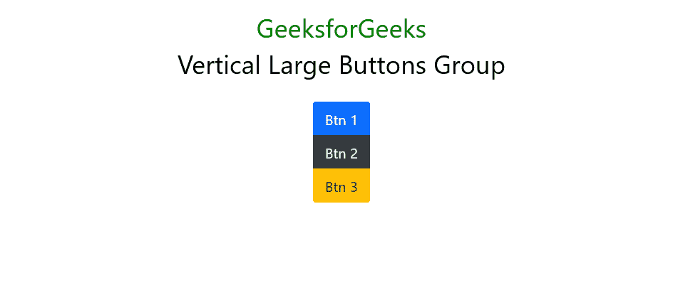

# 如何在 Bootstrap 中创建大按钮组？

> 原文:[https://www . geeksforgeeks . org/we-how-do-create-large-button-group-in-bootstrap/](https://www.geeksforgeeks.org/how-do-we-create-large-button-groups-in-bootstrap/)

**Bootstrap** 是一个免费开源的 CSS 和 JavaScript/jQuery 代码集合，用于创建动态网站布局和 web 应用程序。它是最流行的前端框架之一，有一组非常好的预定义 CSS 代码。它使用不同类型的类来创建响应性网站。 [Bootstrap 5](https://www.geeksforgeeks.org/bootstrap-5-introduction/) 是 Bootstrap 的主要版本，更新了 UI 设计，做了几处改动。[按钮](https://www.geeksforgeeks.org/bootstrap-5-buttons/)是 Bootstrap 5 提供的非常关键的组件类。通过使用各种按钮类，现在我们可以设计一个非常有响应性和吸引力的按钮组件。我们可以使用预定义的类在网页上添加按钮。Bootstrap 提供多种类型的按钮&还支持多种自定义按钮。在本文中，我们将了解如何使用 Bootstrap Buttons 类创建带有标签的大按钮组。

**语法:**

```html
<button class="btn btn-className">Submit</button>
```

**按钮组:**按钮组是 Bootstrap 5 提供的一个组件，基本上可以让你制作一组串联的按钮。按钮组也支持所有类型的按钮类。

**类型:**以下是 Bootstrap 5 中提供的 9 种按钮类型:

*   BTN-初级
*   BTN-二级
*   BTN-成功
*   BTN-危险
*   BTN-警告
*   btn 信息
*   BTN-光
*   BTN-暗
*   btn-link

关于引导按钮和其他按钮组件的详细用法，请参考[引导 5 按钮](https://www.geeksforgeeks.org/bootstrap-5-buttons/) & [引导按钮示例](https://www.geeksforgeeks.org/bootstrap-buttons-with-examples/)文章。

现在让我们通过例子来了解如何使用 *btn-group* 类将一系列按钮组合在一行上。

**方法 1:**

*   在 div 类中使用类 ***btn-group*** 和 ***btn-group-lg*** 。
*   在每个 div 类中，添加一个 HTML **<按钮>** 元素，这些元素想要用预定义的引导按钮类名显示在屏幕上。

**示例 1:** 为了创建按钮组，需要在容器标签中定义一个 ***btn-group*** 类，如< div >。

## 超文本标记语言

```html
<!DOCTYPE html>
<html lang="en">

<head>

    <!-- Required meta tags -->
    <meta charset="utf-8" />
    <meta name="viewport" content="width=device-width,
        initial-scale=1, shrink-to-fit=no" />

    <!-- Bootstrap CSS -->
    <link href=
"https://cdn.jsdelivr.net/npm/bootstrap@5.0.2/dist/css/bootstrap.min.css"
        rel="stylesheet" integrity=
"sha384-EVSTQN3/azprG1Anm3QDgpJLIm9Nao0Yz1ztcQTwFspd3yD65VohhpuuCOmLASjC"
        crossorigin="anonymous" />

    <title>GeeksforGeeks Bootstrap Button</title>
</head>

<body>
    <h1 class="text-success">
        GeeksforGeeks
    </h1>

    <h4 class="text-secondary">
        Bootstrap button group
    </h4>

    <div class="btn-group">
        <button type="button" class="btn btn-primary">
            Primary
        </button>

        <button type="button" class="btn btn-success">
            Success
        </button>
    </div>
</body>

</html>
```

**输出:**



我们还通过将类 ***btn-group-**** 与*包括在内来创建相同大小的按钮组。btn-group* 父类，而不是在每个按钮中包含大小调整类。

*btn-group* 类有多种大小。这些措施如下:

*   **btn-group-sm:** 用于小纽扣组。
*   **btn-group-md:** 用于中按钮组。
*   **btn-group-lg:** 用于大按钮组。

**示例 2:** 此示例演示了在 Bootstrap 中使用不同的按钮组大小调整组。

## 超文本标记语言

```html
<!DOCTYPE html>
<html lang="en">

<head>

    <!-- Required meta tags -->
    <meta charset="utf-8" />
    <meta name="viewport" content="width=device-width, 
        initial-scale=1, shrink-to-fit=no" />

    <!-- Bootstrap CSS -->
    <link href=
"https://cdn.jsdelivr.net/npm/bootstrap@5.0.2/dist/css/bootstrap.min.css"
        rel="stylesheet" integrity=
"sha384-EVSTQN3/azprG1Anm3QDgpJLIm9Nao0Yz1ztcQTwFspd3yD65VohhpuuCOmLASjC"
        crossorigin="anonymous" />

    <title>GeeksforGeeks Bootstrap Button</title>
</head>

<body>
    <h1 class="text-success">
        GeeksforGeeks
    </h1>

    <h4 class="text-secondary">
        Bootstrap Button group sizing
    </h4>

    <div class="container">
        <div class="btn-group btn-group-lg">
            <button type="button" 
                class="btn btn-success">
                HTML
            </button>
        </div>

        <div class="btn-group btn-group-md">
            <button type="button" 
                class="btn btn-success">
                CSS
            </button>
        </div>

        <div class="btn-group btn-group-sm">
            <button type="button" 
                class="btn btn-success">
                JavaScript
            </button>
        </div>
    </div>
</body>

</html>
```

**输出:**



我们将按照以下步骤构建引导大按钮组。

**方法 2:**

**第一步:**要使用 bootstrap 组件类，我们需要下载 Bootstrap 包或者我们可以直接使用 Bootstrap CDN 链接，从[主页面](https://getbootstrap.com/docs/5.0/getting-started/download/) l，在<头里面>标签，如下所示。

> <link href="”https://cdn.jsdelivr.net/npm/bootstrap@5.0.2/dist/css/bootstrap.min.css”" rel="”stylesheet”" integrity="”sha384-EVSTQN3/azprG1Anm3QDgpJLIm9Nao0Yz1ztcQTwFspd3yD65VohhpuuCOmLASjC”" crossorigin="”anonymous”">

**步骤 2:** 将类声明为容器，值为*。btn-group-lg* 在外<区>。

```html
<div class="btn-group-lg">
    <button></button>
    <button></button>
</div>
```

**第三步:**现在，给内部 HTML **<按钮>** 标签添加不同的预定义按钮类。比如 ***。btn btn-success*** 会将按钮的样式设置为 bootstrap success 类，也就是绿色按钮，像这样，你也可以使用不同的类。

```html
<div class="btn-group btn-group-lg">
    <!-- Here basic Bootstrap Button Declared -->
    <button type="button" class="btn btn-success">
        Success
    </button>
</div>
```

我们将利用上述两种方法在 Bootstrap 中创建大按钮组。

**自举中水平排列的大按钮组:***。btn-group-lg* 班连同家长*。btn-group* 类用于创建水平排列的大按钮组。

**示例 3:** 在本例中，我们在 Bootstrap 中创建了大按钮组的水平系列。

## 超文本标记语言

```html
<!DOCTYPE html>
<html>

<head>
    <title>
        Bootstrap 5 Horizontal Large Buttons group
    </title>

    <!-- Load Bootstrap -->
    <link rel="stylesheet" href=
"https://stackpath.bootstrapcdn.com/bootstrap/5.0.0-alpha1/css/bootstrap.min.css"
        integrity=
"sha384-r4NyP46KrjDleawBgD5tp8Y7UzmLA05oM1iAEQ17CSuDqnUK2+k9luXQOfXJCJ4I"
        crossorigin="anonymous" />
</head>

<body class="text-center">
    <div class="container mt-3">
        <h1 class="text-success">
            GeeksforGeeks
        </h1>

        <h1 class="text-dark">
            Horizontal Large Buttons Group
        </h1>

        <div class="btn-group btn-group-lg">
            <button type="button" 
                class="btn btn-primary">
                Btn 1
            </button>

            <button type="button" 
                class="btn btn-dark">
                Btn 2
            </button>

            <button type="button" 
                class="btn btn-warning">
                Btn 3
            </button>
        </div>
    </div>
</body>

</html>
```

**输出:**



**自举中垂直排列的大按钮组:***。btn-group-lg* 班连同家长*。btn-group-vertical* 类用于创建水平排列的大按钮组。

**示例 4:** 在本例中，我们在 Bootstrap 中创建了一个垂直系列的大按钮组。

## 超文本标记语言

```html
<!DOCTYPE html>
<html>

<head>
    <title>
        Bootstrap 5 Vertical Large Buttons group
    </title>

    <!-- Load Bootstrap -->
    <link rel="stylesheet" href=
"https://stackpath.bootstrapcdn.com/bootstrap/5.0.0-alpha1/css/bootstrap.min.css"
        integrity=
"sha384-r4NyP46KrjDleawBgD5tp8Y7UzmLA05oM1iAEQ17CSuDqnUK2+k9luXQOfXJCJ4I" 
        crossorigin="anonymous" />
</head>

<body class="text-center">
    <div class="container mt-3">
        <h1 class="text-success">
            GeeksforGeeks
        </h1>

        <h1 class="text-dark">
            Vertical Large Buttons Group
        </h1>

        <div class="btn-group-vertical btn-group-lg">
            <button type="button" 
                class="btn btn-primary">
                Btn 1
            </button>

            <button type="button" 
                class="btn btn-dark">
                Btn 2
            </button>

            <button type="button" 
                class="btn btn-warning">
                Btn 3
            </button>
        </div>
    </div>
</body>

</html>
```

**输出:**

