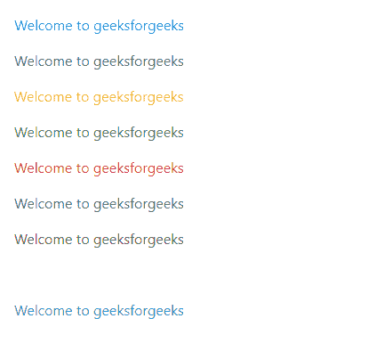
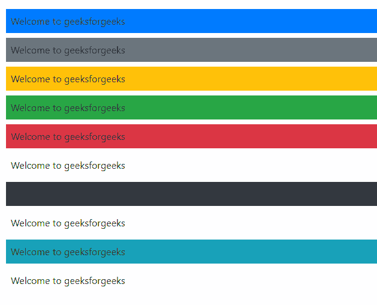

# Bootstrap 4 中有多少种颜色可用？

> 原文:[https://www . geesforgeks . org/bootstrap-4 中有多少种颜色可用/](https://www.geeksforgeeks.org/how-many-colors-available-in-bootstrap-4/)

Bootstrap 4 [](https://www.geeksforgeeks.org/bootstrap-tutorials/)支持 10 种不同的颜色实用程序类，可用于文本和背景颜色。每种颜色都有一个名称，可以用来描述页面上颜色的使用。

**颜色实用程序文本类:**这些类用于更改文本的颜色。

*   **文字-原色:**它赋予文字天蓝色。
*   **文本-次要:**它赋予文本灰色。
*   **文本警告:**它给文本一个黄色的阴影。
*   **文本-成功:**它给文本一种绿色。
*   **文本-危险:**它给文本一种红色。
*   **文本静音:**为文本赋予灰色。
*   **文字-深色:**给文字一种深黑色。
*   **文字-浅:**给文字一个非常浅的灰白色。
*   **文本信息:**它给文本一种蓝色的阴影。
*   **文本-白色:**它赋予文本白色。

**示例:**该示例显示了使用所有颜色实用程序类为页面上的文本着色。

## 超文本标记语言

```
<html>
<head>
    <link rel="stylesheet"
          href=
"https://maxcdn.bootstrapcdn.com/bootstrap/4.0.0/css/bootstrap.min.css">
</head>
<body>
  <div class="p-3">
    <p class="text-primary">
      Welcome to geeksforgeeks
    </p>

    <p class="text-secondary">
      Welcome to geeksforgeeks
    </p>

    <p class="text-warning">
      Welcome to geeksforgeeks
    </p>

    <p class="text-success">
      Welcome to geeksforgeeks
    </p>

    <p class="text-danger">
      Welcome to geeksforgeeks
    </p>

    <p class="text-muted">
      Welcome to geeksforgeeks
    </p>

    <p class="text-dark">
      Welcome to geeksforgeeks
    </p>

    <p class="text-light">
      Welcome to geeksforgeeks
    </p>

    <p class="text-info">
      Welcome to geeksforgeeks
    </p>

    <p class="text-white">
      Welcome to geeksforgeeks
    </p>

  </div>
   <script src=
"https://code.jquery.com/jquery-3.2.1.slim.min.js">
   </script>
  <script src=
"https://cdnjs.cloudflare.com/ajax/libs/popper.js/1.12.9/umd/popper.min.js">
  </script>
  <script src=
"https://maxcdn.bootstrapcdn.com/bootstrap/4.0.0/js/bootstrap.min.js">
  </script>
</body>
</html>
```

**输出:**



**颜色实用程序背景类:**这些类用于更改背景的颜色。当试图使用颜色实用程序类作为背景时，“文本”被替换为“背景”的“bg”。

背景颜色的颜色实用程序类有:

*   **bg-primary:** 给元素的背景赋予天蓝色。
*   **bg-secondary** :给元素的背景一个灰白色。
*   **bg-warning:** 它给元素的背景以黄色的阴影。
*   **bg-success:** 它给元素的背景赋予了绿色。
*   **BG-危险:**它给元素的背景赋予了红色。
*   **BG-静音:**给元素的背景赋予灰色。
*   **bg-dark:** 它给元素的背景赋予了一种深黑色。
*   **bg-light:** 它给元素的背景赋予了非常浅的灰白色。
*   **bg-info:** 它给元素的背景赋予了一种蓝色的色调。
*   **bg-white:** 给元素的背景赋予白色的颜色。

**示例:**该示例显示了使用所有颜色实用程序类为页面背景着色。

## 超文本标记语言

```
<html>
<head>
    <link rel="stylesheet"
          href=
"https://maxcdn.bootstrapcdn.com/bootstrap/4.0.0/css/bootstrap.min.css">
</head>
<body>
  <div class="p-3">
    <div class="bg-primary m-2 p-2">
        Welcome to geeksforgeeks
    </div>
    <div class="bg-secondary m-2 p-2">
        Welcome to geeksforgeeks
    </div>
    <div class="bg-warning m-2 p-2">
        Welcome to geeksforgeeks
    </div>
    <div class="bg-success m-2 p-2">
        Welcome to geeksforgeeks
    </div>
    <div class="bg-danger m-2 p-2">
        Welcome to geeksforgeeks
    </div>
    <div class="bg-muted m-2 p-2">
        Welcome to geeksforgeeks
    </div>
    <div class="bg-dark m-2 p-2">
        Welcome to geeksforgeeks
    </div>
    <div class="bg-light m-2 p-2">
        Welcome to geeksforgeeks
    </div>
    <div class="bg-info m-2 p-2">
        Welcome to geeksforgeeks
    </div>
    <div class="bg-white m-2 p-2">
        Welcome to geeksforgeeks
    </div>
  </div>
   <script src=
"https://code.jquery.com/jquery-3.2.1.slim.min.js">
   </script>
  <script src=
"https://cdnjs.cloudflare.com/ajax/libs/popper.js/1.12.9/umd/popper.min.js">
  </script>
  <script src=
"https://maxcdn.bootstrapcdn.com/bootstrap/4.0.0/js/bootstrap.min.js">
  </script>
</body>
</html>
```

**输出:**

