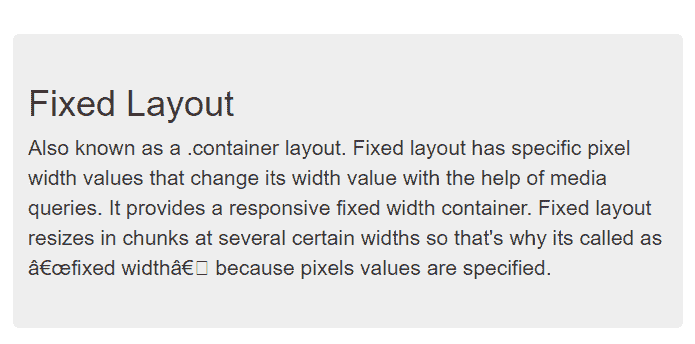
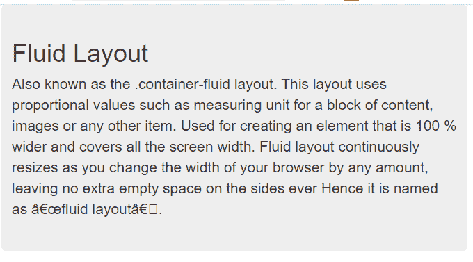
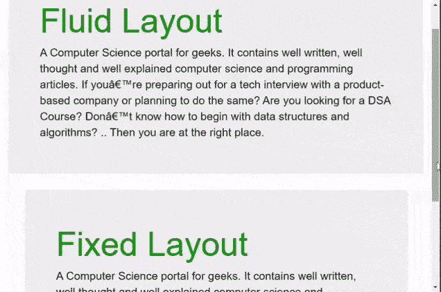

# Bootstrap 中有多少种布局类型？

> 原文:[https://www . geeksforgeeks . org/bootstrap 中有多少种类型的布局/](https://www.geeksforgeeks.org/how-many-types-of-layouts-are-there-in-bootstrap/)

容器是 [Bootstrap](https://www.geeksforgeeks.org/bootstrap-tutorials/) 中最基本的布局元素，在使用默认网格系统时需要用到。Bootstrap 有两种主要布局，即流动布局和固定布局。

*   **流体布局**:这使用了自举*。容器-流体*类为布局。此布局使用比例值，例如内容块、图像或任何其他项目的测量单位。用于创建 100 %宽并覆盖所有屏幕宽度的元素。流体布局会随着浏览器宽度的变化而不断调整大小，不会在两侧留下额外的空白空间，因此它被称为“流体布局”。
*   **固定布局**:这使用了自举*。容器*类为布局。固定布局具有特定的像素宽度值，这些值在媒体查询的帮助下改变其宽度值。它提供了一个响应性的固定宽度容器。固定布局会在指定像素值时，以一定的宽度分块调整大小。

**分步实施指南:**

**步骤 1:** 将 Bootstrap 和 jQuery CDN 包含到 [<u><头></u>](https://www.geeksforgeeks.org/html-head-tag/) 标签之前的所有其他样式表中来加载我们的 CSS。

> <src = " https://Ajax . Google APIs . com/Ajax/libs/jquery/1 . 12 . 4/jquery . min . js "></script><src = " https://maxcdn . bootstracdn . com/bootstrap/3 . 3 . 7/脚本

**第二步:**添加 [<u><样式></u>](https://www.geeksforgeeks.org/html-style-tag/#:~:text=The%20tag%20in%20HTML,ar%20part%20of%20a%20page.&text=The%20property%20is%20borrowed%20from,size%2C%20font%2Dfamily%20etc.) 标签，并为其添加需要的 [<u>CSS</u>](https://www.geeksforgeeks.org/css-tutorials/) 属性。

**第三步**:新建 [<u>< div ></u>](https://www.geeksforgeeks.org/div-tag-html/) 增加不同的布局类。

**第 4 步:**信息必须放在. container(固定布局)或中。容器-流体(流体布局)等级，用于正确对齐和填充。

**示例 1:** 此示例显示了固定布局。

## 超文本标记语言

```html
<!DOCTYPE html>
<html>

<head>
    <title>Fixed Layout</title>
    <link rel="stylesheet" href=
"https://maxcdn.bootstrapcdn.com/bootstrap/3.3.7/css/bootstrap.min.css" />
    <script src=
"https://ajax.googleapis.com/ajax/libs/jquery/1.12.4/jquery.min.js">
    </script>
    <script src=
"https://maxcdn.bootstrapcdn.com/bootstrap/3.3.7/js/bootstrap.min.js">
    </script>

    <style type="text/css">
        body {
            padding-top: 50px;
        }
    </style>
</head>

<body>
    <div class="container">
        <!-- for page header -->
        <div class="jumbotron">
            <h1>Fixed Layout</h1>
            <p>
                Also known as a .container layout. Fixed 
                layout has specific pixel width values 
                that change its width value with the help 
                of media queries. It provides a responsive 
                fixed width container. Fixed layout resizes
                in chunks at several certain widths so 
                that's why its called as “fixed width” 
                because pixels values are specified.
            </p>
        </div>
    </div>
</body>

</html>
```

**输出:**



固定布局

**例 2:** 本例展示了流体布局的工作情况。

## 超文本标记语言

```html
<!DOCTYPE html>
<html>

<head>
    <title>Bootstrap Fluid Layout</title>
    <link rel="stylesheet" href=
"https://maxcdn.bootstrapcdn.com/bootstrap/3.3.7/css/bootstrap.min.css" />
    <script src=
"https://ajax.googleapis.com/ajax/libs/jquery/1.12.4/jquery.min.js">
    </script>
    <script src=
"https://maxcdn.bootstrapcdn.com/bootstrap/3.3.7/js/bootstrap.min.js">
    </script>
</head>

<body>
    <div class="container-fluid">
        <div class="jumbotron">
            <h1>Fluid Layout</h1>
            <p>
                Also known as the .container-fluid 
                layout. This layout uses proportional 
                values such as measuring unit for a 
                block of content, images or any other 
                item. Used for creating an element that 
                is 100 % wider and covers all the screen 
                width. Fluid layout continuously resizes
                as you change the width of your browser 
                by any amount, leaving no extra empty 
                space on the sides ever Hence it is named 
                as “fluid layout”.
            </p>
        </div>
    </div>
</body>

</html>
```

**输出:**



**示例 3:** 这个示例向我们展示了固定布局和流体布局的区别。固定和流动布局的不同屏幕尺寸可实现不同的输出。

## 超文本标记语言

```html
<!DOCTYPE html>
<html>

<head>
    <title>Bootstrap Layouts</title>
    <link rel="stylesheet" href=
"https://maxcdn.bootstrapcdn.com/bootstrap/3.3.7/css/bootstrap.min.css" />
    <script src=
"https://ajax.googleapis.com/ajax/libs/jquery/1.12.4/jquery.min.js">
    </script>
    <script src=
"https://maxcdn.bootstrapcdn.com/bootstrap/3.3.7/js/bootstrap.min.js">
    </script>
</head>

<body>
    <div class="container-fluid">
        <div class="jumbotron">
            <h1 style="color: green">Fluid Layout</h1>
            <p style="color: #000">
                A Computer Science portal for geeks. It 
                contains well written, well thought and 
                well explained computer science and 
                programming articles. If you’re preparing 
                out for a tech interview with a product-
                based company or planning to do the same? 
                Are you looking for a DSA Course? Don’t 
                know how to begin with data structures and 
                algorithms? .. Then you are at the right 
                place.
            </p>
        </div>
    </div>

    <div class="container">
        <div class="jumbotron">
            <!-- for page header -->
            <h1 style="color: green">Fixed Layout</h1>
            <p style="color: #000">
                A Computer Science portal for geeks. It 
                contains well written, well thought and 
                well explained computer science and 
                programming articles. If you’re preparing 
                out for a tech interview with a product-
                based company or planning to do the same? 
                Are you looking for a DSA Course? Don’t 
                know how to begin with data structures and 
                algorithms? .. Then you are at the right 
                place.
            </p>
        </div>
    </div>
</body>

</html>
```

**输出:**



**注意:**固定布局以几个特定的宽度分块调整大小，而流体布局会随着浏览器宽度的任意变化而不断调整大小。