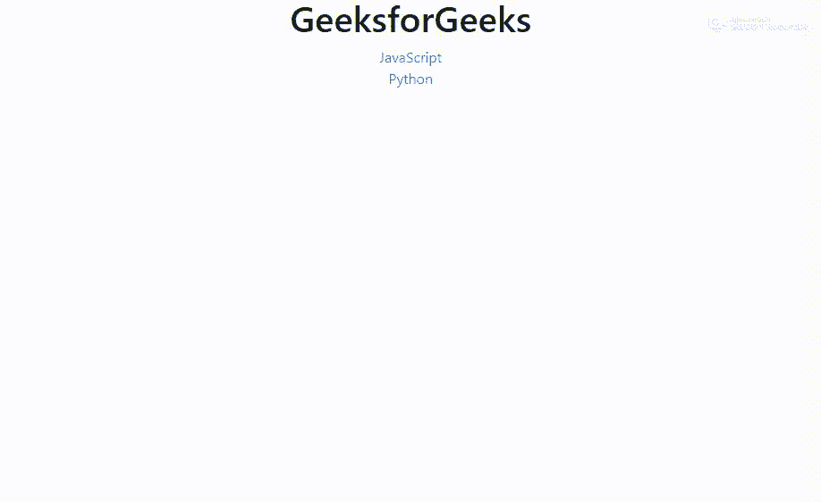

# 如何在 Bootstrap 中手风琴式滚动到顶部打开内容？

> 原文:[https://www . geeksforgeeks . org/how-follow-follow-to-top-to-open-content-in-bootstrap/](https://www.geeksforgeeks.org/how-to-accordion-scroll-to-top-to-open-content-in-bootstrap/)

Bootstrap 手风琴在实际操作中非常吸引人，但是当手风琴上下文元素非常大时，就很难获得活动的手风琴顶部。但是在这里，您将学习如何在几行 JavaScript 代码的帮助下实现这一功能。在这里，我们将使用 [scrolltop](https://www.geeksforgeeks.org/html-dom-scrolltop-property/) 属性来实现手风琴中的功能。

**语法:**

*   它返回 scrollTop 属性。

    ```html
    element.scrollTop
    ```

*   用于设置滚动顶部属性

    ```html
    element.scrollTop = value
    ```

**示例:**

*   **JavaScript 代码:**你所要做的就是创建一个普通的 Bootstrap Accordion 并粘贴下面的 JavaScript 代码 int script 标签，然后动作就开始了。

    ```html
    <script>
    $('#accordion').on('shown.bs.collapse', function () {

        var panel = $(this).find('.in');

        $('html, body').animate({
            scrollTop: panel.offset().top
        }, 500);

    });
    </script>
    ```

*   **程序:**

    ```html
    <!DOCTYPE html>
    <html>

    <head>
        <title>Accordion scroll to open content</title>
        <link rel="stylesheet" href=
    "https://stackpath.bootstrapcdn.com/bootstrap/4.3.1/css/bootstrap.min.css"
    integrity="sha384-ggOyR0iXCbMQv3Xipma34MD+dH/1fQ784/j6cY/iJTQUOhcWr7x9JvoRxT2MZw1T" 
    crossorigin="anonymous">
        <script src=
    "https://code.jquery.com/jquery-3.3.1.slim.min.js"
    integrity="sha384-q8i/X+965DzO0rT7abK41JStQIAqVgRVzpbzo5smXKp4YfRvH+8abtTE1Pi6jizo" 
    crossorigin="anonymous">
        </script>
        <script src=
    "https://cdnjs.cloudflare.com/ajax/libs/popper.js/1.14.7/umd/popper.min.js" 
    integrity="sha384-UO2eT0CpHqdSJQ6hJty5KVphtPhzWj9WO1clHTMGa3JDZwrnQq4sF86dIHNDz0W1" 
    crossorigin="anonymous">
        </script>
        <script src=
    "https://stackpath.bootstrapcdn.com/bootstrap/4.3.1/js/bootstrap.min.js" 
    integrity="sha384-JjSmVgyd0p3pXB1rRibZUAYoIIy6OrQ6VrjIEaFf/nJGzIxFDsf4x0xIM+B07jRM" 
    crossorigin="anonymous">
        </script>
        <script>
            $('#accordion').on('shown.bs.collapse', function() {

                var panel = $(this).find('.in');

                $('html, body').animate({
                    scrollTop: panel.offset().top
                }, 500);

            });
        </script>
    </head>

    <body>
        <center>
            <h1>GeeksforGeeks</h1>
            <div class="panel-group" id="accordion">
                <div class="panel panel-default">
                    <div class="panel-heading">
                        <span class="strong"> 
                          <a data-toggle="collapse" data-parent="#accordion"
                             href="#collapseOne"id="predict">
                             JavaScript 
                             <span class="caret"></span>
                          </a>
                        </span>
                    </div>
                    <div id="collapseOne" class="panel-collapse collapse">
                        <div class="panel-body">
                            <p>
                              Either you love it or hate it, but in the age of Microservice
                              and REST API, you can not ignore JavaScript. JavaScript was 
                              once upon a time used only in client side(browser), but node 
                              js (execution engine/run time/web server) have made possible 
                              to run javascript on server side. JavaScript is everywhere – 
                              on Desktop/Server/Mobile.You can create mobile web app with 
                              javascript and html5, which has lot of advantages like save 
                              licensing cost $99 yearly to pay Apple or making IOS apps 
                              and you don’t have to purchase MAC laptop to make your IOS 
                              app(Apple’s app can only be made in MAC). JavaScript has 
                              stormed the web technology and nowadays small software ventures
                              to fortune 500, all are using node js for web apps. Recently 
                              wordpress.com has rewritten its dashboard in javascript, paypal
                              also chose to rewrite some of its components in javascript. 
                              Be it google/twitter/facebook, javascript is important for everyone.
                              It is used in applications like single-page applications, 
                              Geolocation APIs, net advertisements, etc. However JavaScript is
                              quirky/dynamic/scripting/ functional oriented language, and it has
                              its own idiosyncrasies. It is not scalable, it is good for some 
                              3000 line of code but for a bigger app, it becomes difficult to
                              manage, read and debug. Also, not everyone is very much familiar to 
                              JavaScript. You might sometimes think that I do not know much of a
                              JavaScript then “How to be JavaScript Developer without much 
                              knowledge of JavaScript?” To ease down our work, some smart 
                              developers/companies have made compiler/transpiler which converts 
                              your other language code into javascript code. (Best of both worlds)
                              C++: If you know C++, then it is possible to get it converted into 
                              JavaScript. Cheerp is a free compiler for open-source commercial 
                              projects as well as for closed source non commercial projects.It 
                              is the C++ compiler for the web.You just write a web application 
                              or port your existing one, all in C++. Cheerp will generate its 
                              JavaScript code that can run on any browser. Java: Java is a darling 
                              of open source, backed by Oracle /IBM/Google/Red hat. A maximum number
                              of developers in the world are Java developers (around 10 million). 
                              Maximum number of projects in github and apache are based on Java.
                            </p>
                        </div>
                    </div>
                </div>
                <div class="panel panel-default">
                    <div class="panel-heading">
                        <span class="strong">
                            <a data-toggle="collapse" data-parent="#accordion"
                                               href="#collapseTwo" id="aries">
                               Python<span class="caret"></span>
                            </a>
                        </span>
                    </div>
                    <div id="collapseTwo" class="panel-collapse collapse">
                        <div class="panel-body">
                            <p>
                              Python is a widely used general-purpose, high level programming 
                              language. It was initially designed by Guido van Rossum in 1991 
                              and developed by Python Software Foundation. It was mainly developed
                              for emphasis on code readability, and its syntax allows programmers
                              to express concepts in fewer lines of code. Python is a programming
                              language that lets you work quickly and integrate systems more efficiently.
                              There are two major Python versions- Python 2 and Python 3\. Both are 
                              quite different. Beginning with Python programming: 1) Finding an 
                              Interpreter: Before we start Python programming, we need to have an 
                              interpreter to interpret and run our programs. There are certain online
                              interpreters like https:
                              //ide.geeksforgeeks.org/, http://ideone.com/ or http://codepad.org/ 
                              that can be used to start Python without installing an interpreter.
                              Windows:There are many interpreters available freely to run Python 
                              scripts like IDLE ( Integrated Development Environment) which is installed
                              when you install the python software from http: //python.org/ Linux:
                              For Linux, Python comes bundled with the linux.
                            </p>
                        </div>
                    </div>
                </div>
            </div>
        </center>
    </body>

    </html>
    ```

*   **输出:**
    