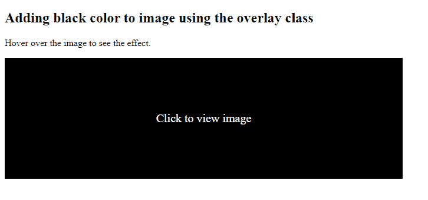

# 如何使用 bootstrap 为图像添加黑色悬停？

> 原文:[https://www . geeksforgeeks . org/如何使用引导程序将黑色悬停添加到图像/](https://www.geeksforgeeks.org/how-to-add-a-black-hover-to-an-image-using-bootstrap/)

Bootstrap 是一种流行的 CSS 框架，被前端开发人员广泛用于为 web 应用程序创建交互式 UI。Bootstrap 因其简单易用而被广泛使用。BootStrap 允许多个实用程序使图像具有交互性。其中一个工具可以在悬停时改变图像的颜色。悬停基本上是将光标移动到图像上。下面的代码片段演示了如何使用 bootstrap 向图像添加黑色悬停。

**第一种方法:**
在这种方法中，当鼠标悬停在图像上时，内容覆盖类指定图像所需的属性。内容覆盖类中的 background 属性指定用户悬停在图像上时图像的不透明度。content-details 类指定一组属性，当鼠标悬停在图像上时，这些属性用于显示在图像顶部的内容。
**例:**

```
<!DOCTYPE html>
<html>
    <head>
        <title></title>
        <!-- importing bootstrap cdn-->
        <link rel="stylesheet" 
              href=
"https://stackpath.bootstrapcdn.com/bootstrap/4.4.1/css/bootstrap.min.css" 
              integrity=
"sha384-Vkoo8x4CGsO3+Hhxv8T/Q5PaXtkKtu6ug5TOeNV6gBiFeWPGFN9MuhOf23Q9Ifjh" 
              crossorigin="anonymous" />
        <style>
            /*setting the properties for container 
          which contains the image */
            .container {
                margin-top: 100px;
            }
            /*setting the properties for title*/
            .title {
                color: #1a1a1a;
                text-align: center;
                margin-bottom: 10px;
            }

            /*setting the properties of 
          content within the image*/
            .content {
                position: relative;
                width: 90%;
                max-width: 400px;
                margin: auto;
                overflow: hidden;
            }

           /* rgb(0,0,0) indicates black and 
              the fourth parameter is the opacity */
            .content .content-overlay {

      /*setting 0.8 to 1 will turn the overlay opaque*/
                background: rgba(0, 0, 0, 0.8); 
                position: absolute;
                height: 99%;
                width: 100%;
                left: 0;
                top: 0;
                bottom: 0;
                right: 0;
                opacity: 0;

              /*transition time and effect*/
                -webkit-transition: all 0.4s ease-in-out 0s; 

              /*transition time and effect*/
                -moz-transition: all 0.4s ease-in-out 0s; 

              /*transition time and effect*/
                transition: all 0.4s ease-in-out 0s; 
            }

            /* setting hover properties */
            .content:hover .content-overlay {
                opacity: 1;
            }

            .content-image {
                width: 100%;
            }

            /*setting image properties*/
            img {
                box-shadow: 1px 1px 5px 1px rgba(0, 0, 0, 0.1);
                border-radius: 5px;
            }

            .content-details {
                position: absolute;
                text-align: center;
                padding-left: 1em;
                padding-right: 1em;
                width: 100%;
                top: 50%;
                left: 50%;
                opacity: 0;
                -webkit-transform: translate(-50%, -50%);
                -moz-transform: translate(-50%, -50%);
                transform: translate(-50%, -50%);

              /*transition time and effect*/
                -webkit-transition: all 0.3s ease-in-out 0s; 

              /*transition time and effect*/
                -moz-transition: all 0.3s ease-in-out 0s; 
              /*transition time and effect*/
                transition: all 0.3s ease-in-out 0s; 
            }

            .content:hover .content-details {
                top: 50%;
                left: 50%;
                opacity: 1;
            }

            .content-details h3 {
                color: #fff;
                font-weight: 500;
                letter-spacing: 0.15em;
                margin-bottom: 0.5em;
                text-transform: uppercase;
            }

            .content-details p {
                color: #fff;
                font-size: 0.8em;
            }
        </style>
    </head>
    <body>
        <div class="container">
            <div class="content">
                <div class="content-overlay"></div>
                
                <div class="content-details">
                    <h3 class="content-title">
                      Workstation</h3>
                    <p class="content-text">
                      Hover out to view image</p>
                </div>
            </div>
        </div>
    </body>
</html>
```

**输出:**


**替代方法:**
第二种方法也处理悬停效果，但这里悬停不透明度设置为 1，这意味着底层图像变得完全隐藏。覆盖类包含悬停时图像的一组规格。背景颜色设置为黑色。过渡时间和性质也定了。
**例:**

```

<!DOCTYPE html>
<html>
    <head>
        <!--helps in scaling the web page 
          according to the device screen size-->
        <meta name="viewport"
              content="width=device-width,
                       initial-scale=1" />
        <style>
            .container {
                position: relative;
                width: 50%;
            }

            /*image class sets the properties of the 
                image used*/
            .image {
                display: block;
                width: 100%;
                height: auto;
            }

            /*overlay class sets the properties 
                 of the overlay image*/
            .overlay {
                position: absolute;
                top: 0;
                bottom: 0;
                left: 0;
                right: 0;
                height: 100%;
                width: 100%;
                opacity: 0;
              /*the transition time between the 
              actual image to overlay*/
                transition: 0.3s ease; 
               /*ensures black hover on the image*/
                background-color: black;
            }

            /*hovering property is set*/
            .container:hover .overlay {
                opacity: 1;
            }

            /*properties for the text on the overlay image*/
            .text {
                color: white;
                font-size: 20px;
                position: absolute;
                top: 50%;
                left: 50%;
                -webkit-transform: translate(-50%, -50%);
                -ms-transform: translate(-50%, -50%);
                transform: translate(-50%, -50%);
                text-align: center;
            }
        </style>
    </head>
    <body>
        <h2>Adding black color to image 
          using the overlay class</h2>
        <p>Hover over the image to see the effect.</p>

        <div class="container">
            
            <div class="overlay">
                <div class="text">Click to view image</div>
            </div>
        </div>
    </body>
</html>
```

**输出:**


