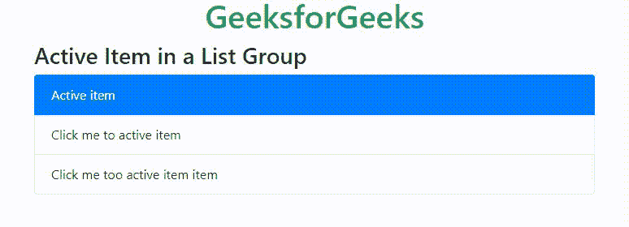

# 如何在 Bootstrap 4 的自定义列表组中添加点击事件的活动类？

> 原文:[https://www . geesforgeks . org/how-add-active-class-on-click-event-in-custom-list-group-in-bootstrap-4/](https://www.geeksforgeeks.org/how-to-add-active-class-on-click-event-in-custom-list-group-in-bootstrap-4/)

在 Bootstrap 4 中，Javascript 或 jQuery 事件用于在自定义列表组中的点击事件上添加活动类。

**语法:**

```
$(document).ready(function() {
    $('selector').click(function() {
        $('selector.active').removeClass("active");
        $(this).addClass("active");
    });
});

```

以下示例说明了如何使用 jQuery 以不同的方式在自定义列表组中添加单击事件的活动类。

**示例 1:** 下面的示例说明了如何使用 jQuery through for loop 在自定义列表组中的点击事件上添加活动类。

```
<!DOCTYPE html>
<html lang="en">
<head>
    <meta charset="utf-8">

    <meta name="viewport" content=
            "width=device-width, initial-scale=1">

    <link rel="stylesheet" href=
"https://maxcdn.bootstrapcdn.com/bootstrap/4.3.1/css/bootstrap.min.css">

    <script src="
https://ajax.googleapis.com/ajax/libs/jquery/3.4.1/jquery.min.js">
    </script>

    <script src="
https://cdnjs.cloudflare.com/ajax/libs/popper.js/1.14.7/umd/popper.min.js">
    </script>

    <script src="
https://maxcdn.bootstrapcdn.com/bootstrap/4.3.1/js/bootstrap.min.js">
    </script>
</head>

<body>
    <center>
        <div class="container">
            <h1 class="text-success">GeeksforGeeks</h1>
            <h3>Active Item in a List Group</h3>
        </div>
    </center>

    <div class="list-group">
        <a href="#!" class="list-group-item 
                            list-group-item-action 
                            flex-column 
                            align-items-start active">

            <div class="d-flex w-100 justify-content-between">
                <h5 class="mb-2 h5">DSA Courses Available soon</h5>
                <small>1 days ago</small>
            </div>

            <p class="mb-2">
                This course is will take you from basics
                to advance as well as it will certify you
                on the basis of your performance.
            </p>

            <small>Students, Working Professionals</small>
        </a>

        <a href="#!" class="list-group-item 
                            list-group-item-action 
                            flex-column 
                            align-items-start">

            <div class="d-flex w-100 justify-content-between">
                <h5 class="mb-2 h5">Placement 100</h5>
                <small>2 days ago</small>
            </div>

            <p class="mb-2">
                This course will guide you for placements
                with theory, lecture videos, weekly
                assessments, contests and doubt assistance.
            </p>

            <small>Pre-final, Final year students</small>
        </a>

        <a href="#!" class="list-group-item 
                            list-group-item-action 
                            flex-column align-items-start">

            <div class="d-flex w-100 justify-content-between">
                <h5 class="mb-2 h5">
                    Machine Learning Foundation With Python
                </h5>
                <small>4 days ago</small>
            </div>

            <p class="mb-2">
                Learn about the concepts of Machine Learning,
                effective machine learning techniques from
                basics with Python.
            </p>

            <small>
                Students, Working Professionals
                seeking a career in ML
            </small>
        </a>
    </div>

    <script>
        $(".list-group-item").click(function() {

            // Select all list items
            var listItems = $(".list-group-item");

            // Remove 'active' tag for all list items
            for (let i = 0; i < listItems.length; i++) {
                listItems[i].classList.remove("active");
            }

            // Add 'active' tag for currently selected item
            this.classList.add("active");
        });
    </script>
</body>

</html>
```

**输出:**


**示例 2:** 下面的示例说明了如何使用 jQuery 以及 jQuery 类属性操作的 addClass 和 removeClass 在自定义列表组中添加点击事件的活动类。

```
<!DOCTYPE html>
<html lang="en">

<head>
    <meta charset="utf-8">
    <meta name="viewport"
          content="width=device-width, initial-scale=1">
    <link rel="stylesheet"
href="https://maxcdn.bootstrapcdn.com/bootstrap/4.3.1/css/bootstrap.min.css">
    <script src="
https://ajax.googleapis.com/ajax/libs/jquery/3.4.1/jquery.min.js">
    </script>
    <script src="
https://cdnjs.cloudflare.com/ajax/libs/popper.js/1.14.7/umd/popper.min.js">
    </script>
    <script src="
https://maxcdn.bootstrapcdn.com/bootstrap/4.3.1/js/bootstrap.min.js">
    </script>
</head>

<body>

    <div class="container">
        <h1 class="text-success text-center">GeeksforGeeks</h1>
        <h3>Active Item in a List Group</h3>
        <ul class="list-group">
            <li class="list-group-item active">Active item</li>
            <li class="list-group-item">Click me to active item</li>
            <li class="list-group-item">Click me too active item item</li>
        </ul>
    </div>
    <script>
        $(document).ready(function() {
            $('li').click(function() {
                $('li.list-group-item.active').removeClass("active");
                $(this).addClass("active");
            });
        });
    </script>
</body>

</html>
```

**输出:**


jQuery 是一个开源的 JavaScript 库，它简化了 HTML/CSS 文档之间的交互，它以其“少写多做”的理念而闻名。
跟随本 [jQuery 教程](https://www.geeksforgeeks.org/jquery-tutorials/)和 [jQuery 示例](https://www.geeksforgeeks.org/jquery-examples/)可以从头开始学习 jQuery。