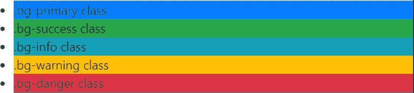
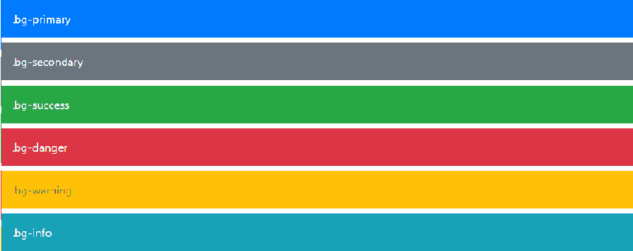

# 如何在 Bootstrap 中给 div 添加背景色？

> 原文:[https://www . geeksforgeeks . org/如何将背景色添加到引导中的 div/](https://www.geeksforgeeks.org/how-to-add-background-color-to-a-div-in-bootstrap/)

[Bootstrap](https://www.geeksforgeeks.org/bootstrap-4-introduction/) 提供了很多类来设置元素的背景颜色。我们可以轻松地将元素的背景设置为任何上下文类。锚点组件将在悬停时变暗，就像文本类一样。下面举例列出了几种背景颜色。

我们可以通过简单地添加类“bg-primary”、“bg-success”、“bg-danger”、“bg-info”等来为 div 添加背景色，如下例所示。

**分步实施指南:**

**第一步:**将 [Bootstrap](https://www.geeksforgeeks.org/bootstrap-4-introduction/) 和 [jQuery CDN](https://ajax.googleapis.com/ajax/libs/jquery/3.3.1/jquery.min.js) [](https://www.geeksforgeeks.org/how-to-add-jquery-code-to-html-file/)包含到<头>标签中，先于所有其他样式表加载我们的 CSS。

> <src 脚本= " https://Ajax . Google APIs . com/Ajax/libs/jquery/3 . 3 . 1/jquery . min . js "></script><src 脚本= " https://cdnjs . cloudflare . com/Ajax/libs/popper . js

**第二步:**用类*容器*在 HTML 体中添加 [< div >](https://www.geeksforgeeks.org/div-tag-html/) 标签。

**第三步:**加 [< li >](https://www.geeksforgeeks.org/html-li-tag/) [](https://www.geeksforgeeks.org/div-li-html/)标记为*。bg-primary，。bg-success* 等类中的 [<体>标记](https://www.geeksforgeeks.org/html-body-tag/)。

**示例 1:** 以下示例显示了不同的*背景色*类来设置内容的背景色。

## 超文本标记语言

```
<!DOCTYPE html>
<html lang="en">

<head>

    <meta charset="utf-8">   
    <meta name="viewport" content="width=device-width, initial-scale=1">

    <link rel="stylesheet" href=
"https://maxcdn.bootstrapcdn.com/bootstrap/4.3.1/css/bootstrap.min.css">     
    <script src=
"https://ajax.googleapis.com/ajax/libs/jquery/3.3.1/jquery.min.js">
    </script>     
    <script src=
"https://cdnjs.cloudflare.com/ajax/libs/popper.js/1.14.7/umd/popper.min.js">
    </script>     
    <script src=
"https://maxcdn.bootstrapcdn.com/bootstrap/4.3.1/js/bootstrap.min.js">
    </script>
</head>

<body>
    <div class="container">
        <ul>
            <li class="bg-primary">.bg-primary class</li>
            <li class="bg-success">.bg-success class</li>
            <li class="bg-info">.bg-info class</li>
            <li class="bg-warning">.bg-warning class</li>
            <li class="bg-danger">.bg-danger class</li>
        </ul>
    </div>
</body> 
</html>
```

**输出:**



不同背景颜色示例

**示例 2:** 下面的示例展示了如何给 HTML [*div 添加背景色和其他类。*](https://www.geeksforgeeks.org/div-tag-html/)

*   首先，在你的 HTML 代码中找到 *div* ，并在开始标签中添加一个预定义的类。
*   将引导预定义类添加到您想要更改的 *div* 中。

## 超文本标记语言

```
<!DOCTYPE html>
<html lang="en">

<head>
    <meta charset="utf-8">   
    <meta name="viewport" content="width=device-width, initial-scale=1">

    <link rel="stylesheet" href=
"https://maxcdn.bootstrapcdn.com/bootstrap/4.3.1/css/bootstrap.min.css">     
    <script src=
"https://ajax.googleapis.com/ajax/libs/jquery/3.3.1/jquery.min.js">
   </script>     
    <script src=
"https://cdnjs.cloudflare.com/ajax/libs/popper.js/1.14.7/umd/popper.min.js">
    </script>     
    <script src=
"https://maxcdn.bootstrapcdn.com/bootstrap/4.3.1/js/bootstrap.min.js">
    </script>
</head>

<body>
    <div class="p-3 mb-2 bg-primary text-white">.bg-primary</div>
    <div class="p-3 mb-2 bg-secondary text-white">.bg-secondary</div>
    <div class="p-3 mb-2 bg-success text-white">.bg-success</div>
    <div class="p-3 mb-2 bg-danger text-white">.bg-danger</div>
    <div class="p-3 mb-2 bg-warning text-dark">.bg-warning</div>
    <div class="p-3 mb-2 bg-info text-white">.bg-info</div>
</body>

</html>
```

**输出:**



div 标签的背景色(每个 div 之间的这些空间是填充)