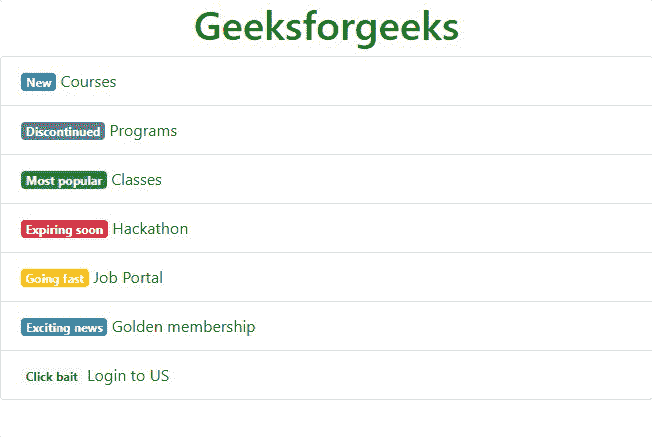
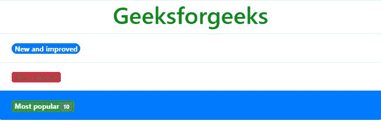

# 如何在 Bootstrap 中为列表组添加徽章？

> 原文:[https://www . geesforgeks . org/如何将徽章添加到引导列表中的组/](https://www.geeksforgeeks.org/how-to-add-badge-to-list-group-in-bootstrap/)

在这篇文章中，我们将学习如何制作一个徽章列表，根据列表的优先级给出想法。列表组用于显示一系列内容。我们可以使用列表组以有组织的方式显示一系列或一系列内容&这很有帮助，因为我们可以根据需要对其进行修改。

徽章是与链接相关联的数字标签，用于指示与链接相关联的项目数量。例如，当登录到一个特定的网站时，可以看到通知号码，该网站通过点击它来告知要查看的新通知的号码。徽章通过使用相对字体大小来缩放以匹配直接父元素的大小。列表组旁边的徽章有助于我们抓住观众的注意力，突出列表组中的重要点。它有助于给定系列中的重要数据增加活力。

**语法:**

```html
<ul class="list-group">
  <li class="list-group-item">
    <span class="badge bg-type">Badge Content</span>
    list-content
  </li>
</ul>
```

**类型:**以下是 Bootstrap 5 中提供的 8 种背景类型。

*   BG-初级
*   BG-中学
*   血糖-成功
*   BG-危险
*   BG-警告
*   BG-信息
*   bg 灯
*   BG-深色

我们将通过示例了解使用所有这些类型徽章的目的。

**示例 1:** 该示例说明了具有不同类型徽章的基本列表组。这些徽章通过它们的背景颜色，如成功、危险和中立，象征着一种情感。

## 超文本标记语言

```html
<!DOCTYPE html>
<html lang="en">

<head>
    <meta charset="utf-8" />
    <meta name="viewport" content=
        "width=device-width, initial-scale=1" />

    <link rel="stylesheet" href=
"https://maxcdn.bootstrapcdn.com/bootstrap/4.3.1/css/bootstrap.min.css" />

    <script src=
"https://ajax.googleapis.com/ajax/libs/jquery/3.3.1/jquery.min.js">
    </script>
    <script src=
"https://cdnjs.cloudflare.com/ajax/libs/popper.js/1.14.7/umd/popper.min.js">
    </script>
    <script src=
"https://maxcdn.bootstrapcdn.com/bootstrap/4.3.1/js/bootstrap.min.js">
    </script>
</head>

<body>
    <h1 style="color: green; text-align: center;">
        Geeksforgeeks
    </h1>

    <ul class="list-group">
        <li class="list-group-item">
            <span class="badge bg-primary" 
                style="color: white">
                New
            </span>
            Courses
        </li>
        <li class="list-group-item">
            <span class="badge bg-secondary" 
                style="color: white">
                Discontinued
            </span>
            Programs
        </li>
        <li class="list-group-item">
            <span class="badge bg-success" 
                style="color: white">
                Most popular
            </span>
            Classes
        </li>
        <li class="list-group-item">
            <span class="badge bg-danger" 
                style="color: white">
                Expiring soon
            </span>
            Hackathon
        </li>
        <li class="list-group-item">
            <span class="badge bg-warning" 
                style="color: white">
                Going fast
            </span>
            Job Portal
        </li>
        <li class="list-group-item">
            <span class="badge bg-info" 
                style="color: white">
                Exciting news
            </span>
            Golden membership
        </li>
        <li class="list-group-item">
            <span class="badge bg-light">
                Click bait
            </span>
            Login to US
        </li>
    </ul>
</body>

</html>
```

**输出:**



**示例 2:** 在本例中，我们可以进一步单独定制列表组和徽章，以获得我们想要的结果。我们将使用带有类别*圆形药丸*的药丸形徽章作为列表组中的通知徽章。

## 超文本标记语言

```html
<!DOCTYPE html>
<html lang="en">

<head>
    <meta charset="utf-8" />
    <meta name="viewport" content=
        "width=device-width, initial-scale=1" />

    <link rel="stylesheet" href=
"https://maxcdn.bootstrapcdn.com/bootstrap/4.3.1/css/bootstrap.min.css" />

    <script src=
"https://ajax.googleapis.com/ajax/libs/jquery/3.3.1/jquery.min.js">
    </script>
    <script src=
"https://cdnjs.cloudflare.com/ajax/libs/popper.js/1.14.7/umd/popper.min.js">
    </script>
    <script src=
"https://maxcdn.bootstrapcdn.com/bootstrap/4.3.1/js/bootstrap.min.js">
    </script>
</head>

<body>

    <h1 style="color: green; text-align: center;">
        Geeksforgeeks
    </h1>

    <ul class="list-group">
        <li class="list-group-item">
            <span class="badge bg-primary 
                rounded-pill text-light">
                New and improved
            </span>
        </li>
        <li class="list-group-item disabled">
            <span class="badge bg-danger text-dark">
                Discontinued
            </span>
        </li>
        <li class="list-group-item active">
            <span class="badge bg-success text-light">
                Most popular
                <span class="badge bg-secondary">
                    10
                </span>
            </span>
        </li>
    </ul>
</body>

</html>
```

**输出:**



**参考:**

*   [自举-5 徽章](https://www.geeksforgeeks.org/bootstrap-5-badges/)
*   [用例子列出引导中的组](https://www.geeksforgeeks.org/list-group-in-bootstrap-with-examples/)
*   [徽章和面包屑](https://www.geeksforgeeks.org/bootstrap-badges-and-breadcrumbs/)