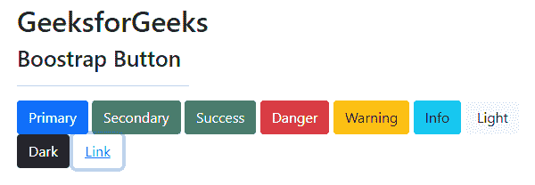
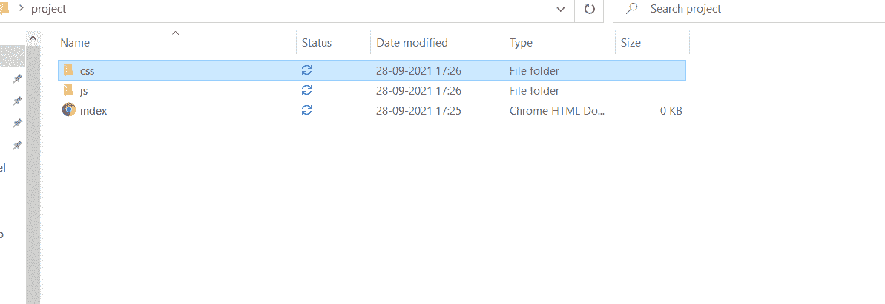
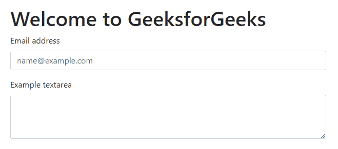

# 如何在项目中添加引导？

> 原文:[https://www . geesforgeks . org/如何在项目中添加引导程序/](https://www.geeksforgeeks.org/how-to-add-bootstrap-in-a-project/)

引导程序是由 HTML、CSS 和 JavaScript 框架组成的开源工具。这是一个由现成的模板组成的专用响应网络开发工具。它最初被命名为推特蓝图，由马克·奥托和雅各布·桑顿开发。随着时间的推移，bootstrap 已经发展到版本 5。因此，由于现成的模板可用，基本网站可以使用 bootstrap 开发。

**选择 Bootstrap 的原因:**

*   更快更容易的网络开发。
*   它创建独立于平台的网页。
*   它创建响应性网页。
*   它也是为响应移动设备而设计的。
*   它是免费的！可在 www.getbootstrap.com 获得

使用大量 CSS 和 JavaScript 构建的网站现在可以使用 Bootstrap 用几行代码来构建。引导主要由三个部分组成:

*   半铸钢ˌ钢性铸铁(Cast Semi-Steel)
*   字体
*   java 描述语言

引导可以通过两种方式使用:

*   使用引导 CDN 链接。
*   通过下载引导文件。

我们可以很容易地从官方网站上获得这两种方法的资源。让我们从第一种方法开始讨论。

**方法 1:使用 CDN 链接–**这种安装 Bootstrap 的方法相当简单，但需要稳定的互联网连接。强烈建议您遵循此方法。

**第一步:**转到[获取引导](https://getbootstrap.com/)并点击开始。在那里你会发现下面的 CDN 链接。

**第二步:**复制链接&粘贴到<头>标签里面。

CSS 链接:

> <link href="”https://cdn.jsdelivr.net/npm/bootstrap@5.1.1/dist/css/bootstrap.min.css”" rel="”stylesheet”" integrity="”sha384-F3w7mX95PdgyTmZZMECAngseQB83DfGTowi0iMjiWaeVhAn4FJkqJByhZMI3AhiU”" crossorigin="”anonymous”">

**JavaScript 链接:**

**第三步:**完成上述步骤后，代码如下:

## 超文本标记语言

```
<!DOCTYPE html>
<html lang="en">

<head>
    <!-- Required meta tags -->
    <meta charset="utf-8" />
    <meta name="viewport" content=
        "width=device-width, initial-scale=1" />

    <!-- Bootstrap CSS -->
    <link href=
"https://cdn.jsdelivr.net/npm/bootstrap@5.1.1/dist/css/bootstrap.min.css"
        rel="stylesheet" integrity=
"sha384-F3w7mX95PdgyTmZZMECAngseQB83DfGTowi0iMjiWaeVhAn4FJkqJByhZMI3AhiU"
        crossorigin="anonymous" />
</head>

<body>
    <h1>Hello, world!</h1>

    <div>
        You're learning Bootstrap
        on Geeksforgeeks.org
    </div>

    <!-- Optional JavaScript; choose one of the two! -->

    <!-- Option 1: Bootstrap Bundle with Popper -->
    <script src=
"https://cdn.jsdelivr.net/npm/bootstrap@5.1.1/dist/js/bootstrap.bundle.min.js"
        integrity=
"sha384-/bQdsTh/da6pkI1MST/rWKFNjaCP5gBSY4sEBT38Q/9RBh9AH40zEOg7Hlq2THRZ"
        crossorigin="anonymous">
    </script>

    <!-- Option 2: Separate Popper and Bootstrap JS -->
    <!--
    <script src=
"https://cdn.jsdelivr.net/npm/@popperjs/core@2.9.3/dist/umd/popper.min.js"
        integrity=
"sha384-W8fXfP3gkOKtndU4JGtKDvXbO53Wy8SZCQHczT5FMiiqmQfUpWbYdTil/SxwZgAN"
        crossorigin="anonymous">
    </script>

    <script src=
"https://cdn.jsdelivr.net/npm/bootstrap@5.1.1/dist/js/bootstrap.min.js"
        integrity=
"sha384-skAcpIdS7UcVUC05LJ9Dxay8AXcDYfBJqt1CJ85S/CFujBsIzCIv+l9liuYLaMQ/"
        crossorigin="anonymous">
    </script>  -->
</body>

</html>
```

在这个阶段，我们已经完成了安装过程&现在我们可以开始实现逻辑了。

**示例:**这个示例说明了引导 CDN 链接的使用，以便将引导与 HTML 文档一起使用。

## 超文本标记语言

```
<!DOCTYPE html>
<html lang="en">

<head>

    <!-- Required meta tags -->
    <meta charset="utf-8" />
    <meta name="viewport"
          content="width=device-width,
                   initial-scale=1" />

    <!-- Bootstrap CSS -->
    <link href=
"https://cdn.jsdelivr.net/npm/bootstrap@5.1.1/dist/css/bootstrap.min.css"
          rel="stylesheet"
          integrity=
"sha384-F3w7mX95PdgyTmZZMECAngseQB83DfGTowi0iMjiWaeVhAn4FJkqJByhZMI3AhiU"
          crossorigin="anonymous"/>
    <title>Welcome to GeeksforGeeks</title>
</head>

<body>
    <h1>GeeksforGeeks</h1>

      <h3>Bootstrap Button</h3>
    <hr />
    <button type="button"
            class="btn btn-primary">Primary
    </button>
    <button type="button"
            class="btn btn-secondary">Secondary
    </button>
    <button type="button"
            class="btn btn-success">Success
    </button>
    <button type="button"
            class="btn btn-danger">Danger
    </button>
    <button type="button"
            class="btn btn-warning">Warning
    </button>
    <button type="button"
            class="btn btn-info">Info
    </button>
    <button type="button"
            class="btn btn-light">Light
    </button>
    <button type="button"
            class="btn btn-dark">Dark
    </button>
    <button type="button"
            class="btn btn-link">Link
    </button>
</body>

</html>
```

**输出:**



**方法 2:通过下载 Bootstrap–**这种安装 Bootstrap 的方法也很简单，但是可以脱机工作(不需要互联网连接)，但是可能不适用于某些浏览器。

**第一步:**转到[获取引导](https://getbootstrap.com/)并点击开始。点击下载引导按钮，下载编译好的 CSS 和 JS。

**第二步:**下载一个. zip 文件。提取它并进入分发文件夹。你会看到两个名为 CSS 和 JS 的文件夹。您可以在那里创建您的 HTML 文件，然后您必须将这些链接粘贴到它们各自的部分中。在 CSS 文件下，要使用的最重要的文件是 bootstrap 和 bootstrap.min。在 JS 文件下，最重要的是 bootstrap.min.js 和 bootstrap.js。

**第三步:**制作一个单独的项目文件夹，创建一个 HTML 文件。在文件夹下，复制从引导下载的提取文件。在 HTML 文件的头部标签下，需要链接 CSS。下载的 jQuery 也应该复制到 JS 文件下。确保在项目文件下，下载的文件和 HTML 页面必须存在于该文件夹中。



**第 4 步:**完成上述步骤后，最终代码将类似于下面的代码示例。将文件保存在同一个文件夹下，并在标题和正文标签下分别添加链接后的最终代码。

## 超文本标记语言

```
<!DOCTYPE html>
<html lang="en">

<head>

      <!-- Required meta tags -->
    <meta charset="utf-8" />
    <meta name="viewport"
          content="width=device-width,
                   initial-scale=1" />

    <link rel="stylesheet"
          type="text/css"
          href="css/bootstrap.css" />
</head>

<body>
    <h1>Welcome to gfg</h1>
    <script type="text/javascript"
            href="js/jquery.js">
    </script>
    <script type="text/javascript"
            href="js/bootstrap.min.js">
    </script>
</body>

</html>
```

**示例:**在示例中，可以观察到从 bootstrap 下载的文件包含在 head 和 body 部分下。现在可以直接使用引导类了。由于它是下载的，因此不需要互联网连接来加载引导类。

## 超文本标记语言

```
<!DOCTYPE html>
<html lang="en">

<head>

    <!-- Required meta tags -->
    <meta charset="utf-8" />
    <meta name="viewport" content=
        "width=device-width, initial-scale=1" />

    <link rel="stylesheet" type="text/css"
        href="css/bootstrap.css" />
</head>

<body>
    <h1>Welcome to GeeksforGeeks</h1>

    <div class="mb-3">
        <label for="exampleFormControlInput1"
            class="form-label">
            Email address
        </label>

        <input type="email" class="form-control"
            id="exampleFormControlInput1"
            placeholder="name@example.com" />
    </div>

    <div class="mb-3">
        <label for="exampleFormControlTextarea1"
            class="form-label">
            Example textarea
        </label>

        <textarea class="form-control"
            id="exampleFormControlTextarea1" rows="3">
      </textarea>
    </div>

    <script type="text/javascript"
        href="js/jquery.js">
    </script>

    <script type="text/javascript"
        href="js/bootstrap.min.js">
    </script>
</body>

</html>
```

**输出:**

