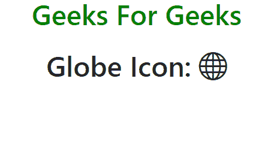
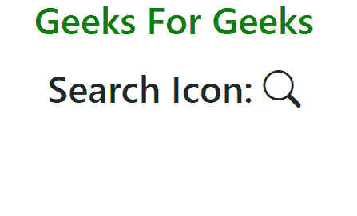
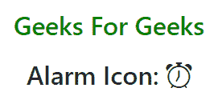
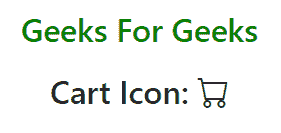

# 如何使用 Bootstrap 在项目中添加图标？

> 原文:[https://www . geesforgeks . org/如何使用引导程序在项目中添加图标/](https://www.geeksforgeeks.org/how-to-add-icons-in-project-using-bootstrap/)

Bootstrap 是一个免费的开源工具集合，用于创建响应性网站和网络应用程序。它是最流行的 HTML、CSS 和 JavaScript 框架，用于开发响应迅速、移动优先的网站。图标是一种视觉表示，有助于理解网站，也有助于浏览网站。换句话说，图标是一种提示，它指定了要执行的使用图标的特定任务。引导图标以标准格式装饰网页/网站，给人以美好的外观。引导图标库包含 1300 多个高质量设计的图标&免费使用。为了使用这样的图标，我们将使用引导 CDN 链接将其包含在 HTML 文档中。

**语法:**

```html
<i class="bi bi-icon_name"></i>
```

> <继电器= "样式表"链接 href = " https://cdn . jsdelivr . net/NPM/bootstrap @ 5 . 0 . 2/dist/CSS/bootstrap . min . CSS "/

t

**进场:**

*   前往&Bootstrap 官方网站，复制 CSS、JS、Propper.js、jQuery 链接的 Bootstrap CDN。
*   在标签内添加 CDN 链接和添加字体图标链接
*   添加带有*毕比-图标名称*后跟图标名称的类。

**示例 1:** 此示例说明了地球仪图标。

## 超文本标记语言

```html
<!DOCTYPE html>
<html lang="en">

<head>
    <meta charset="utf-8" />
    <meta name="viewport" content=
        "width=device-width, initial-scale=1" />

    <title>Bootstrap Icons in HTML</title>

    <!-- Bootstrap CSS -->
    <link rel="stylesheet" href=
"https://cdn.jsdelivr.net/npm/bootstrap@5.0.2/dist/css/bootstrap.min.css" />

    <!-- Bootstrap Font Icon CSS -->
    <link rel="stylesheet" href=
"https://cdn.jsdelivr.net/npm/bootstrap-icons@1.5.0/font/bootstrap-icons.css" />
</head>

<body>
    <center>
        <h1 style="color: green">
            Geeks For Geeks
        </h1>

        <h1 class="m-4">Globe Icon:
            <i class="bi-globe"></i>
        </h1>
    </center>
</body>

</html>
```

**输出:**



**示例 2:** 此示例说明了搜索图标。

## 超文本标记语言

```html
<!DOCTYPE html>
<html lang="en">

<head>
    <meta charset="utf-8" />
    <meta name="viewport" content=
        "width=device-width, initial-scale=1" />

    <title>Bootstrap Icons in HTML</title>

    <!-- Bootstrap CSS -->
    <link rel="stylesheet" href=
"https://cdn.jsdelivr.net/npm/bootstrap@5.0.2/dist/css/bootstrap.min.css" />

    <!-- Bootstrap Font Icon CSS -->
    <link rel="stylesheet" href=
"https://cdn.jsdelivr.net/npm/bootstrap-icons@1.5.0/font/bootstrap-icons.css" />
</head>

<body>
    <center>
        <h1 style="color: green">
            Geeks For Geeks
        </h1>

        <h1 class="m-4">Search Icon:
            <i class="bi-search"></i>
        </h1>
    </center>
</body>

</html>
```

**输出:**



**示例 3:** 本示例说明了报警图标。

## 超文本标记语言

```html
<!DOCTYPE html>
<html lang="en">

<head>
    <meta charset="utf-8" />
    <meta name="viewport" content=
        "width=device-width, initial-scale=1" />

    <title>Bootstrap Icons in HTML</title>

    <!-- Bootstrap CSS -->
    <link rel="stylesheet" href=
"https://cdn.jsdelivr.net/npm/bootstrap@5.0.2/dist/css/bootstrap.min.css" />

    <!-- Bootstrap Font Icon CSS -->
    <link rel="stylesheet" href=
"https://cdn.jsdelivr.net/npm/bootstrap-icons@1.5.0/font/bootstrap-icons.css" />
</head>

<body style="margin-top: 45px">
    <center>
        <h1 style="color: green">
            Geeks For Geeks
        </h1>

        <h1 class="m-4">Alarm Icon:
            <i class="bi-alarm"></i>
        </h1>
    </center>
</body>

</html>
```

**输出:**



**示例 4:** 此示例说明了购物车图标。

## 超文本标记语言

```html
<!DOCTYPE html>
<html lang="en">

<head>
    <meta charset="utf-8" />
    <meta name="viewport" content=
        "width=device-width, initial-scale=1" />
    <title>Bootstrap Icons in HTML</title>

    <!-- Bootstrap CSS -->
    <link rel="stylesheet" href=
"https://cdn.jsdelivr.net/npm/bootstrap@5.0.2/dist/css/bootstrap.min.css" />

    <!-- Bootstrap Font Icon CSS -->
    <link rel="stylesheet" href=
"https://cdn.jsdelivr.net/npm/bootstrap-icons@1.5.0/font/bootstrap-icons.css" />
</head>

<body>
    <center>
        <h1 style="color: green">
            Geeks For Geeks
        </h1>

        <h1 class="m-4">Cart Icon:
            <i class="bi-cart"></i>
        </h1>
    </center>
</body>

</html>
```

**输出:**



参考:[https://icons.getbootstrap.com/](https://icons.getbootstrap.com/)