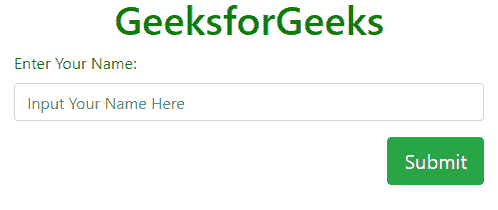

# 如何在 Bootstrap 中将按钮对齐文本框右侧？

> 原文:[https://www . geesforgeks . org/如何将按钮对齐到引导文本框的右侧/](https://www.geeksforgeeks.org/how-to-align-button-to-right-side-of-text-box-in-bootstrap/)

Bootstrap 允许我们通过使用实用程序类**浮动**来对齐元素。当我们想要将按钮与文本框的右侧对齐时，我们必须使用**右浮动**类。
**语法:**

```
<button class="btn btn-success btn-lg float-right" type="submit">Submit</button>
```

**例:**

## 超文本标记语言

```
<!DOCTYPE html>
<html>

<head>
    <title>Bootstrap Button Alignment</title>
    <meta charset="utf-8">
    <meta name="viewport"
          content="width=device-width, initial-scale=1">
    <link rel="stylesheet"
          href=
"https://maxcdn.bootstrapcdn.com/bootstrap/4.3.1/css/bootstrap.min.css">
    <script src=
"https://ajax.googleapis.com/ajax/libs/jquery/3.3.1/jquery.min.js">
  </script>
    <script src=
"https://cdnjs.cloudflare.com/ajax/libs/popper.js/1.14.7/umd/popper.min.js">
    </script>
    <script src=
"https://maxcdn.bootstrapcdn.com/bootstrap/4.3.1/js/bootstrap.min.js">
    </script>
</head>

<body>
    <div class="container">
        <h1 style="text-align:center;color:green;">
          GeeksforGeeks
      </h1>
        <form>
            <div class="form-group">
                <label for="">Enter Your Name:</label>
                <input class="form-control"
                       type="text"
                       placeholder="Input Your Name Here">
            </div>
            <div class="form-group">
                <button class="btn btn-success btn-lg float-right"
                        type="submit">
                     Submit
                </button>
            </div>
        </form>
    </div>
</body>

</html>
```

**输出:**



**注意:**虽然默认情况下，像按钮这样的元素是左对齐的，但我们仍然可以使用**左浮动**类来具体提及它。我们也可以使用类**浮动-无**来移除任何层次浮动。
需要注意的是，我们这里使用的是 Bootstrap 4，在 Bootstrap 3 或 Bootstrap 2 中，我们可以使用像**向左拉**、**向右拉**这样的辅助类来相应地将元素向左或向右对齐。