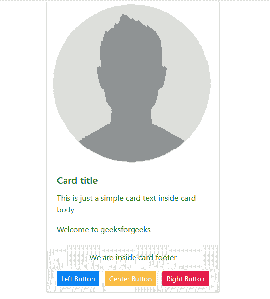

# 如何在 Bootstrap 中对齐卡片页脚的按钮？

> 原文:[https://www . geesforgeks . org/如何对齐-卡片中的按钮-引导中的页脚/](https://www.geeksforgeeks.org/how-to-align-buttons-in-card-footer-in-bootstrap/)

当您熟悉浮动元素时，卡片页脚中按钮的对齐非常容易。还有一种方法可以将按钮放在卡片页脚的任何位置，使其左右对齐。在本文中，您将学习如何对齐引导卡页脚部分的按钮。 **Bootstrap 的卡片**提供了一个灵活且可扩展的内容容器，具有多种变体和选项。
**自举卡结构:**

*   卡片信息
*   卡体
    *   卡片标题
    *   卡片文本
*   卡片页脚
    *   左按钮
    *   中央按钮
    *   右按钮

**示例:**使用左浮动、右浮动和右浮动来对齐卡片上的按钮。

```
<!DOCTYPE html>
<html lang="en">

<head>
    <title>
        How to align buttons in Card footer in Bootstrap ?
    </title>

    <meta charset="utf-8"> 

    <meta name="viewport" content="width=device-width, initial-scale=1"> 

    <link rel="stylesheet" href= 
"https://maxcdn.bootstrapcdn.com/bootstrap/4.3.1/css/bootstrap.min.css"> 

    <script src= 
"https://ajax.googleapis.com/ajax/libs/jquery/3.3.1/jquery.min.js"> 
    </script> 

    <script src= 
"https://cdnjs.cloudflare.com/ajax/libs/popper.js/1.14.7/umd/popper.min.js"> 
    </script> 

    <script src= 
"https://maxcdn.bootstrapcdn.com/bootstrap/4.3.1/js/bootstrap.min.js"> 
    </script> 
</head>

<body>

    <!-- Create a card -->
    <div class="card" style="width: 22rem; margin:0 auto;">
        

        <div class="card-body">
            <h5 class="card-title" style="color:green">
                Card title
            </h5>

            <p class="card-text" style="color:green;">
                This is just a simple card
                text inside card body
            </p>

            <p class="card-text" style="color:green;">
                Welcome to geeksforgeeks
            </p>
        </div>

        <div class="card-footer text-center">

            <p style="color:green;">We are inside card footer</p>

            <button class="btn btn-primary btn-sm float-left"
                        id="left" style="color:white">
                Left Button
            </button>

            <button class="btn btn-warning btn-sm"
                    id="center" style="color:white">
                Center Button
            </button>

            <button class="btn btn-danger btn-sm float-right"
                    id="right" style="color:white">
                Right Button
            </button>
        </div>
    </div>
</body>

</html>
```

**输出:**


**例 2:**

```
<!DOCTYPE html>
<html lang="en">

<head>
    <title>
        How to align buttons in Card footer in Bootstrap ?
    </title>

    <meta charset="utf-8">

    <meta name="viewport"
        content="width=device-width, initial-scale=1">

    <link rel="stylesheet"
href="https://maxcdn.bootstrapcdn.com/bootstrap/4.3.1/css/bootstrap.min.css">

    <script src=
"https://ajax.googleapis.com/ajax/libs/jquery/3.3.1/jquery.min.js">
    </script>

    <script src=
"https://cdnjs.cloudflare.com/ajax/libs/popper.js/1.14.7/umd/popper.min.js">
    </script>

    <script src=
"https://maxcdn.bootstrapcdn.com/bootstrap/4.3.1/js/bootstrap.min.js">
    </script>
</head>

<body>
    <div class="card" style="width: 22rem; margin:0 auto;">

        <div class="card-header text-success text-center">
            <h3>GeekforGeeks</h3>
        </div>
        <div class="card-body text-center">
            <h4 class="card-title ">Practice</h4>

            <p class="card-text">
                Practice for Computer Science coding interview
            </p>
            <a href="#" class="btn btn-primary">Login/Sign UP</a>
        </div>
        <div class="card-footer text-center">
            <button class="btn btn-theme float-left"
                    type="button"><
            </button>
            <button class="btn btn-theme"
                    type="button">+
            </button>
            <button class="btn btn-theme float-right"
                    type="button">>
            </button>
        </div>
    </div>
</body>

</html>
```

**输出:**
