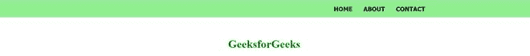
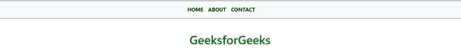
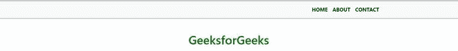

# 如何在 Bootstrap 中将头与包装对齐？

> 原文:[https://www . geeksforgeeks . org/如何将头文件与引导包装对齐/](https://www.geeksforgeeks.org/how-to-align-header-with-wrapper-in-bootstrap/)

一个 HTML 包装器允许你在网页中居中页眉、内容和页脚。头球可能很花哨。创造性地使用 CSS 或 bootstrap 可以给你一个侧边栏，或者两栏式的页面。

**语法:**

```html
<div class="wrapper">
    content...
</div>
```

**示例:**

## 超文本标记语言

```html
<!DOCTYPE html>
<html lang="en">

<head>
    <title>
        How to align header with 
        wrapper in Bootstrap?
    </title>

    <style type="text/css">
        .wrapper {
            width: 500px;
            margin: 0 auto;
        }
    </style>
</head>

<body>
    <div class="wrapper">
        <h1 style="color: green">
            GeeksforGeeks
        </h1>
        Piece of text inside a 500px 
        width div centered on the page
    </div>
</body>

</html>
```

**输出:**


**工作原理:**创建一个包装器，并为其分配一定的宽度。使用*边距:自动*或*边距-左:自动*或*边距-右:自动*属性对其应用自动水平边距。确保您的内容将居中。

有三种方法可以将标头与包装对齐，下面将对此进行讨论:

**方法 1:** 将页眉与 CSS 中的包装对齐。

## 超文本标记语言

```html
<!DOCTYPE html>
<html lang="en">

<head>
    <title>
        Bootstrap 4 Align Header
        with Wrapper
    </title>

<style type="text/css">

        /* Fit the body to the 
        edges of the screen */
        body {
            margin: 0;
            padding: 0;
        }

        nav {
            width: 100%;
            background: lightgreen;
            font-size: 1.1rem !important;
            font-weight: bold;
            text-transform: uppercase !important;
            color: black !important;
            font-family: tahoma;
            padding: 0;
            margin: 0;
        }

        /* The centered wrapper, all other 
          content divs will go interior 
          and this will never surpass the 
          width of 960px. */
        .wrapper {
            width: 960px;
            max-width: 100%;
            margin: 0 auto;
        }

        ul {
            list-style-type: none;
            margin: 0;
            padding: 0;
            overflow: hidden;
        }

        li {
            float: right;
        }

        li a {
            display: block;
            color: black;
            text-align: center;
            padding: 14px 16px;
            text-decoration: none;
        }
    </style>
</head>

<body>
    <header>
        <nav>
            <div class="wrapper">
                <ul>
                    <li><a href="#contact">
                        Contact
                    </a></li>

                    <li><a href="#about">
                        About
                    </a></li>

                    <li><a class="active" 
                        href="#home">Home
                    </a></li>
                </ul>
            </div>
        </nav>
    </header>

    <center>
        <h1 style="color: green">
            GeeksforGeeks
        </h1>
    </center>
</body>

</html>
```

**Output:**


**方法 2:** 将头与引导 4 中的包装对齐。

## 超文本标记语言

```html
<!DOCTYPE html>
<html lang="en">

<head>
  <meta charset="utf-8">
  <meta name="viewport" content=
      "width=device-width, initial-scale=1, 
      shrink-to-fit=no">

  <!-- Bootstrap CSS -->
  <link rel="stylesheet" href=
"https://stackpath.bootstrapcdn.com/bootstrap/4.5.0/css/bootstrap.min.css"
    integrity=
"sha384-9aIt2nRpC12Uk9gS9baDl411NQApFmC26EwAOH8WgZl5MYYxFfc+NcPb1dKGj7Sk"
    crossorigin="anonymous">

  <!-- Optional JavaScript -->
  <!-- jQuery first, then Popper.js, 
      then Bootstrap JS -->
  <script src="https://code.jquery.com/jquery-3.5.1.slim.min.js"
    integrity=
"sha384-DfXdz2htPH0lsSSs5nCTpuj/zy4C+OGpamoFVy38MVBnE+IbbVYUew+OrCXaRkfj"
    crossorigin="anonymous">
  </script>

  <script src=
"https://cdn.jsdelivr.net/npm/popper.js@1.16.0/dist/umd/popper.min.js"
    integrity=
"sha384-Q6E9RHvbIyZFJoft+2mJbHaEWldlvI9IOYy5n3zV9zzTtmI3UksdQRVvoxMfooAo"
    crossorigin="anonymous">
  </script>

  <script src=
"https://stackpath.bootstrapcdn.com/bootstrap/4.5.0/js/bootstrap.min.js"
    integrity=
"sha384-OgVRvuATP1z7JjHLkuOU7Xw704+h835Lr+6QL9UvYjZE3Ipu6Tp75j7Bh/kR0JKI"
    crossorigin="anonymous">
  </script>

  <title>
    Bootstrap 4 Align Header 
    with Wrapper
  </title>

  <style type="text/css">
    html,
    body {
      height: 100%;
      margin: 0;
    }

    .wrapper {
      min-height: 100%;
      width: 300px;
      margin: 0 auto;
      margin-bottom: -50px;
    }

    .push {
      height: 50px;
    }

    .navbar a {
      font-size: 1.1rem !important;
      font-weight: bold;
      text-transform: uppercase !important;
      color: black !important;
    }
  </style>
</head>

<body>
  <header>
    <nav class="navbar navbar-expand-lg 
        navbar-light bg-light border-top 
        border-bottom border-dark">
      <div class="wrapper">
        <button class="navbar-toggler 
            collapsed" type="button" 
            data-toggle="collapse"
            data-target="#navbarSupportedContent" 
            aria-controls="navbarSupportedContent" 
            aria-expanded="false"
            aria-label="Toggle navigation">
          <span class="navbar-toggler-icon"></span>
        </button>

        <div class="navbar-collapse collapse" 
          id="navbarSupportedContent" style="">
          <ul class="navbar-nav">
            <li class="nav-item active">
              <a class="nav-link" href="#">
                Home <span class="sr-only">
                  (current)
                </span>
              </a>
            </li>

            <li class="nav-item">
              <a class="nav-link" href="#">
                About
              </a>
            </li>
            <li class="nav-item">
              <a class="nav-link" href="#">
                Contact
              </a>
            </li>
          </ul>
        </div>
        <div class="push"></div>
      </div>
    </nav>
  </header>

  <center>
    <h1 style="color: green">
      GeeksforGeeks
    </h1>
  </center>
</body>

</html>
```

**Output:**


**注意:**一个“包装器”封装了页面上的所有其他可视组件。最直接的方法是让“包装” *div* 部分具有宽度以及左右自动边缘。负边缘也可用于水平和垂直居中。但是它也有自己的缺点，比如，如果窗口浏览器将被调整大小，内容将无法再被看到。

**方法 3:** 将标题与引导程序 4 中的弹性框对齐。在下面的例子中，导航中的 CSS“Flexbox”被用来将内容居中。

## 超文本标记语言

```html
<!DOCTYPE html>
<html lang="en">

<head>
  <!-- Required meta tags -->
  <meta charset="utf-8">
  <meta name="viewport" content=
      "width=device-width, 
      initial-scale=1, 
      shrink-to-fit=no">

  <!-- Bootstrap CSS -->
  <link rel="stylesheet" href=
"https://stackpath.bootstrapcdn.com/bootstrap/4.5.0/css/bootstrap.min.css"
    integrity=
"sha384-9aIt2nRpC12Uk9gS9baDl411NQApFmC26EwAOH8WgZl5MYYxFfc+NcPb1dKGj7Sk"
    crossorigin="anonymous">

  <!-- Optional JavaScript -->
  <!-- jQuery first, then Popper.js, 
      then Bootstrap JS -->
  <script src="https://code.jquery.com/jquery-3.5.1.slim.min.js"
    integrity=
"sha384-DfXdz2htPH0lsSSs5nCTpuj/zy4C+OGpamoFVy38MVBnE+IbbVYUew+OrCXaRkfj"
    crossorigin="anonymous">
  </script>

  <script src=
"https://cdn.jsdelivr.net/npm/popper.js@1.16.0/dist/umd/popper.min.js"
    integrity=
"sha384-Q6E9RHvbIyZFJoft+2mJbHaEWldlvI9IOYy5n3zV9zzTtmI3UksdQRVvoxMfooAo"
    crossorigin="anonymous">
  </script>

  <script src=
"https://stackpath.bootstrapcdn.com/bootstrap/4.5.0/js/bootstrap.min.js"
    integrity=
"sha384-OgVRvuATP1z7JjHLkuOU7Xw704+h835Lr+6QL9UvYjZE3Ipu6Tp75j7Bh/kR0JKI"
    crossorigin="anonymous">
  </script>

  <title>
    Bootstrap 4 Align header 
    with wrapper
  </title>

  <style type="text/css">
    .navbar {
      display: flex;
      justify-content: space-between;
    }

    .navbar-collapse {
      flex-grow: 0;
    }

    .navbar-expand-lg .navbar-collapse {
      justify-content: flex-end;
    }

    .flex-mobile-nav {
      display: flex;
      justify-content: space-between;
      width: 100%;
    }

    .nav-container-nav {
      max-width: 1024px;
      margin: 0 auto;
      width: 100%;
      display: flex;
    }

    .navbar a {
      font-size: 1.1rem !important;
      font-weight: bold;
      text-transform: uppercase !important;
      color: black !important;
    }
  </style>
</head>

<body>
  <header>
    <nav class="navbar navbar-expand-lg 
        navbar-light bg-light border-top 
        border-bottom border-dark">

      <div class="nav-container-nav">
        <div class="flex-mobile-nav">
          <button class="navbar-toggler 
              collapsed" type="button" 
              data-toggle="collapse"
              data-target="#navbarSupportedContent" 
              aria-controls="navbarSupportedContent" 
              aria-expanded="false"
              aria-label="Toggle navigation">

            <span class="navbar-toggler-icon"></span>
          </button>
        </div>
        <div class="navbar-collapse collapse" 
          id="navbarSupportedContent" style="">

          <ul class="navbar-nav">
            <li class="nav-item active">
              <a class="nav-link" href="#">
                Home <span class="sr-only">
                  (current)
                </span>
              </a>
            </li>
            <li class="nav-item">
              <a class="nav-link" href="#">
                About
              </a>
            </li>
            <li class="nav-item">
              <a class="nav-link" href="#">
                Contact
              </a>
            </li>
          </ul>
        </div>
      </div>
    </nav>
  </header>
  <center>
    <h1 style="color: green"><br>
      GeeksforGeeks
    </h1>
  </center>
</body>

</html>
```

**Output:**


**包装器和容器的区别:**在编程语言中，容器一词用于可以包含多个部分的结构。包装器是包装单个对象以提供更好的灵活界面的东西。