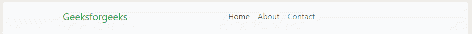

# 如何使用 Bootstrap 4 将导航栏项目对齐中心？

> 原文:[https://www . geesforgeks . org/how-align-nav bar-items-to-center-use-bootstrap-4/](https://www.geeksforgeeks.org/how-to-align-navbar-items-to-center-using-bootstrap-4/)

在 Bootstrap 中，项目可以很容易地分配到左边和右边，因为它为右边和左边提供了类。默认情况下，设置为 left，但是当需要将项目对齐到中心时，您必须自己对齐，因为没有内置的类可以这样做。

基本上有两种方法可以将项目与中心对齐，如下所示:

*   **使用 CSS**
*   **使用自举**

**使用 CSS:** 在这个方法中，我们将使用一个用户定义的类来将项目对齐到中心。然后，我们将使用 CSS 将项目对齐到中心。我们已经定义了班级**中心酒吧**。

*   **例:**

    ```html
    <!DOCTYPE html>
    <html>

    <head>
        <title>Align nav bar item into center</title>
        <link rel="stylesheet" href=
    "https://stackpath.bootstrapcdn.com/bootstrap/4.3.1/css/bootstrap.min.css" 
              integrity=
    "sha384-ggOyR0iXCbMQv3Xipma34MD+dH/1fQ784/j6cY/iJTQUOhcWr7x9JvoRxT2MZw1T"
              crossorigin="anonymous" />

        <link rel="stylesheet" type="text/css" href=
    "https://stackpath.bootstrapcdn.com/font-awesome/4.7.0/css/font-awesome.min.css" />
        <link rel="stylesheet" href=
    "https://cdnjs.cloudflare.com/ajax/libs/font-awesome/4.7.0/css/font-awesome.min.css" />
        <style>
            .navbar-nav.navbar-center {
                position: absolute;
                left: 50%;
                transform: translatex(-50%);
            }
        </style>
    </head>

    <body>
        <!--NAVBAR STARTING-->
        <nav class="navbar navbar-expand-sm navbar-light bg-light">
            <div class="container">
                <a class="navbar-brand text-success" href="#">
                  Geeksforgeeks
                </a>
                <button class="navbar-toggler" type="button" 
                        data-toggle="collapse"
                        data-target="#navbarSupportedContent"
                        aria-controls="navbarSupportedContent"
                        aria-expanded="false" 
                        aria-label="Toggle navigation">
                    <span class="navbar-toggler-icon"></span>
                </button>

                <div class="collapse navbar-collapse" 
                     id="navbarSupportedContent">
                    <ul class=" nav navbar-nav navbar-center">
                        <li class="nav-item active">
                            <a class="nav-link" 
                               href="#">
                              Home 
                              <span class="sr-only">
                                (current)
                              </span>
                          </a>
                        </li>
                        <li class="nav-item">
                            <a class="nav-link" 
                               href="#">
                              About
                            </a>
                        </li>
                        <li class="nav-item">
                            <a class="nav-link" 
                               href="#">
                              About
                            </a>
                        </li>
                    </ul>
                </div>
            </div>
        </nav>
    </body>

    </html>
    ```

*   **输出:**
    

**通过使用 Bootstrap:** 这个方法是一个快速棘手的方法，可以节省你写额外的 CSS。在这种情况下，我们只需在 div 标签上添加另一个 div 标签，使类**折叠导航栏-折叠**。这个新的 div 标签也将有同样的**折叠导航条-折叠**类。

*   **例:**

    ```html
    <!DOCTYPE html>
    <html>

    <head>
        <title>Align nav bar item into center</title>
        <link rel="stylesheet" href=
    "https://stackpath.bootstrapcdn.com/bootstrap/4.3.1/css/bootstrap.min.css" 
              integrity=
    "sha384-ggOyR0iXCbMQv3Xipma34MD+dH/1fQ784/j6cY/iJTQUOhcWr7x9JvoRxT2MZw1T"
              crossorigin="anonymous" />

        <link rel="stylesheet" type="text/css" href=
    "https://stackpath.bootstrapcdn.com/font-awesome/4.7.0/css/font-awesome.min.css" />
        <link rel="stylesheet" href=
    "https://cdnjs.cloudflare.com/ajax/libs/font-awesome/4.7.0/css/font-awesome.min.css" />

    </head>

    <body>

        <nav class="navbar navbar-expand-sm navbar-light bg-light">
            <div class="container">
                <a class="navbar-brand text-success" href="#">
                  Geeksforgeeks
                </a>
                <button class="navbar-toggler" type="button" 
                        data-toggle="collapse"
                        data-target="#navbarSupportedContent"
                        aria-controls="navbarSupportedContent"
                        aria-expanded="false" 
                        aria-label="Toggle navigation">
                    <span class="navbar-toggler-icon"></span>
                </button>

                <div class="collapse navbar-collapse"></div>

                <div class="collapse navbar-collapse" 
                     id="navbarSupportedContent">
                    <ul class="navbar-nav mr-auto">
                        <li class="nav-item active">
                            <a class="nav-link" 
                               href="#">
                              Home 
                              <span class="sr-only">
                                (current)
                              </span>
                          </a>
                        </li>
                        <li class="nav-item">
                            <a class="nav-link" 
                               href="#">
                              About
                            </a>
                        </li>
                        <li class="nav-item">
                            <a class="nav-link"
                               href="#">
                              Contact
                            </a>
                        </li>
                    </ul>
                </div>
            </div>
        </nav>
    </body>

    </html>
    ```

*   **输出:**
    