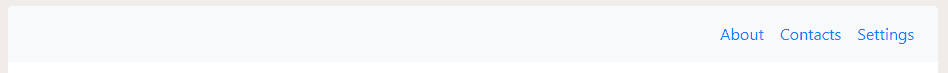

# 如何在 Bootstrap 4 中将 navbar 项目向右对齐？

> 原文:[https://www . geesforgeks . org/how-align-nav bar-items-to-right-in-bootstrap-4/](https://www.geeksforgeeks.org/how-to-align-navbar-items-to-the-right-in-bootstrap-4/)

**。Bootstrap 中的 ml-auto** 类可用于将 navbar 项目向右对齐。**。ml-auto** 类自动将元素向右对齐。在本文中，我们将以两种不同的方式将 navbar 向右对齐，下面用适当的例子讨论这两种方法。

**示例 1:** 在第一个示例中，我们使用了**。ml-auto** 类的 Bootstrap 4，将 navbar 项目向右对齐。**。ml-auto** 类自动给定左边距，并将 navbar 项向右移动。

*   **程序:**

    ```html
    <!DOCTYPE html>
    <html>

    <head>

        <!-- Including the bootstrap CDN -->
        <link rel="stylesheet" href=
    "https://maxcdn.bootstrapcdn.com/bootstrap/4.4.1/css/bootstrap.min.css">
        <script src=
    "https://ajax.googleapis.com/ajax/libs/jquery/3.4.1/jquery.min.js">
        </script>
        <script src=
    "https://cdnjs.cloudflare.com/ajax/libs/popper.js/1.16.0/umd/popper.min.js">
        </script>
        <script src=
    "https://maxcdn.bootstrapcdn.com/bootstrap/4.4.1/js/bootstrap.min.js">
        </script>
    </head>

    <body>

        <!-- Creating a navigation bar using the
             .navbar class of bootstrap -->
        <nav class="navbar navbar-expand-sm bg-light">

            <ul class="navbar-nav ml-auto">
                <li class="nav-item">
                    <a class="nav-link" href="#">
                      About
                    </a>
                </li>
                <li class="nav-item">
                    <a class="nav-link" href="#">
                      Contacts
                    </a>
                </li>
                <li class="nav-item">
                    <a class="nav-link" href="#">
                      Settings
                    </a>
                </li>
            </ul>
        </nav>
    </body>

    </html>
    ```

*   **输出:** 

**示例 2:** 在本例中，我们没有使用任何预定义的 Bootstrap 4 类来对齐项目。在这个例子中，我们创建了一个导航条，然后使用 CSS 将左边距设为自动，将导航条项目向右移动。

*   **程序:**

    ```html
    <!DOCTYPE html>
    <html>

    <head>

        <!-- Including the bootstrap CDN -->
        <link rel="stylesheet" href=
    "https://maxcdn.bootstrapcdn.com/bootstrap/4.4.1/css/bootstrap.min.css">
        <script src=
    "https://ajax.googleapis.com/ajax/libs/jquery/3.4.1/jquery.min.js">
        </script>
        <script src=
    "https://cdnjs.cloudflare.com/ajax/libs/popper.js/1.16.0/umd/popper.min.js">
        </script>
        <script src=
    "https://maxcdn.bootstrapcdn.com/bootstrap/4.4.1/js/bootstrap.min.js">
        </script>
        <style>
            .navbar-nav {
                margin-left: auto;
            }
        </style>
    </head>

    <body>

        <!-- Creating a navigation bar using the
             .navbar class of bootstrap -->
        <nav class="navbar navbar-expand-sm bg-light">

            <ul class="navbar-nav">
                <li class="nav-item">
                    <a class="nav-link" href="#">
                      About
                    </a>
                </li>
                <li class="nav-item">
                    <a class="nav-link" href="#">
                      Contacts
                    </a>
                </li>
                <li class="nav-item">
                    <a class="nav-link" href="#">
                      Settings
                    </a>
                </li>
            </ul>
        </nav>
    </body>

    </html>
    ```

*   **输出:** 