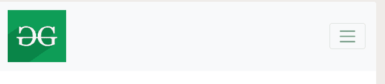

# 如何使用 Bootstrap 将 navbar 徽标与左侧屏幕对齐？

> 原文:[https://www . geeksforgeeks . org/how-align-nav bar-logo-向左-screen-use-bootstrap/](https://www.geeksforgeeks.org/how-to-align-navbar-logo-to-the-left-screen-using-bootstrap/)

在 bootstrap 中，使用 Bootstrap 类左右对齐项目非常容易。默认情况下，它设置为左侧。如果你想将物品居中或右对齐，你可以自己完成。使用 Bootstrap 方法将 navbar 徽标对齐到屏幕左侧是一个快速的技巧，可以省去您编写额外的 CSS。在这种情况下，我们只需在 div 标签上添加另一个 div 标签，该标签具有类 nav bar nav bar-expand-LG nav bar-light BG-light fixed-top py-LG-0。

**示例:**

```html
<!DOCTYPE html>
<html>

<head>
    <title>
        How to Align navbar logo to the 
        left screen using Bootstrap ?
    </title>

    <link href=
"https://stackpath.bootstrapcdn.com/bootstrap/4.4.1/css/bootstrap.min.css"
            rel="stylesheet" integrity=
"sha384-Vkoo8x4CGsO3+Hhxv8T/Q5PaXtkKtu6ug5TOeNV6gBiFeWPGFN9MuhOf23Q9Ifjh"
            crossorigin="anonymous">

    <script src="https://code.jquery.com/jquery-3.5.1.js" integrity=
"sha256-QWo7LDvxbWT2tbbQ97B53yJnYU3WhH/C8ycbRAkjPDc=" 
            crossorigin="anonymous">
    </script>

    <script src=
"https://stackpath.bootstrapcdn.com/bootstrap/4.4.1/js/bootstrap.min.js"
            integrity=
"sha384-wfSDF2E50Y2D1uUdj0O3uMBJnjuUD4Ih7YwaYd1iqfktj0Uod8GCExl3Og8ifwB6"
            crossorigin="anonymous">
    </script>
</head>

<body>
    <!-- NAVBAR STARTING -->
    <!-- Use navbar class to the navbar logo 
        to the far left of the screen-->
    <nav class=" navbar navbar-expand-lg 
        navbar-light bg-light fixed-top py-lg-0 ">

        <a class="navbar-brand" href="#">

            <!-- Add logo with size of 90*80 -->
            
        </a>

        <button class="navbar-toggler" type="button"
                data-toggle="collapse" 
                data-target="#navbarResponsive"
                aria-controls="navbarResponsive" 
                aria-expanded="false" 
                aria-label="Toggle navigation">

                <span class="navbar-toggler-icon"></span>
        </button>

        <div class="collapse navbar-collapse"
                id="navbarResponsive">
            <ul class="navbar-nav ml-auto">
                <li class="nav-item active">
                    <a class="nav-link" href="#">Home
                        <span class="sr-only">(current)</span>
                    </a>
                </li>
                <li class="nav-item">
                    <a class="nav-link" href="#">About</a>
                </li>
                <li class="nav-item">
                    <a class="nav-link" href="#">Courses</a>
                </li>
                <li class="nav-item">
                    <a class="nav-link" href="#">Contact</a>
                </li>
            </ul>
        </div>
    </nav>
</body>

</html>
```

**输出:**
