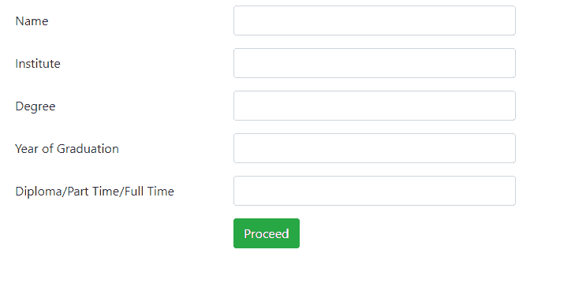
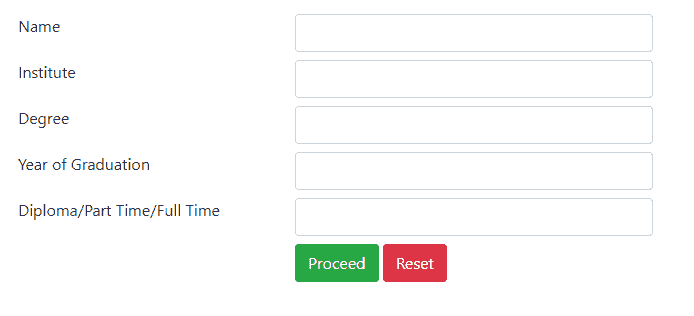

# 如何使用 Bootstrap 4 对齐嵌套表单行？

> 原文:[https://www . geesforgeks . org/how-align-nested-form-row-use-bootstrap-4/](https://www.geeksforgeeks.org/how-to-align-nested-form-rows-using-bootstrap-4/)

**Bootstrap** 是一个用来设计网页的 CSS 框架。引导加上超文本标记语言和 JavaScript 产生了交互式网页设计。最新版本是 Bootstrap 4.5。Bootstrap 有各种组件和实用程序。引导组件包括表单组件。Bootstrap 有一个内置的表单控件类，用于创建表单和相应的表单输入字段。引导表单组件允许使用嵌套行创建表单。行和列是 Bootstrap 中的另一个实用程序，可用于对齐嵌套表单行。

在本文中，我们将看到两个对齐嵌套表单行的示例，其中一个示例使用表单组类，而另一个示例仅使用行和列的概念来显示所需的结构。

**示例 1:** 在本例中，定义了由嵌套表单行组成的主容器。在容器内，一个*表单组*行类被定义为一个宽度为 7 个单位的列。该列同样由包含两列的*表单组*行组成。第一列用于指定输入字段的标签，第二列用于定义输入字段。

由于定义了列宽，表单标签和输入字段不会超过列大小，因此保持对齐。通过将按钮放在嵌套行的第二列中并保持第一列为空，按钮与表单的输入字段对齐。

**代码实现:**

## 超文本标记语言

```html
<!DOCTYPE html>
<html>

<head>
    <!-- Import bootstrap cdn -->
    <link rel="stylesheet" href=
"https://cdn.jsdelivr.net/npm/bootstrap@4.5.3/dist/css/bootstrap.min.css"
        integrity=
"sha384-TX8t27EcRE3e/ihU7zmQxVncDAy5uIKz4rEkgIXeMed4M0jlfIDPvg6uqKI2xXr2"
        crossorigin="anonymous">

    <!-- Import jquery cdn -->
    <script src="https://code.jquery.com/jquery-3.5.1.slim.min.js" 
        integrity=
"sha384-DfXdz2htPH0lsSSs5nCTpuj/zy4C+OGpamoFVy38MVBnE+IbbVYUew+OrCXaRkfj"
        crossorigin="anonymous">
    </script>

    <script src=
"https://cdn.jsdelivr.net/npm/bootstrap@4.5.3/dist/js/bootstrap.bundle.min.js" 
        integrity=
"sha384-ho+j7jyWK8fNQe+A12Hb8AhRq26LrZ/JpcUGGOn+Y7RsweNrtN/tE3MoK7ZeZDyx" 
        crossorigin="anonymous">
    </script>
</head>

<body>
    <div class="container mt-2 ml-2">
        <div class="form-group row">
            <div class="col-sm-7">
                <div class="form-group row">
                    <label for="description" 
                        class="col-sm-5 col-form-label">
                        Name
                    </label>
                    <div class="col-sm-7">
                        <input type="text" 
                            class="form-control">
                    </div>
                </div>
                <div class="form-group row">
                    <label for="description" 
                        class="col-sm-5 col-form-label">
                        Institute
                    </label>
                    <div class="col-sm-7">
                        <input type="text" 
                            class="form-control">
                    </div>
                </div>
                <div class="form-group row">
                    <label for="description" 
                        class="col-sm-5 col-form-label">
                        Degree
                    </label>
                    <div class="col-sm-7">
                        <input type="text" 
                            class="form-control">
                    </div>
                </div>
                <div class="form-group row">
                    <label for="description" 
                        class="col-sm-5 col-form-label">
                        Year of Graduation
                    </label>
                    <div class="col-sm-7">
                        <input type="text" 
                            class="form-control">
                    </div>
                </div>
                <div class="form-group row">
                    <label for="description" 
                        class="col-sm-5 col-form-label">
                        Diploma/Part Time/Full Time
                    </label>
                    <div class="col-sm-7">
                        <input type="text" 
                            class="form-control">
                    </div>
                </div>
                <div class="row">
                    <div class="col-sm-5"></div>
                    <div class="col-sm-7">
                        <button type="button" 
                            class="btn btn-success btn-md">
                            Proceed
                        </button>
                    </div>
                </div>
            </div>
        </div>
    </div>
</body>

</html>
```

**输出:**



**示例 2:** 在本例中，定义了由嵌套行组成的主容器。在容器中，定义了一个*行*类，它有一个宽度为 7 个单位的列。该列同样由包含两列的行组成。第一列用于指定输入字段的标签，第二列用于定义输入字段。由于定义了列宽，表单标签和输入字段不会超过列大小，因此保持对齐。最后，一个按钮与表单的输入字段正确对齐。除了我们不使用*表单组*类之外，它类似于第一种方法。

**代码实现:**

## 超文本标记语言

```html
<!DOCTYPE html>
<html>

<head>

    <!-- Import bootstrap cdn -->
    <link rel="stylesheet" href=
"https://cdn.jsdelivr.net/npm/bootstrap@4.5.3/dist/css/bootstrap.min.css"
        integrity=
"sha384-TX8t27EcRE3e/ihU7zmQxVncDAy5uIKz4rEkgIXeMed4M0jlfIDPvg6uqKI2xXr2"
        crossorigin="anonymous">

    <!-- Import jquery cdn -->
    <script src="https://code.jquery.com/jquery-3.5.1.slim.min.js"
        integrity=
"sha384-DfXdz2htPH0lsSSs5nCTpuj/zy4C+OGpamoFVy38MVBnE+IbbVYUew+OrCXaRkfj"
        crossorigin="anonymous">
    </script>

    <script src=
"https://cdn.jsdelivr.net/npm/bootstrap@4.5.3/dist/js/bootstrap.bundle.min.js"
        integrity=
"sha384-ho+j7jyWK8fNQe+A12Hb8AhRq26LrZ/JpcUGGOn+Y7RsweNrtN/tE3MoK7ZeZDyx" 
        crossorigin="anonymous">
    </script>
</head>

<body>
    <div class="container mt-2 ml-2">
        <div class="row">
            <div class="col-sm-7">
                <div class="row mt-2">
                    <label for="description" 
                        class="col-sm-5">
                        Name
                    </label>
                    <div class="col-sm-7">
                        <input type="text" 
                            class="form-control">
                    </div>
                </div>
                <div class="row mt-2">
                    <label for="description" 
                        class="col-sm-5">
                        Institute
                    </label>
                    <div class="col-sm-7">
                        <input type="text" 
                            class="form-control">
                    </div>
                </div>
                <div class="row mt-2">
                    <label for="description" 
                        class="col-sm-5">
                        Degree
                    </label>
                    <div class="col-sm-7">
                        <input type="text" 
                            class="form-control">
                    </div>
                </div>
                <div class="row mt-2">
                    <label for="description" 
                        class="col-sm-5">
                        Year of Graduation
                    </label>
                    <div class="col-sm-7">
                        <input type="text" 
                            class="form-control">
                    </div>
                </div>
                <div class="row mt-2">
                    <label for="description" 
                        class="col-sm-5">
                        Diploma/Part Time/Full Time
                    </label>
                    <div class="col-sm-7">
                        <input type="text" 
                            class="form-control">
                    </div>
                </div>
                <div class="row mt-2">
                    <div class="col-sm-5"></div>
                    <div class="col-sm-7">
                        <button type="button" 
                            class="btn btn-success btn-md">
                            Proceed
                        </button>
                        <button type="button" 
                            class="btn btn-danger btn-md">
                            Reset
                        </button>
                    </div>
                </div>
            </div>
        </div>
    </div>
</body>

</html>
```

**输出:**

