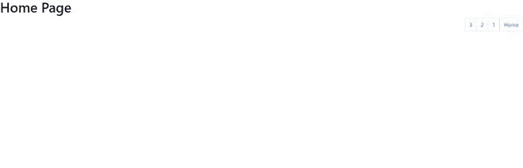
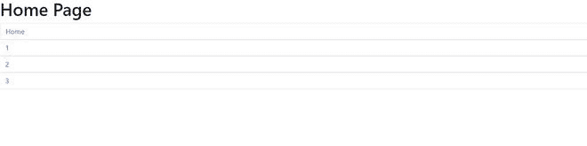
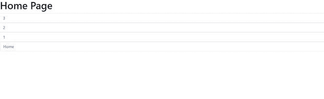
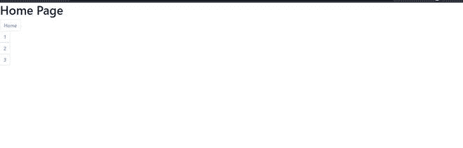
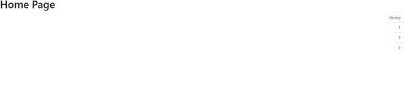

# 如何在 Bootstrap 4 中对齐分页？

> 原文:[https://www . geesforgeks . org/如何在 bootstrap-4 中对齐分页/](https://www.geeksforgeeks.org/how-to-align-pagination-in-bootstrap-4/)

在本文中，我们将学习如何使用 Bootstrap 类在网站上对齐分页。分页是引导程序中非常有用的组件。分页用于在网站的页面之间导航，因为它将文档分成不同的页面，并为它们提供数字。这将创建一个大块的连接链接，有助于轻松导航到不同的页面。因此，有助于增强用户体验。

**创建引导分页的步骤:**

**第一步:**从 bootstrap 的[官方](https://getbootstrap.com/docs/4.6/getting-started/introduction/)网站导入 **CDN** 的 CSS 和 JavaScript**T5 的 Bootstrap 链接。**

> <rel = "样式表"链接 href = " https://cdn . jsdelivr . net/NPM/bootstrap @ 4 . 6 . 1/dist/CSS/bootstrap . min . CSS "完整性= " sha 384-zcbcugajdkqs 1 kpbpd 7 tvep 5 iyje 0 ejuzqtgfld 2 ylzuqbkflfg/estxukn " cross origin = " anonymous "/>
> 
> <src = " https://cdn . jsdelivr . net/NPM/jquery @ 3 . 5 . 1/dist/jquery . slim . min . js "完整性= " sha 384-dfxdz 2 htph 0 LSS 5 nctpuj/zy 4c+ogpamofvy 38 mvbne+ibvyuew+orcxarkfj " cross origin = " anonymous ">

**第二步:**现在在<主体>标签内制作< ul >标签，类名为**【分页】**。

```html
<ul class="pagination"> </ul>
```

**第三步:**使用 **< li >标签**将< ul >标签内的所有页码加上类名**“页面-项目”。**

```html
<ul>
 <li class="page-item"></li>
 <li class="page-item"></li>
 <li class="page-item"></li>
</ul>
```

**第 4 步:**在每个 **< li >** 标签中，使用< a >标签添加页码，并为每个页面赋予“href”属性。

```html
<ul class="pagination">
 <li class="page-item">
    <a class="page-link" href="#">1</a>
 </li>
 <li class="page-item">
    <a class="page-link" href="#">2</a>
 </li>
 <li class="page-item">
    <a class="page-link" href="#">3</a>
 </li>
</ul>
```

在这个阶段，我们已经使用 Bootstrap 创建了一个基本的分页结构。

我们将通过示例了解分页的概念&各种可用的引导类。

**示例:**该示例说明了使用内容均匀对齐&页面项目类的引导分页。

## 超文本标记语言

```html
<!doctype html>
<html lang="en">

<head>

    <!-- Required meta tags -->
    <meta charset="utf-8">
    <meta name="viewport" 
          content="width=device-width, initial-scale=1">

    <!-- Bootstrap CSS -->
    <link rel="stylesheet" 
          href=
"https://cdn.jsdelivr.net/npm/bootstrap@4.6.1/dist/css/bootstrap.min.css" 
          integrity=
"sha384-zCbKRCUGaJDkqS1kPbPd7TveP5iyJE0EjAuZQTgFLD2ylzuqKfdKlfG/eSrtxUkn" 
          crossorigin="anonymous">
    <title>Pagination</title>
</head>

<body>
    <h1>Home Page</h1>
    <ul class="pagination justify-content-evenly">
        <li class="page-item">
            <a class="page-link" href="#">Home</a>
        </li>
        <li class="page-item">
            <a class="page-link" href="#">1</a>
        </li>
        <li class="page-item">
            <a class="page-link" href="#">2</a>
        </li>
        <li class="page-item">
            <a class="page-link" href="#">3</a>
        </li>
    </ul>
</body>

</html>
```

**输出:**从输出中，我们可以看到我们已经创建的分页在页面的最左边。


使用引导进行分页

**使用引导类对齐分页:**

可以使用引导程序中的 **flexbox-utilities** **类**在网页上对齐分页。

**flex-row:** 这个类被添加到组件中，帮助对齐行中的分页。这是默认值。

**语法:**

```html
<ul class="pagination flex-row">
    <li class="page-item"></li>        
</ul>
```

**示例:**此示例说明了使用灵活行类的引导分页。

## 超文本标记语言

```html
<!doctype html>
<html lang="en">

<head>

    <!-- Required meta tags -->
    <meta charset="utf-8">
    <meta name="viewport" 
          content="width=device-width, initial-scale=1">

    <!-- Bootstrap CSS -->
    <link rel="stylesheet" 
          href=
"https://cdn.jsdelivr.net/npm/bootstrap@4.6.1/dist/css/bootstrap.min.css" 
          integrity=
"sha384-zCbKRCUGaJDkqS1kPbPd7TveP5iyJE0EjAuZQTgFLD2ylzuqKfdKlfG/eSrtxUkn" 
          crossorigin="anonymous">
    <title>Pagination</title>
</head>

<body>
    <h1>Home Page</h1>
    <ul class="pagination flex-row">
        <li class="page-item">
            <a class="page-link" href="#">Home</a>
        </li>
        <li class="page-item">
            <a class="page-link" href="#">1</a>
        </li>
        <li class="page-item">
            <a class="page-link" href="#">2</a>
        </li>
        <li class="page-item">
            <a class="page-link" href="#">3</a>
        </li>
    </ul>
</body>

</html>
```

**输出:**


**flex-row-reverse:** 该类在组件内部添加时，有助于以行格式对齐分页，但方向相反，并位于页面的最右侧。

**语法:**

```html
<ul class="pagination flex-row-reverse">
        <li class="page-item"></li>
</ul>
```

**示例:**此示例说明了使用 flex-row-reverse 类的引导分页。

## 超文本标记语言

```html
<!doctype html>
<html lang="en">

<head>

    <!-- Required meta tags -->
    <meta charset="utf-8">
    <meta name="viewport" 
          content="width=device-width, initial-scale=1">

    <!-- Bootstrap CSS -->
    <link rel="stylesheet" 
          href=
"https://cdn.jsdelivr.net/npm/bootstrap@4.6.1/dist/css/bootstrap.min.css" 
          integrity=
"sha384-zCbKRCUGaJDkqS1kPbPd7TveP5iyJE0EjAuZQTgFLD2ylzuqKfdKlfG/eSrtxUkn" 
          crossorigin="anonymous">
    <title>Pagination</title>
</head>

<body>
    <h1>Home Page</h1>
    <ul class="pagination flex-row-reverse">
        <li class="page-item">
            <a class="page-link" href="#">Home</a>
        </li>
        <li class="page-item">
            <a class="page-link" href="#">1</a>
        </li>
        <li class="page-item">
            <a class="page-link" href="#">2</a>
        </li>
        <li class="page-item">
            <a class="page-link" href="#">3</a>
        </li>
    </ul>
</body>

</html>
```

**输出:**



**flex-column:** 该类在组件内部添加时有助于对齐列中的分页。

**语法:**

```html
<ul class="pagination flex-column">
          <li class="page-item"></li>
</ul>
```

**示例:**此示例说明了使用灵活列类的引导分页。

## 超文本标记语言

```html
<!doctype html>
<html lang="en">

<head>

    <!-- Required meta tags -->
    <meta charset="utf-8">
    <meta name="viewport" 
          content="width=device-width, initial-scale=1">

    <!-- Bootstrap CSS -->
    <link rel="stylesheet" 
          href=
"https://cdn.jsdelivr.net/npm/bootstrap@4.6.1/dist/css/bootstrap.min.css" 
          integrity=
"sha384-zCbKRCUGaJDkqS1kPbPd7TveP5iyJE0EjAuZQTgFLD2ylzuqKfdKlfG/eSrtxUkn" 
          crossorigin="anonymous">
    <title>Pagination</title>
</head>

<body>
    <h1>Home Page</h1>
    <ul class="pagination flex-column">
        <li class="page-item">
            <a class="page-link" href="#">Home</a>
        </li>
        <li class="page-item">
            <a class="page-link" href="#">1</a>
        </li>
        <li class="page-item">
            <a class="page-link" href="#">2</a>
        </li>
        <li class="page-item">
            <a class="page-link" href="#">3</a>
        </li>
    </ul>
</body>

</html>
```

**输出:**



**flex-column-reverse:** 该类在组件内部添加时有助于对齐列中的分页，但方向相反。

**语法:**

```html
<ul class="pagination flex-column-reverse">
        <li class="page-item"></li>
 </ul>
```

**示例:**此示例说明了使用 flex-column-reverse 类的引导分页。

## 超文本标记语言

```html
<!doctype html>
<html lang="en">

<head>

    <!-- Required meta tags -->
    <meta charset="utf-8">
    <meta name="viewport"
          content="width=device-width, initial-scale=1">

    <!-- Bootstrap CSS -->
    <link rel="stylesheet" 
          href=
"https://cdn.jsdelivr.net/npm/bootstrap@4.6.1/dist/css/bootstrap.min.css" 
          integrity=
"sha384-zCbKRCUGaJDkqS1kPbPd7TveP5iyJE0EjAuZQTgFLD2ylzuqKfdKlfG/eSrtxUkn" 
          crossorigin="anonymous">
    <title>Pagination</title>
</head>

<body>
    <h1>Home Page</h1>
    <ul class="pagination flex-column-reverse">
        <li class="page-item">
            <a class="page-link" href="#">Home</a>
        </li>
        <li class="page-item">
            <a class="page-link" href="#">1</a>
        </li>
        <li class="page-item">
            <a class="page-link" href="#">2</a>
        </li>
        <li class="page-item">
            <a class="page-link" href="#">3</a>
        </li>
    </ul>
</body>

</html>
```

**输出:**



**内容中心对齐:**该类在组件内部添加时，有助于以行的形式在中心对齐分页。

**语法:**

```html
<ul class="pagination justify-content-center">
         <li class="page-item"></li>
 </ul>
```

**示例:**此示例说明了使用内容中心对齐类的引导分页。

## 超文本标记语言

```html
<!doctype html>
<html lang="en">

<head>

    <!-- Required meta tags -->
    <meta charset="utf-8">
    <meta name="viewport"
          content="width=device-width, initial-scale=1">

    <!-- Bootstrap CSS -->
    <link rel="stylesheet" 
          href=
"https://cdn.jsdelivr.net/npm/bootstrap@4.6.1/dist/css/bootstrap.min.css" 
          integrity=
"sha384-zCbKRCUGaJDkqS1kPbPd7TveP5iyJE0EjAuZQTgFLD2ylzuqKfdKlfG/eSrtxUkn" 
          crossorigin="anonymous">
    <title>Pagination</title>
</head>

<body>
    <h1>Home Page</h1>
    <ul class="pagination justify-content-center">
        <li class="page-item">
            <a class="page-link" href="#">Home</a>
        </li>
        <li class="page-item">
            <a class="page-link" href="#">1</a>
        </li>
        <li class="page-item">
            <a class="page-link" href="#">2</a>
        </li>
        <li class="page-item">
            <a class="page-link" href="#">3</a>
        </li>
    </ul>
</body>

</html>
```

**输出** :


**对齐-内容-开始:**当这个类被添加到组件中时，有助于在行方向上对齐开始处的分页。

**语法:**

```html
<ul class="pagination Justify-content-start ">
          <li class="page-item"></li>
 </ul>
```

**示例:**该示例使用调整内容开始类说明了引导分页。

## 超文本标记语言

```html
<!doctype html>
<html lang="en">

<head>

    <!-- Required meta tags -->
    <meta charset="utf-8">
    <meta name="viewport"
          content="width=device-width, initial-scale=1">

    <!-- Bootstrap CSS -->
    <link rel="stylesheet" 
          href=
"https://cdn.jsdelivr.net/npm/bootstrap@4.6.1/dist/css/bootstrap.min.css" 
          integrity=
"sha384-zCbKRCUGaJDkqS1kPbPd7TveP5iyJE0EjAuZQTgFLD2ylzuqKfdKlfG/eSrtxUkn" 
          crossorigin="anonymous">
    <title>Pagination</title>
</head>

<body>
    <h1>Home Page</h1>
    <ul class="pagination justify-content-start">
        <li class="page-item">
            <a class="page-link" href="#">Home</a>
        </li>
        <li class="page-item">
            <a class="page-link" href="#">1</a>
        </li>
        <li class="page-item">
            <a class="page-link" href="#">2</a>
        </li>
        <li class="page-item">
            <a class="page-link" href="#">3</a>
        </li>
    </ul>
</body>

</html>
```

**输出:**


**调整内容结束:**该类在组件中添加时，有助于在行方向上对齐页面末尾的分页。

**语法:**

```html
 <ul class="pagination justify-content-end">
       <li class="page-item"></li>
</ul>
```

**示例:**此示例说明了使用两端对齐内容类的引导分页。

## 超文本标记语言

```html
<!doctype html>
<html lang="en">

<head>

    <!-- Required meta tags -->
    <meta charset="utf-8">
    <meta name="viewport" 
          content="width=device-width, initial-scale=1">

    <!-- Bootstrap CSS -->
    <link rel="stylesheet" 
          href=
"https://cdn.jsdelivr.net/npm/bootstrap@4.6.1/dist/css/bootstrap.min.css" 
          integrity=
"sha384-zCbKRCUGaJDkqS1kPbPd7TveP5iyJE0EjAuZQTgFLD2ylzuqKfdKlfG/eSrtxUkn" 
          crossorigin="anonymous">
    <title>Pagination</title>
</head>

<body>
    <h1>Home Page</h1>
    <ul class="pagination justify-content-end">
        <li class="page-item">
            <a class="page-link" href="#">Home</a>
        </li>
        <li class="page-item">
            <a class="page-link" href="#">1</a>
        </li>
        <li class="page-item">
            <a class="page-link" href="#">2</a>
        </li>
        <li class="page-item">
            <a class="page-link" href="#">3</a>
        </li>
    </ul>
</body>

</html>
```

**输出:**


**align-items-start:** 这个类在组件内部添加时，有助于以列的形式在页面开始时对齐分页。

**语法:**

```html
<ul class="pagination align-items-start">
       <li class="page-item"></li>
 </ul>
```

**示例:**此示例说明了使用 align-items-start 类的引导分页。

## 超文本标记语言

```html
<!doctype html>
<html lang="en">

<head>

    <!-- Required meta tags -->
    <meta charset="utf-8">
    <meta name="viewport"
          content="width=device-width, initial-scale=1">

    <!-- Bootstrap CSS -->
    <link rel="stylesheet" 
          href=
"https://cdn.jsdelivr.net/npm/bootstrap@4.6.1/dist/css/bootstrap.min.css" 
          integrity=
"sha384-zCbKRCUGaJDkqS1kPbPd7TveP5iyJE0EjAuZQTgFLD2ylzuqKfdKlfG/eSrtxUkn" 
          crossorigin="anonymous">
    <title>Pagination</title>
</head>

<body>
    <h1>Home Page</h1>
    <ul class="pagination align-items-start">
        <li class="page-item">
            <a class="page-link" href="#">Home</a>
        </li>
        <li class="page-item">
            <a class="page-link" href="#">1</a>
        </li>
        <li class="page-item">
            <a class="page-link" href="#">2</a>
        </li>
        <li class="page-item">
            <a class="page-link" href="#">3</a>
        </li>
    </ul>
</body>

</html>
```

**输出:**



**align-items-end:** 该类在组件内部添加时，有助于以列方式对齐页面末尾的分页。

**语法:**

```html
<ul class="pagination align-items-end">
       <li class="page-item"></li>
 </ul>
```

**示例:**此示例说明了使用 align-items-end 类的引导分页。

## 超文本标记语言

```html
<!doctype html>
<html lang="en">

<head>

    <!-- Required meta tags -->
    <meta charset="utf-8">
    <meta name="viewport" 
          content="width=device-width, initial-scale=1">

    <!-- Bootstrap CSS -->
    <link rel="stylesheet" 
          href=
"https://cdn.jsdelivr.net/npm/bootstrap@4.6.1/dist/css/bootstrap.min.css" 
          integrity=
"sha384-zCbKRCUGaJDkqS1kPbPd7TveP5iyJE0EjAuZQTgFLD2ylzuqKfdKlfG/eSrtxUkn" 
          crossorigin="anonymous">
    <title>Pagination</title>
</head>

<body>
    <h1>Home Page</h1>
    <ul class="pagination flex-column align-items-end">
        <li class="page-item">
            <a class="page-link" href="#">Home</a>
        </li>
        <li class="page-item">
            <a class="page-link" href="#">1</a>
        </li>
        <li class="page-item">
            <a class="page-link" href="#">2</a>
        </li>
        <li class="page-item">
            <a class="page-link" href="#">3</a>
        </li>
    </ul>
</body>

</html>
```

**输出**:



**对齐-项目-中心:**该类在组件内部添加时，有助于以列方式将分页与页面中心对齐。

**语法:**

```html
<ul class="pagination align-items-center">
     <li class="page-item"></li>
 </ul>
```

**示例:**此示例说明了使用对齐项目中心类的引导分页。

## 超文本标记语言

```html
<!doctype html>
<html lang="en">

<head>

    <!-- Required meta tags -->
    <meta charset="utf-8">
    <meta name="viewport"
          content="width=device-width, initial-scale=1">

    <!-- Bootstrap CSS -->
    <link rel="stylesheet" 
          href=
"https://cdn.jsdelivr.net/npm/bootstrap@4.6.1/dist/css/bootstrap.min.css" 
          integrity=
"sha384-zCbKRCUGaJDkqS1kPbPd7TveP5iyJE0EjAuZQTgFLD2ylzuqKfdKlfG/eSrtxUkn" 
          crossorigin="anonymous">
    <title>Pagination</title>
</head>

<body>
    <h1>Home Page</h1>
    <ul class="pagination flex-column align-items-center">
        <li class="page-item">
            <a class="page-link" href="#">Home</a>
        </li>
        <li class="page-item">
            <a class="page-link" href="#">1</a>
        </li>
        <li class="page-item">
            <a class="page-link" href="#">2</a>
        </li>
        <li class="page-item">
            <a class="page-link" href="#">3</a>
        </li>
    </ul>
</body>

</html>
```

**输出:**


**注:**

*   大部分分页都是以行的形式完成的。在极少数情况下，分页是按列格式给出的。
*   仅当分页以逐行格式完成时，调整类才起作用。
*   仅当分页以列方式完成时，对齐项才起作用。因此，我们必须添加 flex-column/flex-column-reverse 类。