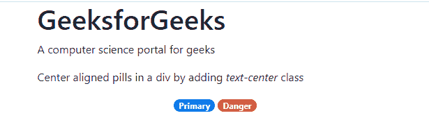

# 如何在 Bootstrap 中将药丸对准中心？

> 原文:[https://www . geesforgeks . org/如何将药丸对准引导中心/](https://www.geeksforgeeks.org/how-to-align-pills-to-center-in-bootstrap/)

Bootstrap 是一个免费的开源工具集合，用于创建响应性网站和网络应用程序。如果您是 Bootstrap 新手，我们强烈建议您浏览我们的 [Bootstrap 4 简介](https://www.geeksforgeeks.org/bootstrap-4-introduction/)。

药丸是一种更圆角的自举[徽章](https://www.geeksforgeeks.org/bootstrap-4-badges/)。默认情况下，药丸将作为一个[内嵌块](https://www.geeksforgeeks.org/what-is-the-difference-between-display-inline-and-display-inline-block-in-css/)元素。该行为在 Bootstrap 的核心样式表之一([_ badge . SCS](https://github.com/twbs/bootstrap/blob/main/scss/_badge.scss))中定义。

由于[药丸](https://www.geeksforgeeks.org/bootstrap-4-nav-pills/)是内嵌块元素，因此*药丸*的对齐由*药丸*的父容器中提到的对齐决定。如果父容器没有任何对齐规则，那么样式将继承自*药丸的最近祖先。*

我们可以使用 Bootstrap 内置的文本对齐类*文本居中*来居中一个药丸或一组药丸。如果我们将类*文本居中*添加到*药丸的父容器中，*我们可以居中对齐*药丸*。

## 超文本标记语言

```
<p>
    Center aligned pills in a div by
    adding <i>text-center</i> class
</p>

<div class="text-center">
    <span class="badge badge-pill badge-primary">
        Primary
    </span>

    <span class="badge badge-pill badge-danger">
        Danger
    </span>
</div>
```

**HTML 代码:**完整的 HTML 代码如下图所示。您可以在我们的 [IDE](https://ide.geeksforgeeks.org/tryit.php/Nd6zcGOkaX) 中查看以下代码的工作情况

## 超文本标记语言

```
<!DOCTYPE html>
<html lang="en">

<head>
    <title>Bootstrap Example</title>
    <meta charset="utf-8" />
    <meta name="viewport" content=
        "width=device-width, initial-scale=1" />

    <!-- Bootstrap CSS library -->
    <link rel="stylesheet" href=
"https://stackpath.bootstrapcdn.com/bootstrap/4.3.1/css/bootstrap.min.css"
        integrity=
"sha384-ggOyR0iXCbMQv3Xipma34MD+dH/1fQ784/j6cY/iJTQUOhcWr7x9JvoRxT2MZw1T"
        crossorigin="anonymous" />

    <!-- jQuery library -->
    <script src="https://code.jquery.com/jquery-3.3.1.slim.min.js"
        integrity=
"sha384-q8i/X+965DzO0rT7abK41JStQIAqVgRVzpbzo5smXKp4YfRvH+8abtTE1Pi6jizo"
        crossorigin="anonymous">
    </script>

    <!-- JS library -->
    <script src=
"https://cdnjs.cloudflare.com/ajax/libs/popper.js/1.14.7/umd/popper.min.js"
        integrity=
"sha384-UO2eT0CpHqdSJQ6hJty5KVphtPhzWj9WO1clHTMGa3JDZwrnQq4sF86dIHNDz0W1"
        crossorigin="anonymous">
    </script>

    <!-- Latest compiled JavaScript library -->
    <script src=
"https://stackpath.bootstrapcdn.com/bootstrap/4.3.1/js/bootstrap.min.js"
        integrity=
"sha384-JjSmVgyd0p3pXB1rRibZUAYoIIy6OrQ6VrjIEaFf/nJGzIxFDsf4x0xIM+B07jRM"
        crossorigin="anonymous">
    </script>
</head>

<body>
    <div class="container">
        <h1>GeeksforGeeks</h1>

<p>A computer science portal for geeks</p>

        <!-- Add pills -->

<p>
            Center aligned pills in a div by
            adding <i>text-center</i> class
        </p>

        <div class="text-center">
            <span class="badge badge-pill badge-primary">
                Primary
            </span>

            <span class="badge badge-pill badge-danger">
                Danger
            </span>
        </div>
    </div>
</body>

</html>
```

**输出:**



自举药丸

同样，我们可以使用*文本-右*来右对齐药丸，使用*文本-左*来左对齐药丸。

在某些情况下，将类*文本中心*添加到父类是不可能的，因为这会影响父类的其他样式。在这些情况下，推荐的方法是用块级标签(如 [div](https://www.geeksforgeeks.org/div-tag-html/) 或[段落](https://www.geeksforgeeks.org/html-paragraph/)标签)包装*药丸*