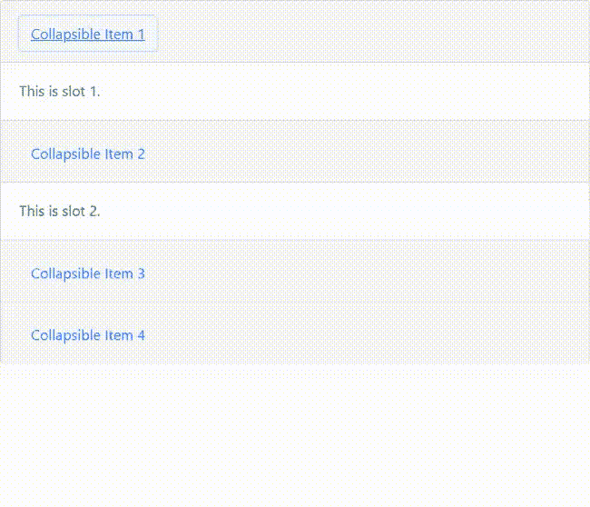
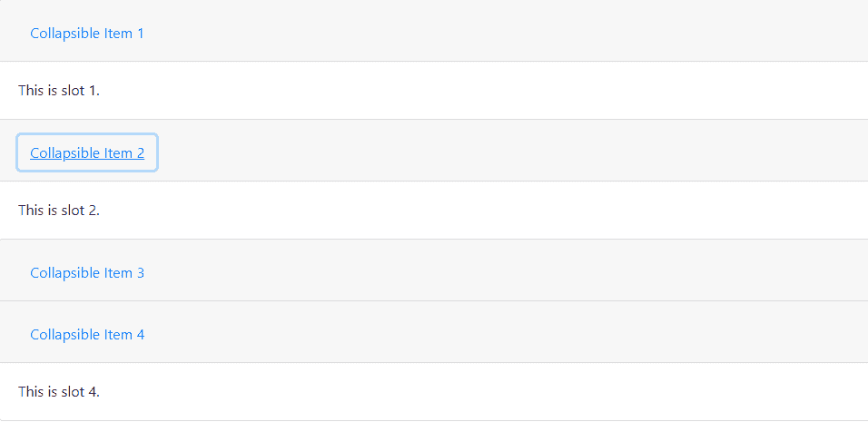
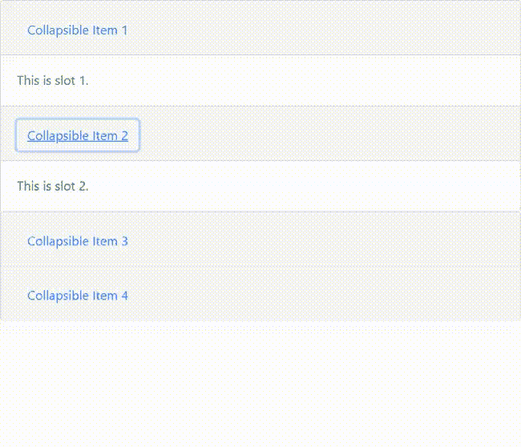

# 如何使用 Bootstrap 始终显示动态折叠的前两行？

> 原文:[https://www . geeksforgeeks . org/如何始终显示动态折叠中的前两行-使用引导/](https://www.geeksforgeeks.org/how-to-always-show-first-two-rows-in-dynamic-collapse-using-bootstrap/)

Bootstrap 是一个开源的前端 CSS 框架，广泛用于交互式网站的开发。带有 HTML 和 JavaScript 的 Bootstrap 为用户界面增加了交互性。jQuery 是一个 JS 库，用于操纵 HTML DOM、事件处理、CSS 动画和 Ajax。jQuery 也是超过 73%的开发人员使用的免费开源库。jQuery 以简化的方式完成由 JavaScript 执行的任务。

在本文中，我们将讨论在动态折叠中显示前两行的方法。Bootstrap 附带了多种功能，Bootstrap 提供的功能之一是用于显示和隐藏内容的可折叠组件。按钮或锚点用作我们切换的特定元素的触发器。以下是有助于折叠以显示元素的类。

**类:**

*   **。折叠:**该类隐藏内容
*   **。折叠**:此类应用于从折叠状态到可见状态的转换，反之亦然
*   **.collapse.show** :此类显示内容。

**可及性:**一架手风琴就能证明我们的要求。“卡片”组件用于扩展默认折叠行为以创建折叠。*咏叹调扩展的*属性被添加到控制元素中。此属性表示绑定到控件的可折叠元素的当前状态。

如果默认情况下，可折叠元素是关闭的，则属性设置为 *aria-expanded="false"* 。如果默认情况下使用 *show* 类显示可折叠元素，则在控件上设置 *aria-expanded="true"* 。这将根据可折叠元素的当前状态在控件上自动切换该属性。

如果控制元素以单个可折叠元素为目标，即*数据目标*属性指向“id”选择器，那么我们应该将 *aria-controls* 属性添加到包含可折叠元素“id”的控制元素中。显示可折叠项时，父项下的所有可折叠元素都将关闭。

**例 1:**

```html
<!DOCTYPE html>
<html>

<head>
    <!-- CSS only -->
    <link rel="stylesheet" href=
"https://stackpath.bootstrapcdn.com/bootstrap/4.5.2/css/bootstrap.min.css"
        integrity=
"sha384-JcKb8q3iqJ61gNV9KGb8thSsNjpSL0n8PARn9HuZOnIxN0hoP+VmmDGMN5t9UJ0Z"
        crossorigin="anonymous">

    <!-- JS, Popper.js, jquery -->
    <script src="https://code.jquery.com/jquery-3.5.1.slim.min.js"
        integrity=
"sha384-DfXdz2htPH0lsSSs5nCTpuj/zy4C+OGpamoFVy38MVBnE+IbbVYUew+OrCXaRkfj"
        crossorigin="anonymous">
    </script>

    <script src=
"https://cdn.jsdelivr.net/npm/popper.js@1.16.1/dist/umd/popper.min.js"
        integrity=
"sha384-9/reFTGAW83EW2RDu2S0VKaIzap3H66lZH81PoYlFhbGU+6BZp6G7niu735Sk7lN"
        crossorigin="anonymous">
    </script>

    <script src=
"https://stackpath.bootstrapcdn.com/bootstrap/4.5.2/js/bootstrap.min.js"
        integrity=
"sha384-B4gt1jrGC7Jh4AgTPSdUtOBvfO8shuf57BaghqFfPlYxofvL8/KUEfYiJOMMV+rV"
        crossorigin="anonymous">
    </script>
</head>

<body>
    <!-- Accordian wrapper starts -->
    <div class="accordion" id="accordionExample">
        <div class="card">
            <!-- Visible portion in collapsed state -->
            <div class="card-header" id="headingOne">
                <h2 class="mb-0">
                    <!-- no data-toggle, data-target, 
                        aria-expanded, aria-controls 
                        attributes are used -->
                    <!-- The toggling functionality is lost -->
                    <button class="btn btn-link" type="button">
                        Collapsible Item 1
                    </button>
                </h2>
            </div>

            <!-- Content to be displayed in open state -->
            <!-- data-parent attribute removed so that 
                the cards are not dependent on each other -->
            <div id="collapseOne" class="collapse show" 
                aria-labelledby="headingOne">
                <div class="card-body">
                    This is slot 1.
                </div>
            </div>
        </div>
        <div class="card">
            <!--visible portion in collapsed state-->
            <div class="card-header" id="headingTwo">
                <h2 class="mb-0">
                    <!-- no data-toggle, data-target, 
                        aria-expanded, aria-controls 
                        attributes are used -->
                    <!-- The toggling functionality is lost-->
                    <button class="btn btn-link collapsed" 
                        type="button">
                        Collapsible Item 2
                    </button>
                </h2>
            </div>

            <!-- Content to be displayed in open state -->
            <!-- data-parent attribute removed so that the
                cards are not dependent on each other-->
            <div id="collapseTwo" class="collapse show" 
                aria-labelledby="headingTwo">
                <div class="card-body">
                    This is slot 2.
                </div>
            </div>
        </div>
        <div class="card">
            <div class="card-header" id="headingThree">
                <h2 class="mb-0">
                    <!-- data-toggle, data-target, 
                        aria-expanded, aria-controls 
                        attributes are used -->
                    <!-- As a result the toggling 
                        functionality are intact -->
                    <button class="btn btn-link collapsed" 
                        type="button" data-toggle="collapse"
                        data-target="#collapseThree" 
                        aria-expanded="false" 
                        aria-controls="collapseThree">
                        Collapsible Item 3
                    </button>
                </h2>
            </div>
            <div id="collapseThree" class="collapse" 
                aria-labelledby="headingThree" 
                data-parent="#accordionExample">
                <div class="card-body">
                    This is slot 3.
                </div>
            </div>
        </div>
        <div class="card">
            <div class="card-header" id="headingFour">
                <h2 class="mb-0">
                    <!-- data-toggle, data-target, aria-expanded, 
                        aria-controls attributes are used -->
                    <!-- The toggling functionality are intact -->
                    <button class="btn btn-link collapsed" 
                        type="button" data-toggle="collapse"
                        data-target="#collapseFour" 
                        aria-expanded="false" 
                        aria-controls="collapseFour">
                        Collapsible Item 4
                    </button>
                </h2>
            </div>
            <div id="collapseFour" class="collapse" 
                aria-labelledby="headingFour" 
                data-parent="#accordionExample">
                <div class="card-body">
                    This is slot 4.
                </div>
            </div>
        </div>
    </div>
</body>

</html>
```

**输出:**


在以下示例中，默认情况下，手风琴的前两行始终保持打开状态。即使单击行标题，也没有切换效果。这是因为前两行没有导致切换效果的“数据切换”、“数据目标”、“aria 扩展”、“aria 控制”属性。由于前两行的*数据父级*属性也被移除，它们独立于显示切换功能的其余行。最后两行完整保留了所有必需的属性，因此它们显示了动态折叠功能。

**方法:**第二种方法与第一种方法非常相似，只是我们创建了嵌套手风琴，并删除了前两行的*数据切换*属性。前两行有*数据父级*属性。如果用户希望在前两行添加折叠特征，添加*数据-切换*属性。单击第一行，标题将打开并折叠第二行，反之亦然。前两行独立于后两行，作为第一行和第二行的*数据父项*属性值。

```html
<!DOCTYPE html>
<html>

<head>

    <!-- CSS only -->
    <link rel="stylesheet" href=
"https://stackpath.bootstrapcdn.com/bootstrap/4.5.2/css/bootstrap.min.css"
        integrity=
"sha384-JcKb8q3iqJ61gNV9KGb8thSsNjpSL0n8PARn9HuZOnIxN0hoP+VmmDGMN5t9UJ0Z"
        crossorigin="anonymous">

    <!-- JS, Popper.js, jquery and jQuery autocomplete -->
    <script src="https://code.jquery.com/jquery-3.5.1.slim.min.js"
        integrity=
"sha384-DfXdz2htPH0lsSSs5nCTpuj/zy4C+OGpamoFVy38MVBnE+IbbVYUew+OrCXaRkfj" 
        crossorigin="anonymous">
    </script>
    <script src=
"https://cdn.jsdelivr.net/npm/popper.js@1.16.1/dist/umd/popper.min.js"
        integrity=
"sha384-9/reFTGAW83EW2RDu2S0VKaIzap3H66lZH81PoYlFhbGU+6BZp6G7niu735Sk7lN"
        crossorigin="anonymous">
    </script>
    <script src=
"https://stackpath.bootstrapcdn.com/bootstrap/4.5.2/js/bootstrap.min.js"
        integrity=
"sha384-B4gt1jrGC7Jh4AgTPSdUtOBvfO8shuf57BaghqFfPlYxofvL8/KUEfYiJOMMV+rV"
        crossorigin="anonymous">
    </script>
</head>

<body>
    <!-- Accordian wrapper starts -->
    <div class="accordion" id="accordionExample">
        <div class="card">
            <!-- Visible portion in collapsed state -->
            <div class="card-header" id="headingOne">
                <h2 class="mb-0">
                    <!-- data-toggle attribute removed -->
                    <button class="btn btn-link" type="button" 
                        data-target="#collapseOne" 
                        aria-expanded="true"
                        aria-controls="collapseOne">
                        Collapsible Item 1
                    </button>
                </h2>
            </div>
            <!--content to be displayed in open state-->
            <div id="collapseOne" class="collapse show" 
                aria-labelledby="headingOne" 
                data-parent="#accordionExample">
                <div class="card-body">
                    This is slot 1.
                </div>
            </div>
        </div>
        <div class="card">
            <!-- Visible portion in collapsed state -->
            <div class="card-header" id="headingTwo">
                <h2 class="mb-0">
                    <!--data-toggle attribute removed-->
                    <button class="btn btn-link collapsed" 
                        type="button" data-target="#collapseTwo" 
                        aria-expanded="true"
                        aria-controls="collapseTwo">
                        Collapsible Item 2
                    </button>
                </h2>
            </div>
            <!-- Content to be displayed in open state -->
            <div id="collapseTwo" class="collapse show" 
                aria-labelledby="headingTwo" 
                data-parent="#accordionExample">
                <div class="card-body">
                    This is slot 2.
                </div>
            </div>
        </div>
        <!-- nested accordion -->
        <div class="accordion" id="accordionExample1">
            <div class="card">
                <!--visible portion in collapsed state-->
                <div class="card-header" id="headingThree">
                    <h2 class="mb-0">
                        <button class="btn btn-link collapsed"
                            type="button" data-toggle="collapse"
                            data-target="#collapseThree" 
                            aria-expanded="false" 
                            aria-controls="collapseThree">
                            Collapsible Item 3
                        </button>
                    </h2>
                </div>
                <!-- Content to be displayed in open state -->
                <div id="collapseThree" class="collapse" 
                    aria-labelledby="headingThree"
                    data-parent="#accordionExample1">
                    <div class="card-body">
                        This is slot 3.
                    </div>
                </div>
            </div>
            <div class="card">

                <!-- Visible portion in collapsed state -->
                <div class="card-header" id="headingFour">
                    <h2 class="mb-0">
                        <button class="btn btn-link collapsed" 
                            type="button" data-toggle="collapse"
                            data-target="#collapseFour" 
                            aria-expanded="false" 
                            aria-controls="collapseFour">
                            Collapsible Item 4
                        </button>
                    </h2>
                </div>

                <!-- Content to be displayed in open state -->
                <div id="collapseFour" class="collapse" 
                    aria-labelledby="headingFour" 
                    data-parent="#accordionExample1">
                    <div class="card-body">
                        This is slot 4.
                    </div>
                </div>
            </div>
        </div>
        <!-- end of nested accordian-->
    </div>
</body>

</html>
```

**输出:**

**视频输出:**
