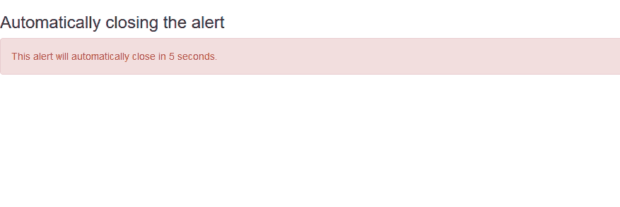
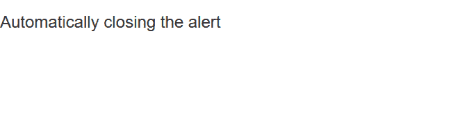
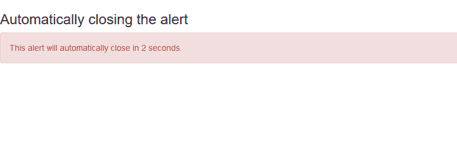

# 如何使用 Twitter Bootstrap 自动关闭提醒？

> 原文:[https://www . geesforgeks . org/如何自动关闭警报-使用-twitter-bootstrap/](https://www.geeksforgeeks.org/how-to-automatically-close-alerts-using-twitter-bootstrap/)

所有现代 web 应用程序都使用警报来向用户显示消息。这些警报有一个关闭按钮来关闭它们，或者可以使用推特引导自动关闭。在这篇文章中，我们将使用 twitter Bootstrap 创建自动关闭警报。

基本思想是使用 jQuery setTimeout()方法在指定时间后关闭警报。

**语法:**

```html
setTimeout(function, delay)

```

**注意:**延迟以毫秒为单位定义。1 秒等于 1000 毫秒。

**示例 1:** 在此示例中，使用 id 在脚本中访问警报，然后警报在 5 秒钟后关闭。

## 超文本标记语言

```html
<!DOCTYPE html>
<html>

<head>
    <title>
          How to Automatically Close Alerts 
          using Twitter Bootstrap ?
      </title>

    <!-- Including Bootstrap CSS -->
    <link rel="stylesheet" href=
"https://maxcdn.bootstrapcdn.com/bootstrap/3.4.0/css/bootstrap.min.css">

    <!-- Including jQuery -->
    <script src=
"https://cdnjs.cloudflare.com/ajax/libs/jquery/3.2.1/jquery.js">
    </script>

    <!-- Including Bootstrap JS -->
    <script src=
"https://maxcdn.bootstrapcdn.com/bootstrap/3.4.1/js/bootstrap.min.js">
    </script>
</head>

<body>
    <h3>Automatically closing the alert</h3>

    <!-- Showing alert -->
    <div id="alert" class="alert alert-danger">
        This alert will automatically 
        close in 5 seconds.
    </div>

    <script type="text/javascript">
        setTimeout(function () {

            // Closing the alert
            $('#alert').alert('close');
        }, 5000);
    </script>
</body>

</html>
```




**示例 2:** 在本例中，使用警报的类在脚本中访问警报，警报在 2 秒后关闭。

## 超文本标记语言

```html
<!DOCTYPE html>
<html>

<head>
    <meta http-equiv="content-type" 
        content="text/html;charset=utf-8" />
    <title>
          How to Automatically Close Alerts 
          using Twitter Bootstrap ?
    </title>

    <!-- Including Bootstrap CSS -->
    <link rel="stylesheet" href=
"https://maxcdn.bootstrapcdn.com/bootstrap/3.4.0/css/bootstrap.min.css">

    <!-- Including jQuery -->
    <script src=
"https://cdnjs.cloudflare.com/ajax/libs/jquery/3.2.1/jquery.js">
    </script>

    <!-- Including Bootstrap JS -->
    <script src=
"https://maxcdn.bootstrapcdn.com/bootstrap/3.4.1/js/bootstrap.min.js">
    </script>
</head>

<body>
    <h3>Automatically closing the alert</h3>

    <!-- Showing alert -->
    <div class="alert alert-danger">
        This alert will automatically 
        close in 2 seconds.
    </div>

    <script type="text/javascript">
        setTimeout(function () {

            // Closing the alert
            $('.alert').alert('close');
        }, 2000);
    </script>
</body>

</html>
```



**例 3:** 在本例中，bootstrap *hide* 类被动态添加到 alert 中，5 秒后关闭 alert。 ***addClass()*** 是使用 JavaScript 向任何元素添加类的方法。

## 超文本标记语言

```html
<!DOCTYPE html>
<html>

<head>
    <meta http-equiv="content-type" 
        content="text/html;charset=utf-8" />

    <title>
        How to Automatically Close Alerts
        using Twitter Bootstrap ?
    </title>

    <!-- Including Bootstrap CSS -->
    <link rel="stylesheet" href=
"https://maxcdn.bootstrapcdn.com/bootstrap/3.4.0/css/bootstrap.min.css">

    <!-- Including jQuery -->
    <script src=
"https://cdnjs.cloudflare.com/ajax/libs/jquery/3.2.1/jquery.js">
    </script>

    <!-- Including Bootstrap JS -->
    <script src=
"https://maxcdn.bootstrapcdn.com/bootstrap/3.4.1/js/bootstrap.min.js">
    </script>
</head>

<body>
    <h3>Automatically closing the alert</h3>

    <!-- Showing alert -->
    <div id="alert" class="alert alert-danger">
        This alert will automatically 
        close in 5 seconds.
    </div>

    <script type="text/javascript">
        setTimeout(function () {

            // Adding the class dynamically
            $('#alert').addClass('hide');
        }, 5000);
    </script>
</body>

</html>
```

**输出:**


