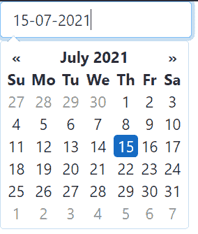
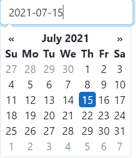
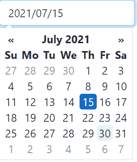

# 如何更改特定日期格式的 Bootstrap 日期选择器？

> 原文:[https://www . geesforgeks . org/how-change-bootstrap-date picker-with-specific-date-format/](https://www.geeksforgeeks.org/how-to-change-bootstrap-datepicker-with-specific-date-format/)

**日期选择器**是 Bootstrap Framework 的一个组件，通过提供用户友好的界面，允许用户选择日期。使用日期选择器，我们可以从日期选择器对话框中选择一个日期，这比手动在输入字段中键入日期要好得多。

此外，我们可以根据需求格式化日期选择器。DatePicker 提供了各种日期格式，如*DD/mm/yyy*、*yyy-mm-DD*、 *dd/mm/yyyy* 、*DD-mm-yyy、*等，从中可以选择最符合要求的一种。要使用这种自定义的日期格式，我们需要在 jQuery DatePicker 中设置这种格式。

下面是一些不同日期格式的例子。

**例 1:** 以下是**格式的日期选择器。**

## 超文本标记语言

```
<!DOCTYPE html>
<html>
  <head>
    <link
      href=
"https://maxcdn.bootstrapcdn.com/bootstrap/4.0.0/css/bootstrap.min.css"
      rel="stylesheet"
    />
    <link
      href=
"https://cdnjs.cloudflare.com/ajax/libs/bootstrap-datepicker/1.5.0/css/bootstrap-datepicker.css"
      rel="stylesheet"
    />
    <script src=
"https://ajax.googleapis.com/ajax/libs/jquery/1.9.1/jquery.js">
    </script>
    <script src=
"https://maxcdn.bootstrapcdn.com/bootstrap/4.0.0/js/bootstrap.min.js">
    </script>
    <script src=
"https://cdnjs.cloudflare.com/ajax/libs/bootstrap-datepicker/1.5.0/js/bootstrap-datepicker.js">
    </script>
  </head>
  <body>
    <input type="text" class="date form-control" style="width: 200px" />

    <script type="text/javascript">
      $(".date").datepicker({
        format: "dd-mm-yyyy",
      });
    </script>
  </body>
</html>
```

**输出:**



**示例 2:** 以下是 *yyyy-mm-dd* 格式的日期选择器。

## 超文本标记语言

```
<!DOCTYPE html>
<html>
  <head>
    <link
      href=
"https://maxcdn.bootstrapcdn.com/bootstrap/4.0.0/css/bootstrap.min.css"
      rel="stylesheet"
    />
    <link
      href=
"https://cdnjs.cloudflare.com/ajax/libs/bootstrap-datepicker/1.5.0/css/bootstrap-datepicker.css"
      rel="stylesheet"
    />
    <script src=
"https://ajax.googleapis.com/ajax/libs/jquery/1.9.1/jquery.js">
    </script>
    <script src=
"https://maxcdn.bootstrapcdn.com/bootstrap/4.0.0/js/bootstrap.min.js">
    </script>
    <script src=
"https://cdnjs.cloudflare.com/ajax/libs/bootstrap-datepicker/1.5.0/js/bootstrap-datepicker.js">
    </script>
  </head>
  <body>
    <input type="text" class="date form-control" style="width: 200px" />

    <script type="text/javascript">
      $(".date").datepicker({
        format: "yyyy-mm-dd",
      });
    </script>
  </body>
</html>
```

**输出:**



**例 3:** 以下是*日/月/年*格式的日期选择器。

## 超文本标记语言

```
<!DOCTYPE html>
<html>
  <head>
    <link
      href=
"https://maxcdn.bootstrapcdn.com/bootstrap/4.0.0/css/bootstrap.min.css"
      rel="stylesheet"
    />
    <link
      href=
"https://cdnjs.cloudflare.com/ajax/libs/bootstrap-datepicker/1.5.0/css/bootstrap-datepicker.css"
      rel="stylesheet"
    />
    <script src=
"https://ajax.googleapis.com/ajax/libs/jquery/1.9.1/jquery.js">
    </script>
    <script src=
"https://maxcdn.bootstrapcdn.com/bootstrap/4.0.0/js/bootstrap.min.js">
    </script>
    <script src=
"https://cdnjs.cloudflare.com/ajax/libs/bootstrap-datepicker/1.5.0/js/bootstrap-datepicker.js">
    </script>
  </head>
  <body>
    <input type="text" class="date form-control" style="width: 200px" />

    <script type="text/javascript">
      $(".date").datepicker({
        format: "dd/mm/yyyy",
      });
    </script>
  </body>
</html>
```

**输出:**


**例 4:** 以下是 *yyyy/mm/dd* 格式的日期选择器。

## 超文本标记语言

```
<!DOCTYPE html>
<html>
  <head>
    <link
      href=
"https://maxcdn.bootstrapcdn.com/bootstrap/4.0.0/css/bootstrap.min.css"
      rel="stylesheet"
    />
    <link
      href=
"https://cdnjs.cloudflare.com/ajax/libs/bootstrap-datepicker/1.5.0/css/bootstrap-datepicker.css"
      rel="stylesheet"
    />
    <script src=
"https://ajax.googleapis.com/ajax/libs/jquery/1.9.1/jquery.js">
    </script>
    <script src=
"https://maxcdn.bootstrapcdn.com/bootstrap/4.0.0/js/bootstrap.min.js">
    </script>
    <script src=
"https://cdnjs.cloudflare.com/ajax/libs/bootstrap-datepicker/1.5.0/js/bootstrap-datepicker.js">
    </script>
  </head>
  <body>
    <input type="text" class="date form-control" style="width: 200px" />

    <script type="text/javascript">
      $(".date").datepicker({
        format: "yyyy/mm/dd",
      });
    </script>
  </body>
</html>
```

**输出:**

