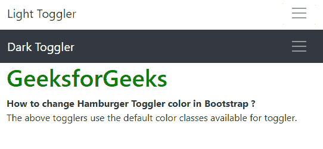

# 如何在 Bootstrap 中改变汉堡托格勒的颜色？

> 原文:[https://www . geesforgeks . org/how-change-hamburger-toggler-color-in-bootstrap/](https://www.geeksforgeeks.org/how-to-change-hamburger-toggler-color-in-bootstrap/)

在 Bootstrap 4 中，可以使用两种方法来更改汉堡包的颜色:

**方法 1:使用内置的颜色类**

hamburger toggler 颜色由两个用于更改导航栏中内容颜色的内置类控制:

*   **。navbar-light:** 这个类用于将导航栏内容的颜色设置为深色。它将更改 toggler 图标，使其具有更深的线条。
*   **。nav bar-深色:**该类用于将导航栏内容的颜色设置为浅色。它会将 toggler 图标更改为白线。

**注:**命名好像有点倒退。不应该吗？nav bar-深色使内容更暗。navbar 灯，让它更轻？深色和浅色代表背景的颜色，而不是导航栏上的内容。

**示例:**

```
<!DOCTYPE html>
<html>

<head>
    <title>
      How to change Hamburger Toggler color in Bootstrap ?
  </title>

    <!-- Include Bootstrap CSS -->
    <link rel="stylesheet"
          href=
"https://stackpath.bootstrapcdn.com/bootstrap/4.3.1/css/bootstrap.min.css">
</head>

<body>
    <nav class="navbar navbar-light bg-lignt">
        <a href="/" class="navbar-brand">
          Light Toggler
      </a>
        <button class="navbar-toggler ml-auto" 
                type="button" 
                data-toggle="collapse"
                data-target="#nav1">
            <span class="navbar-toggler-icon my-toggler">
          </span>
        </button>
        <div class="navbar-collapse collapse" id="nav1">
            <ul class="navbar-nav mx-auto">
                <li class="nav-item">
                    <a class="nav-link"
                       href="#">Link 1</a>
                </li>
                <li class="nav-item">
                    <a class="nav-link"
                       href="#">Link 2</a>
                </li>
            </ul>
        </div>
    </nav>
    <nav class="navbar navbar-dark bg-dark">
        <a href="/" class="navbar-brand">
          Dark Toggler
      </a>
        <button class="navbar-toggler ml-auto" 
                type="button"
                data-toggle="collapse" 
                data-target="#nav2">
            <span class="navbar-toggler-icon">
          </span>
        </button>
        <div class="navbar-collapse collapse" 
             id="nav2">
            <ul class="navbar-nav mx-auto">
                <li class="nav-item">
                    <a class="nav-link"
                       href="#">Link 1</a>
                </li>
                <li class="nav-item">
                    <a class="nav-link" 
                       href="#">Link 2</a>
                </li>
            </ul>
        </div>
    </nav>

    <div class="container">
        <h1 style="color: green">
          GeeksforGeeks
      </h1>
        <b>How to change Hamburger Toggler
          color in Bootstrap ?</b>
        <p>The above togglers use the default 
          color classes available for toggler.</p>
    </div>

    <script src=
"https://code.jquery.com/jquery-3.2.1.slim.min.js">
  </script>
    <script src=
"https://cdnjs.cloudflare.com/ajax/libs/popper.js/1.12.9/umd/popper.min.js">
  </script>
    <script src=
"https://maxcdn.bootstrapcdn.com/bootstrap/4.0.0/js/bootstrap.min.js">
  </script>
</body>

</html>
```

**输出:**


**方法 2:为 toggler 创建一个自定义类**

Bootstrap 使用一个 SVG 图像来表示 toggler。可以在图标内的线条上用修改后的颜色创建新的图像数据。图像数据中的笔画属性用于表示 RGB 值中的颜色。该值被修改为所需的颜色。

该新图标用于**。navbar-toggler-icon** 类具有**背景图像**，因此内置图标被这个新的 toggler 图标替换。

> /*更改图像数据描边属性中的颜色*/
> 。定制的托格勒。nav bar-toggler-icon {
> background-image:URL(" data:image/SVG+XML；charset=utf8、% 3cs VG viewBox = ' 0 0 32 32 ' xmlns = ' http://www . w3 . org/2000/SVG ' % 3E % 3 path stroke = ' rgba(0，128，0，0.8)' stroke-width = ' 2 ' stroke-line cap = ' round ' stroke-miterlimit = ' 10 ' d = ' M4 8h 24 M4 16h 24 24h 24 '/% 3E % 3C/SVG % 3E ")；

通过指定具有所需颜色的**边框颜色**属性来设置网格线的边框颜色。

```
/* Set the border color to the desired color */
.custom-toggler.navbar-toggler {
    border-color: lightgreen;
}
```

**示例:**

```
<!DOCTYPE html>
<html>

<head>
    <title>How to change Hamburger
      Toggler color in Bootstrap ?</title>

    <!-- Include Bootstrap CSS -->
    <link rel="stylesheet"
          href=
"https://stackpath.bootstrapcdn.com/bootstrap/4.3.1/css/bootstrap.min.css">
    <style>
        /* Set the border color */

        .custom-toggler.navbar-toggler {
            border-color: lightgreen;
        }
        /* Setting the stroke to green using rgb values (0, 128, 0) */

        .custom-toggler .navbar-toggler-icon {
            background-image: url(
"data:image/svg+xml;charset=utf8,%3Csvg viewBox='0 0 32 32' xmlns='http://www.w3.org/2000/svg'%3E%3Cpath stroke='rgba(0, 128, 0, 0.8)' stroke-width='2' stroke-linecap='round' stroke-miterlimit='10' d='M4 8h24M4 16h24M4 24h24'/%3E%3C/svg%3E");
        }
    </style>
</head>

<body>
    <nav class="navbar navbar-dark bg-dark">
        <a href="/" class="navbar-brand">Custom Toggler</a>
        <button class="navbar-toggler ml-auto custom-toggler" 
                type="button" 
                data-toggle="collapse" 
                data-target="#nav3">
            <span class="navbar-toggler-icon"></span>
        </button>
        <div class="navbar-collapse collapse" id="nav3">
            <ul class="navbar-nav mx-auto">
                <li class="nav-item">
                    <a class="nav-link" href="#">Link 1</a>
                </li>
                <li class="nav-item">
                    <a class="nav-link" href="#">Link 2</a>
                </li>
            </ul>
        </div>
    </nav>

    <div class="container">
        <h1 style="color: green">GeeksforGeeks</h1>
        <b>How to change Hamburger Toggler color in Bootstrap ?</b>
        <p>The above togglers use the a custom classe for the toggler.</p>
    </div>

    <script src=
"https://code.jquery.com/jquery-3.2.1.slim.min.js">
  </script>
    <script src=
"https://cdnjs.cloudflare.com/ajax/libs/popper.js/1.12.9/umd/popper.min.js">
  </script>
    <script src=
 "https://maxcdn.bootstrapcdn.com/bootstrap/4.0.0/js/bootstrap.min.js">
  </script>
</body>

</html>
```

**输出:**

