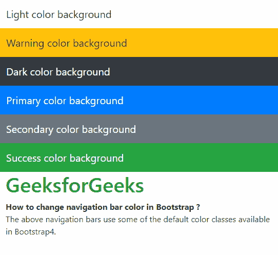
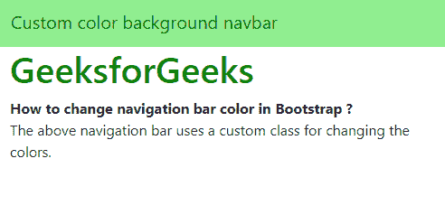

# 如何在 Bootstrap 中更改导航栏颜色？

> 原文:[https://www . geesforgeks . org/how-change-navigation-bar-color-in-bootstrap/](https://www.geeksforgeeks.org/how-to-change-navigation-bar-color-in-bootstrap/)

在 Bootstrap 中可以使用两种方法更改导航栏颜色:
**方法 1:使用内置颜色类**
**更改文本颜色**
可以使用两个内置类来更改导航栏的文本颜色:

*   **navbar-light:** 这个类将文本的颜色设置为深色。这在使用浅色背景时使用。
*   **nav bar-深色:**这个类将文本的颜色设置为浅色。这在使用深色背景时使用。

**改变背景颜色:**
Bootstrap 4 有几个内置的类，适用于任何背景的颜色。这些可用于设置导航栏背景的颜色。可用的各种背景类有:

*   **。BG-原色:**这将颜色设置为原色。
*   **。bg-secondary:** 这将颜色设置为二级色。
*   **。bg-success:** 这将颜色设置为成功颜色。
*   **。BG-危险:**这将颜色设置为危险颜色。
*   **。BG-警告:**这将颜色设置为警告颜色。
*   **。bg-info:** 这将颜色设置为信息颜色。
*   **。bg-light:** 这将颜色设置为浅色。
*   **。BG-深色:**这将颜色设置为深色。
*   **。bg-white:** 这将颜色设置为白色。
*   **。bg-transparent:** 这将 navbar 设置为透明。

**例:**

## 超文本标记语言

```
<!DOCTYPE html>
<html>

<head>
    <title>
      How to change navigation bar color in Bootstrap ?
  </title>

    <!-- Include Bootstrap CSS -->
    <link rel="stylesheet" href=
"https://stackpath.bootstrapcdn.com/bootstrap/4.3.1/css/bootstrap.min.css">
</head>

<body>
    <!-- Navbar text is dark and background is light -->
    <nav class="navbar navbar-light bg-light">
        <a class="navbar-brand" href="#">
          Light color background
      </a>
    </nav>

    <nav class="navbar navbar-light bg-warning">
        <a class="navbar-brand" href="#">
          Warning color background
      </a>
    </nav>

    <!-- Navbar text is light and background is dark -->
    <nav class="navbar navbar-dark bg-dark">
        <a class="navbar-brand" href="#">
          Dark color background
      </a>
    </nav>

    <nav class="navbar navbar-dark bg-primary">
        <a class="navbar-brand" href="#">
          Primary color background
      </a>
    </nav>

    <nav class="navbar navbar-dark bg-secondary">
        <a class="navbar-brand" href="#">
          Secondary color background
      </a>
    </nav>

    <nav class="navbar navbar-dark bg-success">
        <a class="navbar-brand" href="#">
          Success color background
      </a>
    </nav>

    <div class="container">
        <h1 style="color: green">GeeksforGeeks</h1>
        <b>
          How to change navigation bar color in Bootstrap ?
      </b>

<p>The above navigation bars use some of the
          default color classes available in Bootstrap4.</p>

    </div>
</body>

</html>
```

**输出:**



**方法二:为导航栏创建自定义类**
可以创建自定义类来指定导航栏的背景颜色和文本颜色。这个类是根据需要的值用 CSS 设计的。类的名称以覆盖内置导航栏类的方式保存。
通过直接指定**背景色**属性所需的颜色来设置背景色。

## 超文本标记语言

```
/* Modify the background color */
.navbar-custom {
    background-color: lightgreen;
}
```

可以使用**设置导航栏文本和品牌文本颜色。导航条-文本**和**。nav bar-品牌**级。这些是内置的导航栏类，可以通过使用相同的类名来覆盖。使用**颜色**属性指定文本颜色。

## 超文本标记语言

```
/* Modify brand and text color */
.navbar-custom .navbar-brand,
.navbar-custom .navbar-text {
    color: green;
}
```

**例:**

## 超文本标记语言

```
<!DOCTYPE html>
<html>

<head>
    <title>
      How to change navigation bar color in Bootstrap ?
  </title>

    <!-- Include Bootstrap CSS -->
    <link rel="stylesheet"
          href=
"https://stackpath.bootstrapcdn.com/bootstrap/4.3.1/css/bootstrap.min.css">

    <style>
        /* Modify the background color */

        .navbar-custom {
            background-color: lightgreen;
        }
        /* Modify brand and text color */

        .navbar-custom .navbar-brand,
        .navbar-custom .navbar-text {
            color: green;
        }
    </style>
</head>

<body>
    <!-- Navbar text is dark and background is light -->
    <nav class="navbar navbar-custom">
        <a class="navbar-brand" href="#">
          Custom color background navbar
      </a>
    </nav>

    <div class="container">
        <h1 style="color: green">GeeksforGeeks</h1>
        <b>How to change navigation bar
          color in Bootstrap ?</b>

<p>The above navigation bar uses a
          custom class for changing the colors.</p>

    </div>
</body>

</html>
```

**输出:**

