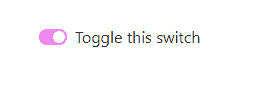
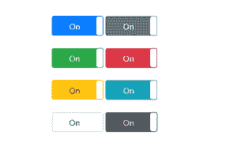

# 如何更改 Bootstrap 4 中拨动开关的“选中”背景色？

> 原文:[https://www . geeksforgeeks . org/如何更改已检查的背景色-切换开关在引导中-4/](https://www.geeksforgeeks.org/how-to-change-the-checked-background-color-of-toggle-switch-in-bootstrap-4/)

Bootstrap 是 web 开发人员构建交互式网页设计的流行选择。Bootstrap 已经有了很大的进步，发布了多个版本，每个新版本都丰富了内容。Bootstrap 有一个广泛的社区，该社区还提供了更新的包，使使用 Bootstrap 变得更加容易。在本文中，我们将讨论在 Bootstrap 4 中更改拨动开关的背景颜色。Bootstrap 4 默认提供了一个自定义开关类，用于创建切换开关，自定义控制输入类处理开关的背景色和边框色。在 Bootstrap 4 中，拨动开关的背景色是蓝色。可以通过操作自定义控件输入类来更改此颜色。还有另一种方法可以使用具有各种颜色类别的外部库来更改颜色。我们将在下面的例子中讨论这两种方法。

**第一次进场**

这种方法使用预定义的自定义开关类创建切换开关，并且通过在自定义控件输入类中指定所需的颜色来改变颜色。这种方法包括大量的编码，因为人们必须为不同的颜色重复整个代码。这使得它很麻烦。

**代码实现**

```
<!DOCTYPE html>
<html>
    <head>
        <title></title>
        <link rel="stylesheet" 
              type="text/css" 
              href=
"https://stackpath.bootstrapcdn.com/bootstrap/4.5.2/css/bootstrap.min.css" />
        <style>
            .custom-control-input:focus ~ 
          .custom-control-label::before {
                /* when the button is toggled off 
  it is still in focus and a violet border will appear */
                border-color: violet !important;
                /* box shadow is blue by default
  but we do not want any shadow hence we have set 
  all the values as 0 */
                box-shadow:
                  0 0 0 0rem rgba(0, 0, 0, 0) !important;
            }

            /*sets the background color of
          switch to violet when it is checked*/
            .custom-control-input:checked ~ 
          .custom-control-label::before {
                border-color: violet !important;
                background-color: violet !important;
            }

            /*sets the background color of
          switch to violet when it is active*/
            .custom-control-input:active ~ 
          .custom-control-label::before {
                background-color: violet !important;
                border-color: violet !important;
            }

            /*sets the border color of switch
          to violet when it is not checked*/
            .custom-control-input:focus:
          not(:checked) ~ .custom-control-label::before {
                border-color: violet !important;
            }
        </style>
    </head>
    <body>
        <!--main container which contains
 the web elements-->
        <div class="container mt-5">
            <div class="custom-control custom-switch">
                <input type="checkbox" 
                       class="custom-control-input" 
                       id="customSwitch1" />
                <label class="custom-control-label"
                       for="customSwitch1">
                  Toggle this switch</label>
            </div>
        </div>
    </body>
</html>
```

**输出**



**第二次进场**

第二种方法消除了第一种方法中为每个自定义控件输入类指定颜色更改所需的额外工作。这是一种更好、更复杂的方法，因为它不包括冗长的编码。该方法利用了 Github 上提供的引导开关按钮包。它是一个开源库，可与所有 Bootstrap 4 组件一起工作。这个库有预定义的类来帮助我们定义切换开关的颜色。输入标记的 data-onstyle 属性负责设置切换开关颜色。可用的颜色选项类似于引导 4 中的按钮。数据切换属性指定复选框是一个开关按钮，数据宽度属性指定切换开关的宽度。checked 属性表示当页面加载时，开关已经被选中，可以根据需要取消选中。

**代码实现**

```
<!DOCTYPE html>
<html>
    <head>
        <title>Toggle switch</title>
        <!--import Bootstrap Switch 
       Button package using cdn-->
        <link href=
"https://cdn.jsdelivr.net/gh/gitbrent/bootstrap-switch-button@1.1.0/css/bootstrap-switch-button.min.css"
              rel="stylesheet" />
        <!--import Bootstrap 4 using cdn-->
        <link rel="stylesheet" type="text/css"
              href=
"https://stackpath.bootstrapcdn.com/bootstrap/4.5.2/css/bootstrap.min.css" />
    </head>
    <body>
        <!--main container which contains the web elements-->
        <div class="container mt-5">
            <input type="checkbox" 
                   data-toggle="switchbutton"
                   checked data-width="100" 
                   data-onstyle="primary" />
            <input type="checkbox" 
                   data-toggle="switchbutton" 
                   checked data-width="100" 
                   data-onstyle="secondary" /><br />
            <br />
            <input type="checkbox" 
                   data-toggle="switchbutton" 
                   checked data-width="100" 
                   data-onstyle="success" />
            <input type="checkbox" 
                   data-toggle="switchbutton" 
                   checked data-width="100"
                   data-onstyle="danger" /><br />
            <br />
            <input type="checkbox"
                   data-toggle="switchbutton"
                   checked data-width="100" 
                   data-onstyle="warning" />
            <input type="checkbox" 
                   data-toggle="switchbutton"
                   checked data-width="100"
                   data-onstyle="info" /><br />
            <br />
            <input type="checkbox"
                   data-toggle="switchbutton" 
                   checked data-width="100" 
                   data-onstyle="light" />
            <input type="checkbox" 
                   data-toggle="switchbutton" 
                   checked data-width="100" 
                   data-onstyle="dark" />
        </div>

        <!--javascript cdn-->
        <script src=
"https://cdn.jsdelivr.net/gh/gitbrent/bootstrap-switch-button@1.1.0/dist/bootstrap-switch-button.min.js">
      </script>
    </body>
</html>
```

**输出**

