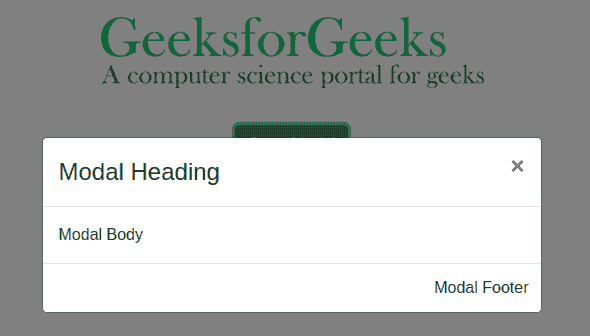
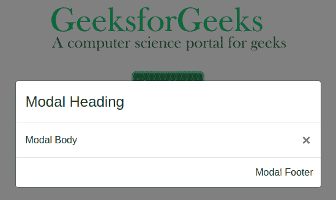
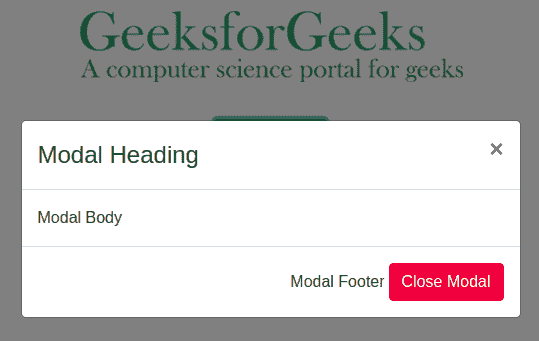

# 如何改变 bootstrap 中模态关闭按钮的位置？

> 原文:[https://www . geeksforgeeks . org/如何更改模式关闭按钮在引导中的位置/](https://www.geeksforgeeks.org/how-to-change-the-position-of-modal-close-button-in-bootstrap/)

模态组件是显示在页面顶部的对话框或弹出窗口。模态可以用作警报窗口，也可以接受一些输入值。

**一个基本模态的例子:**为了改变关闭按钮的位置，我们需要创建一个模态元素。下面的代码将创建一个非常基本的模式。

## 超文本标记语言

```html
<!DOCTYPE html>
<html>
    <head>
        <title>Modal Closing Button</title>
        <meta name="viewport"
              content="width=device-width, initial-scale=1.0" />
        <meta content="text/html;charset=utf-8"
              http-equiv="Content-Type" />
        <meta content="utf-8" http-equiv="encoding" />

        <!-- Jquery -->
        <script src=
"https://ajax.googleapis.com/ajax/libs/jquery/3.5.1/jquery.min.js">
        </script>

        <!-- Bootstrap -->
        <link rel="stylesheet" href=
"https://maxcdn.bootstrapcdn.com/bootstrap/4.5.0/css/bootstrap.min.css" />
        <script src=
 "https://maxcdn.bootstrapcdn.com/bootstrap/4.5.0/js/bootstrap.min.js">
        </script>

        <!-- Personalized Includes -->
        <!-- CSS -->
        <style>
            .center {
                margin: 0 auto;
                text-align: center;
                justify-content: center;
            }
            .btn-div {
                margin-top: 20px;
            }
        </style>
    </head>
    <body>
        <div class="modal fade" id="main-modal">
            <div class="modal-dialog modal-dialog-centered modal-lg">
                <div class="modal-content">
                    <!-- Modal Header -->
                    <div class="modal-header" id="modal-header">
                        <h4 class="modal-title" id="modal-title">
                          Modal Heading
                        </h4>
                        <button type="button" class="close"
                                data-dismiss="modal">
                            ×
                        </button>
                    </div>

                    <!-- Modal body -->
                    <div class="modal-body" id="modal-body">
                        Modal Body
                    </div>

                    <!-- Modal footer -->
                    <div class="modal-footer" id="modal-footer">
                        Modal Footer
                    </div>
                </div>
            </div>
        </div>
        <div class="center btn-div">
            <div>
                
            </div>
            <br />
            <button class="btn btn-success" data-toggle="modal"
                    data-target="#main-modal">
                Open Modal
            </button>
        </div>
    </body>
</html>
```

**输出:**



**进场:**在上图中，可以观察到模态表头内有一个 class =“close”的按钮。该按钮用于关闭模态元素。**数据-消除**属性用于切换模态元素的显示样式。

```html
<button type="button" class="close" data-dismiss="modal">
      &times;
</button>
```

*   **&时代；**给出十字图标。
*   **数据消除**将模态元素的显示属性从“块”切换到“无”。
*   您可以将这个按钮描述从标题移到整个模式分区内的任何位置，以移动关闭按钮，或者您可以声明自己的额外关闭按钮。

以下是上述步骤的实现方法。

**方法 1:** 移动按钮说明。

## 超文本标记语言

```html
<!DOCTYPE html>
<html>
    <head>
        <title>Modal Closing Button</title>
        <meta name="viewport"
              content="width=device-width, initial-scale=1.0" />
        <meta content="text/html;charset=utf-8"
              http-equiv="Content-Type" />
        <meta content="utf-8" http-equiv="encoding" />
        <!-- Jquery -->
        <script src=
"https://ajax.googleapis.com/ajax/libs/jquery/3.5.1/jquery.min.js">
        </script>

        <!-- Bootstrap -->
        <link rel="stylesheet" href=
"https://maxcdn.bootstrapcdn.com/bootstrap/4.5.0/css/bootstrap.min.css"/>

        <script src=
"https://maxcdn.bootstrapcdn.com/bootstrap/4.5.0/js/bootstrap.min.js">
        </script>

        <!-- Personalized Includes -->
        <!-- CSS -->
        <style>
            .center {
                margin: 0 auto;
                text-align: center;
                justify-content: center;
            }
            .btn-div {
                margin-top: 20px;
            }
        </style>
    </head>
    <body>
        <div class="modal fade" id="main-modal">
            <div class="modal-dialog modal-dialog-centered modal-lg">
                <div class="modal-content">
                    <!-- Modal Header -->
                    <div class="modal-header" id="modal-header">
                        <h4 class="modal-title"
                            id="modal-title">
                          Modal Heading
                        </h4>

                        <!--Button shifted from here...-->
                    </div>

                    <!-- Modal body -->
                    <div class="modal-body" id="modal-body">
                        Modal Body

                        <!--Button shifted to this place...-->
                        <button type="button" class="close"
                                data-dismiss="modal">
                            ×
                        </button>
                    </div>

                    <!-- Modal footer -->
                    <div class="modal-footer" id="modal-footer">
                        Modal Footer
                    </div>
                </div>
            </div>
        </div>
        <div class="center btn-div">
            <div>
                
            </div>
            <br />
            <button class="btn btn-success"
                    data-toggle="modal"
                    data-target="#main-modal">
                Open Modal
            </button>
        </div>
    </body>
</html>
```

**输出:**按钮出现在模态元素的主体部分，因为它被移动到主体部分。



**方法 2:** 使用**数据-关闭**属性定义您自己的关闭按钮。

## 超文本标记语言

```html
<!DOCTYPE html>
<html>
    <head>
        <title>Modal Closing Button</title>
        <meta name="viewport"
              content="width=device-width, initial-scale=1.0" />
        <meta content="text/html;charset=utf-8"
              http-equiv="Content-Type" />
        <meta content="utf-8"
              http-equiv="encoding" />
        <!-- Jquery -->
        <script src=
"https://ajax.googleapis.com/ajax/libs/jquery/3.5.1/jquery.min.js">
        </script>

        <!-- Bootstrap -->
        <link rel="stylesheet" href=
"https://maxcdn.bootstrapcdn.com/bootstrap/4.5.0/css/bootstrap.min.css"/>
        <script src=
 "https://maxcdn.bootstrapcdn.com/bootstrap/4.5.0/js/bootstrap.min.js">
        </script>

        <!-- Personalized Includes -->
        <!-- CSS -->
        <style>
            .center {
                margin: 0 auto;
                text-align: center;
                justify-content: center;
            }
            .btn-div {
                margin-top: 20px;
            }
        </style>
    </head>
    <body>
        <div class="modal fade" id="main-modal">
            <div class="modal-dialog modal-dialog-centered modal-lg">
                <div class="modal-content">
                    <!-- Modal Header -->
                    <div class="modal-header"
                         id="modal-header">
                        <h4 class="modal-title"
                            id="modal-title">
                          Modal Heading
                        </h4>
                        <button type="button"
                                class="close"
                                data-dismiss="modal">
                            ×
                        </button>
                    </div>

                    <!-- Modal body -->
                    <div class="modal-body" id="modal-body">
                        Modal Body
                    </div>

                    <!-- Modal footer -->
                    <div class="modal-footer" id="modal-footer">
                        Modal Footer

                        <!--New Button declared here...-->
                        <button class="btn btn-danger" data-dismiss="modal">
                            Close Modal
                        </button>
                    </div>
                </div>
            </div>
        </div>
        <div class="center btn-div">
            <div>
                
            </div>
            <br />
            <button class="btn btn-success"
                    data-toggle="modal"
                    data-target="#main-modal">
                Open Modal
            </button>
        </div>
    </body>
</html>
```

**输出:**模式页脚部分有一个新的关闭按钮。



**支持的浏览器:**

*   谷歌 Chrome
*   微软公司出品的 web 浏览器
*   火狐浏览器
*   歌剧
*   旅行队