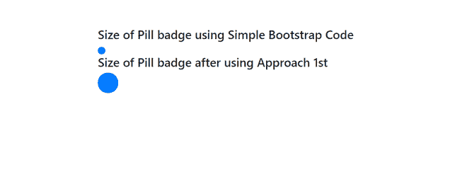
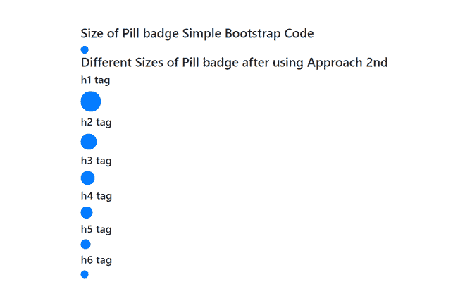
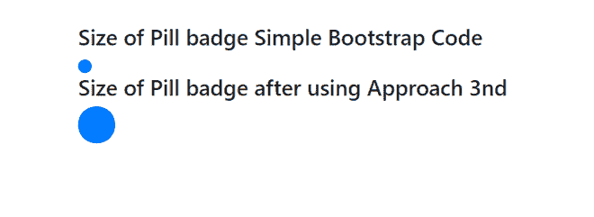

# 如何改变自举药丸徽章的大小？

> 原文:[https://www . geeksforgeeks . org/如何改变自举药丸徽章的大小/](https://www.geeksforgeeks.org/how-to-change-the-size-of-a-bootstrap-pill-badge/)

给定一个带有药丸徽章的 HTML 文档(如果你不知道药丸徽章是什么，那么参考[这个](https://getbootstrap.com/docs/4.0/components/badge/#pill-badges))，任务是增加徽章的大小。有三种方法可以做到这一点。这些方法讨论如下

**方法一:使用内嵌样式:**你可以简单的给 span 标签添加一个样式属性，span 标签以徽章-药丸为类，根据你的意愿改变字体大小。

**示例:**

```html
<!DOCTYPE html>
<html>

<head>
    <link rel="stylesheet" href=
"https://cdnjs.cloudflare.com/ajax/libs/twitter-bootstrap/4.5.0/css/bootstrap.min.css">
</head>

<body>
    <h3>
        Size of Pill badge Simple 
        Bootstrap Code
    </h3>

    <span class="badge badge-pill 
        badge-primary"> 
    </span>

    <h3>
        Size of Pill badge after 
        using Approach 1st 
    </h3>

    <span class="badge badge-pill 
        badge-primary" 
        style="font-size:2rem;"> 
    </span>
</body>

</html>
```

**输出:**



**方法二:将徽章嵌入标题标签内:**我们还可以将徽章的 span 标签包装在不同的标题标签中，以达到预期的效果。

**示例:**

```html
<!DOCTYPE html>
<html>

<head>
    <link rel="stylesheet" href=
"https://cdnjs.cloudflare.com/ajax/libs/twitter-bootstrap/4.5.0/css/bootstrap.min.css">
</head>

<body>

    <div class="example">

        <h3>
            Size of Pill badge Simple 
            Bootstrap Code
        </h3>

        <span class="badge badge-pill 
            badge-primary"> </span>

        <h3>
            Different Sizes of Pill badge 
            after using Approach 2nd 
        </h3>

        <h4>h1 tag</h4>
        <h1><span class="badge badge-pill 
            badge-primary"> </span>
        </h1>

        <h4>h2 tag</h4>
        <h2><span class="badge badge-pill 
            badge-primary"> </span>
        </h2>

        <h4>h3 tag</h4>
        <h3><span class="badge badge-pill 
            badge-primary"> </span>
        </h3>

        <h4>h4 tag</h4>
        <h4><span class="badge badge-pill 
            badge-primary"> </span>
        </h4>

        <h4>h5 tag</h4>
        <h5><span class="badge badge-pill 
            badge-primary"> </span>
        </h5>

        <h4>h6 tag</h4>
        <h6><span class="badge badge-pill 
            badge-primary"> </span>
        </h6>
    </div>
</body>

</html>
```

**输出:**



**方法 3:通过使用内部/外部 CSS 覆盖类:**我们还可以为徽章添加我们自己的自定义类名，并且在 CSS 文件中，我们可以更新 font-size 属性以达到期望的结果。

**示例:**

```html
<!DOCTYPE html>
<html>

<head>
    <link rel="stylesheet" href=
"https://cdnjs.cloudflare.com/ajax/libs/twitter-bootstrap/4.5.0/css/bootstrap.min.css">

    <style>
        .increase-size {
            font-size: 2rem;
        }
    </style>
</head>

<body>
    <div class="example">

        <h3>
            Size of Pill badge Simple 
            Bootstrap Code
        </h3>

        <span class="badge badge-pill 
            badge-primary"> 
        </span>

        <h3>
            Size of Pill badge after 
            using Approach 3nd 
        </h3>

        <span class="badge badge-pill 
               badge-primary increase-size">
             </span>
    </div>
</body>

</html>
```

**输出:**

