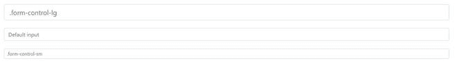

# 如何在 Bootstrap 中更改窗体控件的大小？

> 原文:[https://www . geeksforgeeks . org/如何更改引导程序中表单控件的大小/](https://www.geeksforgeeks.org/how-to-change-the-size-of-form-controls-in-bootstrap/)

引导允许使用 [**改变表单控件的大小。**形态控制类](https://www.geeksforgeeks.org/bootstrap-part-4/)。对于默认尺寸**。使用形状控制**，对于较小的尺寸，我们可以使用**。表单控制**类和**类。对于更大的尺寸，我们可以使用**。表单控制**类和**类。表单-控件-lg** 。**

#### 语法:

*   **默认尺寸:**

```html
class="form-control"                            
```

*   **小尺寸:**

```html
class="form-control form-control-sm"
```

*   **对于大尺寸:**

```html
class="form-control form-control-lg"
```

#### 方法:

*   在所有其他样式表之前，将 Bootstrap 和 jQuery CDN 包含到标签中，以加载我们的 CSS。

> <src 脚本= " https://Ajax . Google APIs . com/Ajax/libs/jquery/3 . 5 . 1/jquery . min . js "></script><src 脚本= " https://cdnjs . cloudflare . com/Ajax/libs/popper . js

*   添加**。表单控件**类为默认大小，**。形态控制-sm** 用于小型形态控制和**。表单-控件-lg** 对于 [**<类中的大尺寸表单控件，输入>标记**](https://www.geeksforgeeks.org/html-input-tag/)

> <input class="”form-control" form-control-lg="" type="”text”" placeholder="”.form-control-lg”" aria-label="”.form-control-lg" example="">
> <输入类=【表单-控件】type = " text " placeholder = " Default input " aria-label = " Default input example ">
> <输入类=【表单-控件表单-控件-sm" type="text" placeholder= "。form-control-sm" aria-label= "。表单-控件-sm 示例">

#### 示例:

## 超文本标记语言

```html
<!DOCTYPE html>
<html>
   <head>
      <title>Bootstrap Form Control Size Example</title>
      <!--Include Latest Bootstrap, jQuery and CSS CDN -->
      <link rel="stylesheet"
            href=
"https://maxcdn.bootstrapcdn.com/bootstrap/4.5.2/css/bootstrap.min.css">
      <script src=
"https://ajax.googleapis.com/ajax/libs/jquery/3.5.1/jquery.min.js">
     </script>
      <script src=
"https://cdnjs.cloudflare.com/ajax/libs/popper.js/1.16.0/umd/popper.min.js">
     </script>
      <script src=
"https://maxcdn.bootstrapcdn.com/bootstrap/4.5.2/js/bootstrap.min.js">
     </script>
   </head>
   <body style="padding:100px;">
     <!-- Add class .form-control-lg after
     .form-control to display large size form control-->
     <input class="form-control form-control-lg"
            type="text"
            placeholder=".form-control-lg"
            aria-label=".form-control-lg example">
     <br>
      <!-- Add class .form-control to display
          default size form control-->
     <input class="form-control" type="text"
            placeholder="Default input"
            aria-label="default input example">
     <br>
      <!-- Add class .form-control-sm after
          .form-control to display small form control-->
     <input class="form-control form-control-sm"
            type="text"
            placeholder=".form-control-sm"
            aria-label=".form-control-sm example">
   </body>
</html>
```

#### 输出:

