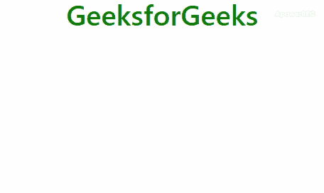

# 如何更改 Twitter Bootstrap 工具提示的宽度和高度？

> 原文:[https://www . geeksforgeeks . org/如何更改 twitter 的宽度和高度-引导-工具提示/](https://www.geeksforgeeks.org/how-to-change-the-width-and-height-of-twitter-bootstraps-tooltips/)

**[引导工具提示:](https://www.geeksforgeeks.org/bootstrap-4-tooltip/)** 工具提示用于在鼠标指针移动时向用户提供关于元素的交互式文本提示。标准化的引导元素集合就像一个小弹出窗口，每当用户执行任何特定操作**单击、悬停(默认)、**和**将焦点**放在该元素上时，该窗口就会出现。它还支持针对特定事件的手动触发。

在本文中，我们将首先设计工具提示，然后我们将操作工具提示的高度和宽度。
**创建工具提示:**数据-toggle=“工具提示”属性用于创建工具提示。title 属性用于指定应该在工具提示中显示的文本。

*   **程序:**

    ```html
    <!DOCTYPE html> 
    <html lang="en"> 
    <head> 
        <title>Tooltip</title> 

        <meta charset="utf-8"> 
        <meta name="viewport" content="width=device-width, initial-scale=1"> 

        <link rel="stylesheet" href= 
    "https://maxcdn.bootstrapcdn.com/bootstrap/4.3.1/css/bootstrap.min.css"> 

        <script src= 
    "https://ajax.googleapis.com/ajax/libs/jquery/3.3.1/jquery.min.js"> 
        </script> 

        <script src= 
    "https://cdnjs.cloudflare.com/ajax/libs/popper.js/1.14.7/umd/popper.min.js"> 
        </script> 

        <script src= 
    "https://maxcdn.bootstrapcdn.com/bootstrap/4.3.1/js/bootstrap.min.js"> 
        </script> 
    </head> 

    <body style="text-align:center;"> 

        <div class="container"> 

            <h1 style="color:green;" data-toggle="tooltip" title="Tooltip"> 
                GeeksforGeeks 
            </h1> 
        </div> 

        <script> 
            $(document).ready(function() { 
                $('[data-toggle="tooltip"]').tooltip(); 
            }); 
        </script> 
    </body> 

    </html>                     
    ```

*   **输出:**
    

**改变工具提示的宽度/高度:**在这里，我们将修改**。工具提示-内部**类，通过超越一些默认的 CSS 属性来满足需求。下面是相同的实现。

*   **程序:**

    ```html
    <!DOCTYPE html> 
    <html lang="en"> 
    <head> 
        <title>Tooltip</title> 

        <meta charset="utf-8"> 
        <meta name="viewport" content="width=device-width, initial-scale=1"> 

        <link rel="stylesheet" href= 
    "https://maxcdn.bootstrapcdn.com/bootstrap/4.3.1/css/bootstrap.min.css"> 

        <script src= 
    "https://ajax.googleapis.com/ajax/libs/jquery/3.3.1/jquery.min.js"> 
        </script> 

        <script src= 
    "https://cdnjs.cloudflare.com/ajax/libs/popper.js/1.14.7/umd/popper.min.js"> 
        </script> 

        <script src= 
    "https://maxcdn.bootstrapcdn.com/bootstrap/4.3.1/js/bootstrap.min.js"> 
        </script> 
        <style>
            body {
                text-align:center;
            }

            h1 {
                color: green;
            }
            .tooltip-inner
                        {
                            width:200px;
                            height:100px; 
                            padding:4px;
                        }
        </style>
    </head> 

    <body> 

        <div class="container"> 

            <h1 data-toggle="tooltip" 
                title="A Computer Science Portal for Geeks"> 
                GeeksforGeeks 
            </h1> 
        </div> 

        <script> 
            $(document).ready(function() { 
                $('[data-toggle="tooltip"]').tooltip(); 
            }); 
        </script> 
    </body> 

    </html>                        
    ```

*   **输出:**
    