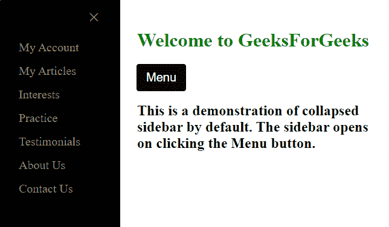
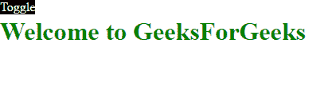
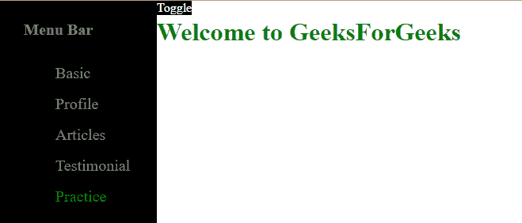

# 如何使用 Bootstrap 默认关闭侧边栏？

> 原文:[https://www . geesforgeks . org/如何默认关闭侧栏-使用引导/](https://www.geeksforgeeks.org/how-to-close-sidebar-by-default-using-bootstrap/)

Bootstrap 是软件开发人员使用的最流行的响应性和开源 CSS 框架。侧边栏是一个小部件，包含指向网站其他部分的导航链接。侧边栏通常用于显示菜单项列表。本文演示了两种创建网页侧边栏的方法，默认情况下，侧边栏保持关闭或隐藏。第一种方法是通过单击菜单按钮来显示边栏，稍后可以通过单击右上角的 X 图标来关闭边栏。第二个方法演示了一个切换边栏，默认情况下保持隐藏。点按“菜单”按钮会显示边栏，再次点按“菜单”按钮会隐藏边栏。

**方法一:**网页包含一个带`id=main`的分部，这个分部包含网页的实际内容。一个标记为**“菜单”**的按钮被创建，它触发了开放导航()功能。功能 *openNav()* 使用*document . getelementbyid()*获取侧边栏分区，并设置侧边栏的宽度和**“main”**分区。工具条显示后，用户点击工具条右上角的关闭按钮，触发*关闭导航()*功能。功能 *closeNav()* 使用**document . getelementbyid()**获取主分区，将侧边栏宽度设置为 0，对网页隐藏，主分区左边距设置为 0，使其占据整个屏幕宽度。因为这两个函数都是 javascript 函数，所以它们被放在脚本标签中。样式标签中指定的 CSS 支持边栏和主要部分的正确定位和转换。

**例 1:**

```html
<!DOCTYPE html>
<html lang="en">

<head>
    <style>
        /* The sidebar menu */
        .sidebar {
            height: 100%;
            /* 100% Full-height */
            width: 0;
            /* 0 width */
            position: fixed;
            /* Fixed place */
            z-index: 1;
            /* Stay on top */
            top: 0;
            left: 0;
            background-color: black;
            /* Disable horizontal scroll */
            overflow-x: hidden;
            /* Place content 60px from the top */
            padding-top: 60px;
            /* Transition effect to slide 
                in the sidebar */
            transition: 0.5s;
        }

        /* The sidebar links */
        .sidebar a {
            padding: 8px 8px 8px 32px;
            text-decoration: none;
            font-size: 20px;
            color: #818181;
            display: block;
            transition: 0.3s;
        }

        /* Mouse over the navigation 
          links, to change their color */
        .sidebar a:hover {
            color: green;
        }

        /* Position and style the close 
          button at top right corner */
        .sidebar .closebtn {
            position: absolute;
            top: 0;
            right: 25px;
            font-size: 36px;
            margin-left: 50px;
        }

        /* The button used to open the sidebar */
        .openbtn {
            font-size: 20px;
            cursor: pointer;
            background-color: #111;
            color: white;
            padding: 10px 15px;
            border: none;
        }

        .openbtn:hover {
            background-color: #444;
        }

        /* Style page content - pushes the
          page content to the right when the 
          sidebar is opened */
        #main {

            /* If you want a transition effect */
            transition: margin-left 0.5s;
            padding: 20px;
        }

        /* On smaller screens, where height is 
          less than 450px, change the style of
          the side-nav (less padding and a 
          smaller font size) */
        @media screen and (max-height: 450px) {
            .sidebar {
                padding-top: 15px;
            }

            .sidebar a {
                font-size: 18px;
            }
        }
    </style>
</head>

<body>
    <div id="mySidebar" class="sidebar">
        <a href="javascript:void(0)" 
            class="closebtn" onclick="closeNav()">
            ×
        </a>
        <a href="#">My Account</a>
        <a href="#">My Articles</a>
        <a href="#">Interests</a>
        <a href="#">Practice</a>
        <a href="#">Testimonials</a>
        <a href="#">About Us</a>
        <a href="#">Contact Us</a>
    </div>
    <!-- The main division contains the actual 
        content of the webpage -->
    <div id="main">
        <h1 style="color: green;">
            Welcome to GeeksForGeeks
        </h1>
        <button class="openbtn" 
            onclick="openNav()">Menu
        </button>

        <h2>
            This is a demonstration of collapsed
            sidebar by default. The sidebar opens
            on clicking the Menu button.
        </h2>
    </div>

    <script>
        function openNav() {
            document.getElementById(
                "mySidebar").style.width = "200px";
            document.getElementById(
                "main").style.marginLeft = "200px";
        }

        /* Set the width of the sidebar to 0 
        and the left margin of the page content to 0 */
        function closeNav() {
            document.getElementById(
                "mySidebar").style.width = "0";
            document.getElementById(
                "main").style.marginLeft = "0";
        }
    </script>
</body>

</html>
```

**输出**


**方法 2:** 该方法使用具有类型“复选框”和角色“按钮”的输入字段的切换功能来显示侧栏。当用户点击按钮时，复选框被选中，它将“内容”部分的左边距设置为 0，这意味着它占据了整个屏幕。当用户再次点击按钮时，复选框被取消选中，并且“内容”部分的左边距被设置为 200px，侧边栏被显示。这种转换发生在 CSS 中，不像前面的例子，整个操作是由 javascript 函数执行的。

**示例:**

```html
<html>

<head>
    <style>
        .sidebar {
            background-color: black;

            /* Occupies 100% height of the page */
            height: 100%;

            /* Specifies the width of sidebar */
            width: 500px;
            position: absolute;
            top: 0;
            left: 0;
            bottom: 0;
            padding-right: 60px;

            /* Transition effect of sidebar */
            transition: 0.5s;
        }

        .sidebar h2,
        li {
            padding: 8px 8px 8px 32px;
            text-decoration: none;
            font-size: 20px;
            color: #818181;
            display: block;

            /* Transition effect of h2 and li */
            transition: 0.3s;
        }

        .sidebar li:hover {

            /* Sidebar items change color 
            when hovered over */
            color: green;
        }

        .content {
            background-color: white;
            position: absolute;
            top: 0;

            /* The left margin when 
            sidebar is visible */
            left: 200px;
            right: 0;
            bottom: 0;

            -moz-transition: left 0.5s ease;
            transition: left 0.5s ease;
        }

        input[type="checkbox"] {
            display: none;
        }

        /* Toggling of sidebar */
        input:checked~.content {
            left: 0;
        }

        input:checked~label {
            left: 0;
        }

        /* Styling of the button */
        label {
            z-index: 2;
            position: absolute;
            top: 0;
            left: 200px;
            background-color: black;
            color: white;
            -moz-transition: left 0.5s ease;
            transition: left 0.5s ease;
        }
    </style>
</head>

<body>
    <!-- This division contains 
        the sidebar and its content -->
    <div class="main-wrap">
        <input id="slide-sidebar" 
            type="checkbox" role="button" />

        <label for="slide-sidebar">
            <span>Toggle</span>
        </label>
        <div class="sidebar">
            <h2>Menu Bar</h2>
            <ul>
                <li>Basic</li>
                <li>Profile</li>
                <li>Articles</li>
                <li>Testimonial</li>
                <li>Practice</li>
            </ul>
        </div>

        <!-- This division contains the
          actual content of the webpage -->
        <div class="content">
            <h1 style="color: green;">
                Welcome to GeeksForGeeks
            </h1>
        </div>
    </div>
</body>

</html>
```

**输出**



默认情况下，两个示例中的边栏都保持关闭或隐藏状态。只有当用户点击按钮时，侧边栏才会显示。折叠边栏节省空间，使网页看起来干净宽敞。侧栏可以根据用户要求固定和滚动。然而，这篇文章演示了固定边栏。