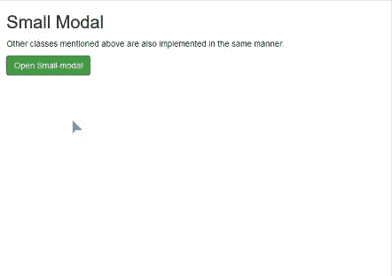
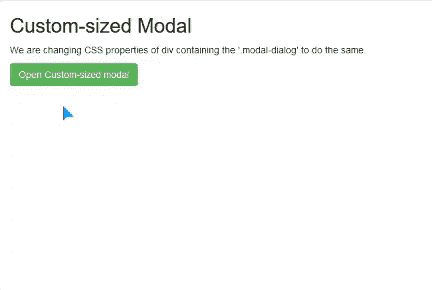

# 如何在 Bootstrap 中配置模态宽度？

> 原文:[https://www . geeksforgeeks . org/如何配置引导模式宽度/](https://www.geeksforgeeks.org/how-to-configure-modal-width-in-bootstrap/)

**引导模式:**这是一个对话框窗口，当触发某些事件时，会在浏览器窗口中打开。按照要求改进网站的内容呈现确实是一个很方便的方法。
在本文中，我们将重点调整模态框的宽度/高度。
**方法 1:** 使用预定义的 Bootstrap 类
Bootstrap 具有预定义的类，用于更改模式维度属性，以便与包含*的 div 元素一起使用。模态对话框*。这些列表如下:

*   小型模型:。*模态-sm*
*   中型模式:。*模态-md*
*   大型模型:。*模态-lg*

## 超文本标记语言

```html
<!-- Small Bootstrap Modal Example -->
<!DOCTYPE html>
<html lang="en">
  <head>
    <meta charset="utf-8" />
    <meta name="viewport" 
     content="width=device-width, initial-scale=1" />
    <link
      rel="stylesheet"
      href=
"https://maxcdn.bootstrapcdn.com/bootstrap/3.4.1/css/bootstrap.min.css"
    />
    <script src=
"https://ajax.googleapis.com/ajax/libs/jquery/3.4.1/jquery.min.js">
    </script>
    <script src=
"https://maxcdn.bootstrapcdn.com/bootstrap/3.4.1/js/bootstrap.min.js">
    </script>
  </head>

  <body>
    <div class="container-fluid">
      <h2>Small Modal</h2>

      <p>
        Other classes mentioned above are 
        also implemented in the same manner.
      </p>

      <button
        type="button"
        class="btn btn-success"
        data-toggle="modal"
        data-target="#modal"
      >
        Open Small-modal
      </button>
      <!-- Modal Code -->
      <div class="modal fade" id="modal" role="dialog">
        <div class="modal-dialog modal-sm">
          <!-- .modal-sm here makes a small modal
       Can be replaced with '.modal-md' & '.modal-lg'
    -->
          <div class="modal-content">
            <div class="modal-header">
              <button type="button" class="close" data-dismiss="modal">
                ×
              </button>
              <h4 class="modal-title">GeeksforGeeks</h4>
            </div>
            <div class="modal-body">
              <p>GeeksforGeeks - A computer science portal for geeks</p>
            </div>
            <div class="modal-footer">
              <button
                type="button"
                class="btn btn-default"
                data-dismiss="modal"
              >
                Close
              </button>
            </div>
          </div>
        </div>
      </div>
    </div>
  </body>
</html>
```

**输出** :



**方法 2:** 通过篡改默认 CSS 属性使用自定义尺寸
我们还可以通过更改包含*的 div 的 CSS 属性来自定义模态的宽度/高度。模态对话框*类。下面是同样的解决方案。
**解决方案** :

## 超文本标记语言

```html
<!-- Changing CSS properties for the div 
containing '.modal-dialog' class -->
<!DOCTYPE html>
<html lang="en">
  <head>
    <meta charset="utf-8" />
    <meta name="viewport" 
     content="width=device-width, initial-scale=1" />
    <link
      rel="stylesheet"
      href=
"https://maxcdn.bootstrapcdn.com/bootstrap/3.4.1/css/bootstrap.min.css"
    />
    <script src=
"https://ajax.googleapis.com/ajax/libs/jquery/3.4.1/jquery.min.js">
    </script>
    <script src=
"https://maxcdn.bootstrapcdn.com/bootstrap/3.4.1/js/bootstrap.min.js">
    </script>
    <style>
      .custom {
        width: 600px;
        min-height: 400px;
      }
    </style>
  </head>

  <body>
    <div class="container-fluid">
      <h2>Custom-sized Modal</h2>

      <p>
        We are changing CSS properties of div containing 
        the '.modal-dialog' to do the same.
      </p>

      <button
        type="button"
        class="btn btn-success"
        data-toggle="modal"
        data-target="#modal"
      >
        Open Custom-sized modal
      </button>

      <!-- Modal Code -->
      <div class="modal fade" id="modal" role="dialog">
        <div class="modal-dialog">
          <!-- '.custom' class added here to do the same -->
          <div class="modal-content custom">
            <div class="modal-header">
              <button type="button" 
               class="close" data-dismiss="modal">
                ×
              </button>
              <h4 class="modal-title">GeeksforGeeks</h4>
            </div>
            <div class="modal-body">
              <p>GeeksforGeeks - A computer science 
                 portal for geeks</p>
            </div>
          </div>
        </div>
      </div>
    </div>
  </body>
</html>
```

**输出** :

