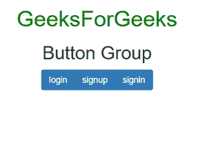
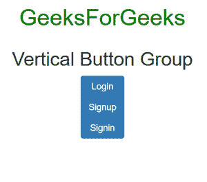
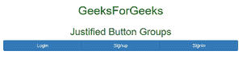

# 如何在 Bootstrap 中创建基本按钮组？

> 原文:[https://www . geesforgeks . org/如何创建基本按钮组引导/](https://www.geeksforgeeks.org/how-to-create-a-basic-button-group-in-bootstrap/)

**按钮:**按钮。btn 类与<按钮>元素一起使用，使用 Bootstrap 创建基本按钮。bootstrap 中的按钮用于表单、对话框等。

**Bootstrap 中的按钮组:**在 Bootstrap 中，按钮组将一组按钮放在一行中。按钮组是使用*类**创建的。btn-group*** 。

**示例:**

## 超文本标记语言

```html
<!DOCTYPE html>
<html lang="en">

<head>
    <meta charset="utf-8">
    <meta name="viewport" content=
        "width=device-width, initial-scale=1">
    <link rel="stylesheet" href=
"https://maxcdn.bootstrapcdn.com/bootstrap/3.4.1/css/bootstrap.min.css">
    <script src=
"https://ajax.googleapis.com/ajax/libs/jquery/3.5.1/jquery.min.js">
    </script>
    <script src=
"https://maxcdn.bootstrapcdn.com/bootstrap/3.4.1/js/bootstrap.min.js">
    </script>
</head>

<body>
    <center>
        <div class="container">
            <h1 style="color:green;">
                GeeksForGeeks
            </h1>

            <h2>Button Group</h2>

            <div class="btn-group">
                <button type="button" 
                    class="btn btn-primary">
                    login
                </button>

                <button type="button" 
                    class="btn btn-primary">
                    signup
                </button>

                <button type="button" 
                    class="btn btn-primary">
                    signin
                </button>
            </div>
        </div>
    </center>
</body>

</html>
```

**输出:**



在上面的例子中，按钮组被创建为单个，就像有 3 个按钮登录，注册和登录排列在一行。这些按钮是使用类 btn-group 创建的。

**垂直按钮组:**在 Bootstrap 中，垂直按钮组按垂直顺序排列。这些垂直按钮组使用类 ***创建。BTN-组-垂直。***

**示例:**

## 超文本标记语言

```html
<!DOCTYPE html>
<html lang="en">

<head>
    <title>Bootstrap Example</title>
    <meta charset="utf-8">
    <meta name="viewport" content=
        "width=device-width, initial-scale=1">
    <link rel="stylesheet" href=
"https://maxcdn.bootstrapcdn.com/bootstrap/3.4.1/css/bootstrap.min.css">
    <script src=
"https://ajax.googleapis.com/ajax/libs/jquery/3.5.1/jquery.min.js">
    </script>
    <script src=
"https://maxcdn.bootstrapcdn.com/bootstrap/3.4.1/js/bootstrap.min.js">
    </script>
</head>

<body>
    <center>
        <h1 style="color:green">GeeksForGeeks</h1>
        <div class="container">
            <h2>Vertical Button Group</h2>
            <div class="btn-group-vertical">
                <button type="button" 
                    class="btn btn-primary">
                    Login
                </button>

                <button type="button" 
                    class="btn btn-primary">
                    Signup
                </button>

                <button type="button" 
                    class="btn btn-primary">
                    Signin
                </button>
            </div>
        </div>
    </center>
</body>

</html>
```

**输出:**



在上例中，创建了垂直按钮组。有 3 个按钮登录，注册和登录排列在一个垂直顺序使用类 BTN-组-垂直。

**对齐按钮组:**在 Bootstrap 中，对齐**和**按钮组按照屏幕宽度排列，按钮按照宽度对齐。使用类 ***创建对齐按钮组。BTN-组-对齐。***

**示例:**

## 超文本标记语言

```html
<!DOCTYPE html>
<html lang="en">

<head>
    <title>Bootstrap Example</title>
    <meta charset="utf-8">
    <meta name="viewport" content=
        "width=device-width, initial-scale=1">
    <link rel="stylesheet" href=
"https://maxcdn.bootstrapcdn.com/bootstrap/3.4.1/css/bootstrap.min.css">
    <script src=
"https://ajax.googleapis.com/ajax/libs/jquery/3.5.1/jquery.min.js">
    </script>
    <script src=
"https://maxcdn.bootstrapcdn.com/bootstrap/3.4.1/js/bootstrap.min.js">
    </script>
</head>

<body>
    <center>
        <h1 style="color:green">
            GeeksForGeeks
        </h1>

        <div class="container">
            <h2>Justified Button Groups</h2>
            <div class="btn-group btn-group-justified">
                <a href="#" class="btn btn-primary">
                    Login
                </a>

                <a href="#" class="btn btn-primary">
                    Signup
                </a>

                <a href="#" class="btn btn-primary">
                    Signin
                </a>
            </div>
        </div>
    </center>
</body>

</html>
```

**输出:**



在上例中，创建了对齐按钮组。有 3 个按钮登录，注册和登录排列使用对齐顺序，即按钮与屏幕宽度对齐。这些对齐的按钮组是使用类 BTN-group-aligned 创建的。