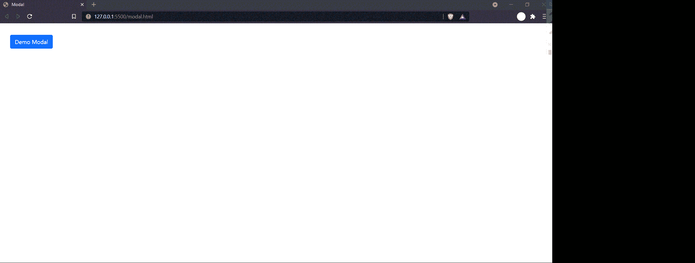

# 如何在 Bootstrap 中创建基本模态组件？

> 原文:[https://www . geeksforgeeks . org/如何创建基本模式引导组件/](https://www.geeksforgeeks.org/how-to-create-a-basic-modal-component-in-bootstrap/)

Modals 是 JavaScript 弹出窗口，帮助我们在网站中传递非常有用的内容，例如在网站上显示保存、删除、下载或关闭确认。引导模式是轻量级和多用途的 JavaScript 组件。它们也是可定制和响应的组件。在本文中，我们将学习如何使用 bootstrap 框架创建一个基本的模态组件。

首先，我们必须在我们的 HTML 文件中导入以下引导 CDN。

> <链接 href = " https://cdn . jsdelivr . net/NPM/bootstrap @ 5 . 1 . 1/dist/CSS/bootstrap . min . CSS " rel = " style sheet "完整性= " sha 384-F3 w7 MX 95 pdgytmzmecchangqb83 dfgtwi 0 imjiwavhan 4 fjkjbyhzmi 3 ahiu " cross origin = " anonymous ">
> 
> <src = " https://cdn . jsdelivr . net/NPM/bootstrap @ 5 . 1 . 1/dist/js/bootstrap . bundle . min . js "完整性= " sha 384/bq dsth/da 6 PKI 1 MST/rwkfnjcp 5 gbsy 4 seft 38q/9 rbh 9 ah 40 zeog 7 hlq 2 thrz " cross origin = " anonymous ">T4

**示例:**在本例中，我们将看到如何使用 Bootstrap 模态组件创建基本模态。

## 超文本标记语言

```html
<!doctype html>
<html lang="en">

<head>
    <!-- Required meta tags -->
    <meta charset="utf-8">
    <meta name="viewport" content=
        "width=device-width, initial-scale=1">

    <!-- Bootstrap CSS -->
    <link href=
"https://cdn.jsdelivr.net/npm/bootstrap@5.1.1/dist/css/bootstrap.min.css"
        rel="stylesheet" integrity=
"sha384-F3w7mX95PdgyTmZZMECAngseQB83DfGTowi0iMjiWaeVhAn4FJkqJByhZMI3AhiU"
        crossorigin="anonymous">

    <script src=
"https://cdn.jsdelivr.net/npm/bootstrap@5.1.1/dist/js/bootstrap.bundle.min.js"
        integrity=
"sha384-/bQdsTh/da6pkI1MST/rWKFNjaCP5gBSY4sEBT38Q/9RBh9AH40zEOg7Hlq2THRZ"
        crossorigin="anonymous">
    </script>
</head>

<body>
    <!-- Button trigger modal -->
    <button type="button" class="btn btn-primary" 
        data-bs-toggle="modal" 
        data-bs-target="#exampleModal"
        style="margin: 2em;">
        Demo Modal
    </button>

    <!-- Modal -->
    <div class="modal fade" id="exampleModal" 
        tabindex="-1" aria-labelledby="exampleModalLabel" 
        aria-hidden="true">

        <div class="modal-dialog">
            <div class="modal-content">
                <div class="modal-header">
                    <h5 class="modal-title" 
                        id="exampleModalLabel">
                        This is sample title.
                    </h5>
                    <button type="button" class="btn-close" 
                        data-bs-dismiss="modal" 
                        aria-label="Close">
                    </button>
                </div>

                <div class="modal-body">
                    This is the body of the modal.
                </div>
                <div class="modal-footer">
                    <button type="button" 
                        class="btn btn-secondary" 
                        data-bs-dismiss="modal">
                        Close
                    </button>

                    <button type="button" 
                        class="btn btn-primary">
                        Save
                    </button>
                </div>
            </div>
        </div>
    </div>
</body>

</html>
```

**输出:**

