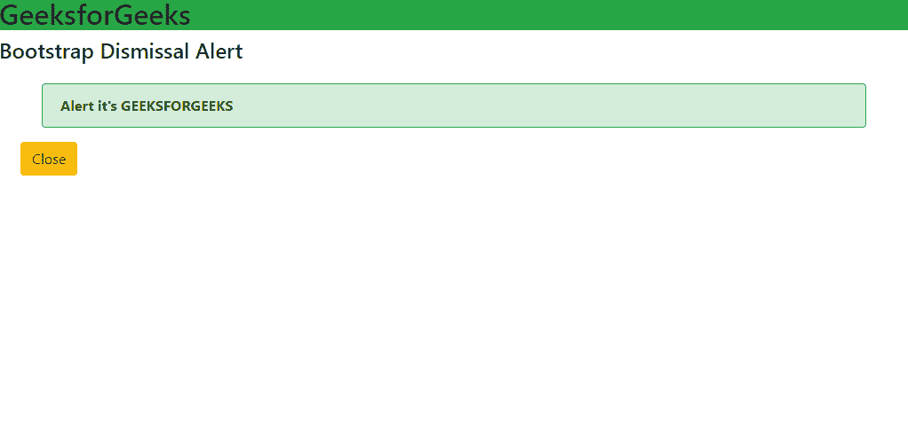
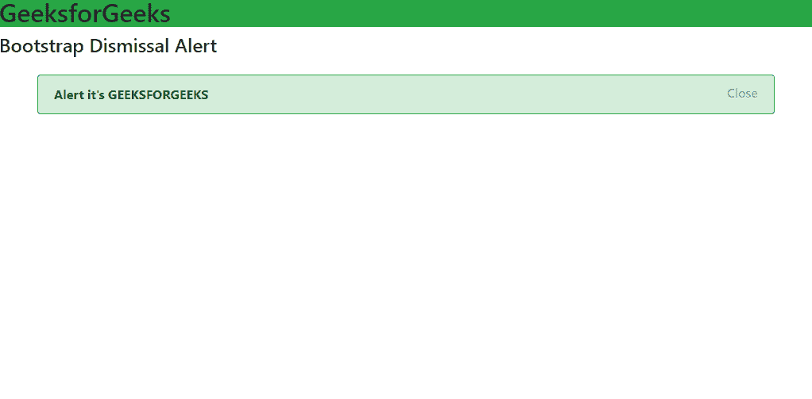

# 如何创建引导可解除警报？

> 原文:[https://www . geeksforgeeks . org/如何创建引导-不可删除-警报/](https://www.geeksforgeeks.org/how-to-create-a-bootstrap-dismissible-alert/)

Bootstrap 是一个免费的开源工具，可以非常容易地制作出响应迅速且美观的网页。警报用于通知网页的用户和访问者一些动作或信息。此外，我们还可以为用户提供取消警报的功能。但是简单的提醒并不那么好看。因此，在 Bootstrap 的帮助下，我们可以在网页内容中制作真正好的警报，也就是内联警报，稍后我们将学习如何消除它们。

**方法:**我们将首先在我们的网站中创建一个带有一些内容的 **div** 元素。我们需要添加**类**和**角色** *字段*作为 ***预警*** 。那么该元素将作为**警报**工作。现在，我们将创建一个**按钮**到 ***关闭**T21**警报**。我们可以使用**按钮**的 ***数据-消除字段*** 在元素内部创建一个警报作为**警报**或者在**容器**外部创建一个 *javascript* 功能。我们将在本教程中学习这两种方法。首先在**头**标签中导入引导的 **CDN 库**。*

> <link rel="”stylesheet”" href="”https://cdn.jsdelivr.net/npm/bootstrap@4.6.0/dist/css/bootstrap.min.css”">
> <脚本 src = " https://code . jquery . com/jquery-3 . 6 . 0 . slim . js "></脚本>
> <脚本 src = " https://cdn . jsdeliver . net/NPM/bootstrap @ 4 . 6 . 0/dist/js/bootstrap . min . js "></脚本>

**示例 1:** 为了使警报可解除，我们需要在类中添加警报可解除。现在，为了使警报不可消除，我们需要引导的 Javascript 库。我们只是第一次把它包括在内。现在根据 bootstrap，最好用一个按钮。我们可以将按钮放在警报容器内部或外部。我们将在脚本文件中调用一个函数来关闭警报容器。脚本文件包括一个**功能**。当 **e 用户按下关闭按钮**时，上述功能被调用，根据我们的功能，**报警被关闭**。上面的代码使用了 jQuery 库，因此我们的项目需要引导 jQuery 库。

```html
The ".alert('close')" is a bootstrap function.
```

## 超文本标记语言

```html
<!DOCTYPE html>
<html>

<head>
    <meta charset="utf-8">
    <meta name="viewport" content="width=device-width">
    <title>GeeksforGeeks</title>
    <link href="style.css" rel="stylesheet" 
        type="text/css" />
    <link rel="stylesheet" href=
"https://cdn.jsdelivr.net/npm/bootstrap@4.6.0/dist/css/bootstrap.min.css">
    <script src="https://code.jquery.com/jquery-3.6.0.slim.js">
    </script>
    <script src=
"https://cdn.jsdelivr.net/npm/bootstrap@4.6.0/dist/js/bootstrap.min.js">
    </script>
</head>

<body>
    <h2 class="bg-success">GeeksforGeeks</h2>
    <h4>Bootstrap Dismissal Alert</h4>
    <div class="alert alert-success 
        alert-dismissible fade show mx-5 mt-4 
        border border-success" role="alert">
        <b>Alert it's GEEKSFORGEEKS</b>
    </div>
    <button type="button" class="btn bg-warning ml-4" 
        onclick="onButtonPress()">
        Close
    </button>

    <script src="script.js"></script>
</body>

</html>
```

## java 描述语言

```html
function onButtonPress() {
    $('.alert').alert('close')
}
```

**输出:**



引导解除警报

**示例 2:** 在本例中，我们将使用一个按钮，代码如下。这里的按钮应该是**按钮**和**按钮【关闭】**。我们已经将按钮放在 div 容器中，这样按钮将与警报一起出现，并且当警报解除时，按钮被移除。这里重要的是**数据-蔑=“alert”**因为不然就不行了。当我们单击按钮时，bootstrap 只调用我们在第一个示例中调用的相同函数来隐藏警报。

## 超文本标记语言

```html
<!DOCTYPE html>
<html>

<head>
    <meta charset="utf-8">
    <meta name="viewport" content="width=device-width">
    <title>GeeksforGeeks</title>
    <link href="style.css" rel="stylesheet" type="text/css" />
    <link rel="stylesheet" href=
"https://cdn.jsdelivr.net/npm/bootstrap@4.6.0/dist/css/bootstrap.min.css">
    <script src="https://code.jquery.com/jquery-3.6.0.slim.js">
    </script>
    <script src=
"https://cdn.jsdelivr.net/npm/bootstrap@4.6.0/dist/js/bootstrap.min.js">
    </script>
</head>

<body>
    <h2 class="bg-success">GeeksforGeeks</h2>
    <h4>Bootstrap Dismissal Alert</h4>
    <div class="alert alert-success 
        alert-dismissible fade show mx-5 mt-4 
        border border-success" role="alert">
        <b>Alert it's GEEKSFORGEEKS</b>
        <button type="button" class="close" 
            data-dismiss="alert">
            <h6>Close</h6>
        </button>
    </div>
</body>

</html>
```

**输出:**

