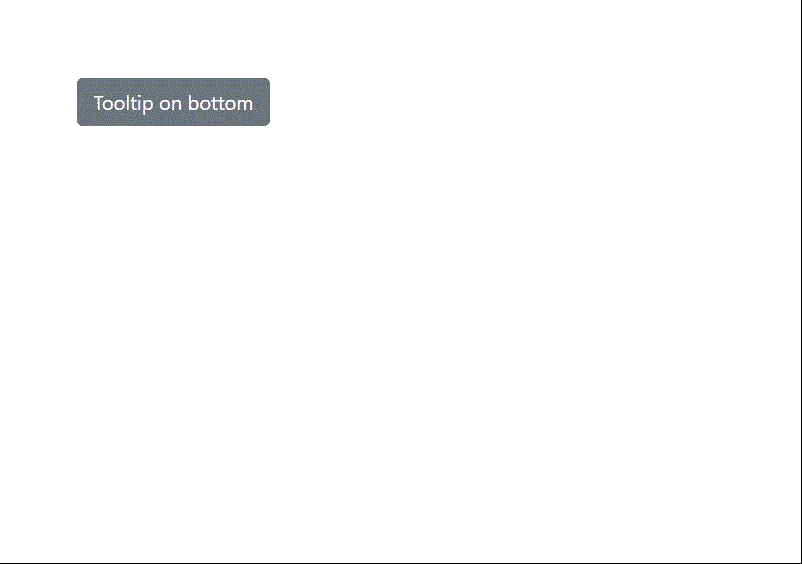

# 如何使用 jQuery 创建引导工具提示？

> 原文:[https://www . geesforgeks . org/如何创建引导-工具提示-使用-jquery/](https://www.geeksforgeeks.org/how-to-create-a-bootstrap-tooltip-using-jquery/)

工具提示就像一个气球或者一个小屏幕提示，显示网页中任何对象的文本描述。当用户使用光标悬停在对象上时，会显示工具提示。它是网站非常有用的一部分，现在几乎可以在所有网站上找到，包括一些网络应用程序，如 Adobe Photoshop、Adobe Illustrator 等。工具提示对新用户非常有帮助，用户可以通过阅读工具提示文本来了解对象。

现在，理解了工具提示的基本概念，让我们学习如何使用 Bootstrap 框架和 jQuery 创建工具提示。

**什么是 jQuery？**

jQuery 是一个 JavaScript 库，使得对 HTML DOM(文档对象模型)属性的操作非常容易。让我们开始吧。

**第一步:**首先从 Bootstrap 官网导入 Bootstrap CSS 的所有 Bootstrap CDN。

**自举 CSS:**

> <link href="”https://cdn.jsdelivr.net/npm/bootstrap@5.1.1/dist/css/bootstrap.min.css”" rel="”stylesheet”" integrity="”sha384-F3w7mX95PdgyTmZZMECAngseQB83DfGTowi0iMjiWaeVhAn4FJkqJByhZMI3AhiU”" crossorigin="”anonymous”">

#### 引导 JS:

**第二步:**从 jQuery CDN 官方网站导入 jQuery 链接到 HTML 文件。

**第三步:**要创建工具提示，我们必须给任何元素添加**‘data-bs-toggle’**属性，要添加工具提示悬停时需要显示的文本，我们必须给 HTML 元素添加**‘title’**属性。

> 搜索种子..

(这里我们使用了按钮来显示工具提示效果，但是，您也可以将工具提示用于其他引导组件。过程非常相似。)

**第 4 步:**之后，将 jQuery 代码段添加到下面给定的 HTML 文件中的脚本标签中:

```html
<script>
    var tool = $("#tooltip");
    var tooltip = new bootstrap.Tooltip(tool, {
        boundary: $("body")
    })
</script>

```

在上面的代码中，我们使用 Tooltip()函数在鼠标悬停时触发工具提示。

**注意:**这里我们在底部做了工具提示文字放置，可以使用“data-bs-placement”属性放置在左侧、右侧或顶部。在这里，我们将其设置为“底部”。

**步骤 5:** 因此，我们已经使用 jQuery 在 Bootstrap 中成功创建了工具提示。

#### 以下是完整的 HTML 代码:

## 超文本标记语言

```html
<!DOCTYPE html>
<html lang="en">
    <head>
        <meta charset="UTF-8" />
        <meta http-equiv="X-UA-Compatible" content="IE=edge" />
        <meta name="viewport" 
              content="width=device-width, initial-scale=1.0" />
        <!-- Bootstrap CSS -->
        <link
            href=
"https://cdn.jsdelivr.net/npm/bootstrap@5.1.1/dist/css/bootstrap.min.css"
            rel="stylesheet"
            integrity=
"sha384-F3w7mX95PdgyTmZZMECAngseQB83DfGTowi0iMjiWaeVhAn4FJkqJByhZMI3AhiU"
            crossorigin="anonymous"
        />
        <style>
            button {
                margin: 4em;
            }
        </style>
        <title>Document</title>
    </head>
    <body>
        <button
            type="button"
            id="tooltip"
            class="tool btn btn-secondary"
            data-bs-toggle="tooltip"
            data-bs-placement="bottom"
            title="Tooltip on bottom"
        >
            Tooltip on bottom
        </button>

        <!-- Bootstrap Javascript -->
        <script
            src=
"https://cdn.jsdelivr.net/npm/bootstrap@5.1.1/dist/js/bootstrap.bundle.min.js"
            integrity=
"sha384-/bQdsTh/da6pkI1MST/rWKFNjaCP5gBSY4sEBT38Q/9RBh9AH40zEOg7Hlq2THRZ"
            crossorigin="anonymous"
        ></script>

        <script
            type="text/javascript"
            src=
"http://ajax.googleapis.com/ajax/libs/jquery/3.5.1/jquery.min.js"
        ></script>
        <script>
            var tool = $("#tooltip");
            var tooltip = new bootstrap.Tooltip(tool, {
                boundary: $("body"),
            });
        </script>
    </body>
</html>
```

#### 输出:



使用引导和 jQuery 的工具提示

### 对齐工具提示

现在，在此之后，我们还可以在不同的方向上定义工具提示消息的方向，如底部、顶部、左侧、右侧等。

为了将工具提示与不同的位置对齐，我们需要引导对象的**‘data-bs-placement’**属性。它有四个放置选项。它们是:

**1。顶部–**将工具提示放置在对象顶部。

**语法:**

> <button type="”button”" class="”btn" btn-secondary="" data-bs-toggle="”tooltip”" data-bs-placement="”top”" title="”…”">……
> </按钮></button>

**2。底部–**将工具提示放置在对象的底部。

**语法:**

> <button type="”button”" class="”btn" btn-secondary="" data-bs-toggle="”tooltip”" data-bs-placement="”bottom”" title="”…”">……
> </按钮></button>

**3。左–**将工具提示放置在对象的左侧。

**语法:**

> <button type="”button”" class="”btn" btn-secondary="" data-bs-toggle="”tooltip”" data-bs-placement="”left”" title="”…”">……
> </按钮></button>

**4。右–**将工具提示放置在对象的右侧。

**语法:**

> <button type="”button”" class="”btn" btn-secondary="" data-bs-toggle="”tooltip”" data-bs-placement="”bottom”" title="”…”">……
> </按钮></button>