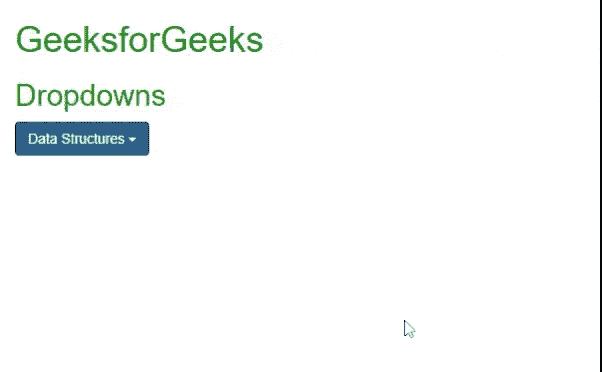

# 如何在 Bootstrap 中创建下拉菜单？

> 原文:[https://www . geesforgeks . org/如何在引导程序中创建下拉菜单/](https://www.geeksforgeeks.org/how-to-create-a-dropdown-menu-in-bootstrap/)

一个**下拉菜单**在点击或悬停时提供了一个备选列表，这是一个提供备选列表的干净方法，因为最初只有一个选项显示在屏幕上。现在几乎所有类型的软件都使用下拉菜单来显示选项的子选项。

**第一步:**要利用 bootstrap 将这个下拉列表包含到您的网站中，您只需要将以下 jQuery 和 [bootstrap](https://www.geeksforgeeks.org/bootstrap-tutorials/) js 库作为脚本包含在您的 HTML 代码中。

> <脚本 src = " https://maxcdn . bootstrapcdn . com/bootstrap/3 . 3 . 6/js/bootstrap . min . js "></脚本>

**步骤 2:** 在 HTML 文档的头部包含以下样式表，以给出下拉菜单的外观。

> <link rel="”stylesheet”" href="”https://maxcdn.bootstrapcdn.com/bootstrap/3.3.6/css/bootstrap.min.css”">

**步骤 3:** 并确保将下拉菜单包含在*中。下拉*类，**内的按钮或主选项** *。btn btn-primary* *下拉-切换*类，以及*内的备选列表。下拉菜单*分类如下。

```
<div class="dropdown">  
   <button class="btn btn-primary dropdown-toggle" 
           type="button" data-toggle="dropdown">
      Data Structures  
     <span class="caret"></span>
    </button>  
   <ul>  
     <li><a href="#">Array</a></li>  
     <li><a href="#">Stack</a></li>  
     <li><a href="#">Queue</a></li>  
   </ul>  
</div>  
```

班级*。脱字符号*用于显示按钮中的小倒三角，如输出所示。

**示例:**

## 超文本标记语言

```
<!DOCTYPE html>
<html>

<head>

    <meta name="viewport" content="width=device-width, initial-scale=1">
    <link rel="stylesheet" href=
"https://maxcdn.bootstrapcdn.com/bootstrap/3.3.6/css/bootstrap.min.css">
    <script src=
"https://ajax.googleapis.com/ajax/libs/jquery/1.12.0/jquery.min.js">
    </script>
    <script src=
"https://maxcdn.bootstrapcdn.com/bootstrap/3.3.6/js/bootstrap.min.js">
    </script>
    <style>
        .container {
            color: green;
        }
    </style>
</head>

<body>

    <div class="container">
        <h1>GeeksforGeeks</h1>
        <h2>Dropdowns</h2>
        <div class="dropdown">
            <button class="btn btn-primary dropdown-toggle"
                type="button" data-toggle="dropdown">
                Data Structures 
                <span class="caret"></span>
            </button>
            <ul class="dropdown-menu">
                <li><a href="#">Array</a></li>
                <li><a href="#">String</a></li>
                <li><a href="#">Stack</a></li>
                <li><a href="#">Queue</a></li>
                <li><a href="#">Map</a></li>
                <li><a href="#">Tree</a></li>
            </ul>
        </div>
    </div>
</body>

</html>
```

**输出:**在输出中可以看到，下拉按钮是用名称*数据结构*创建的，点击它，你会看到一个选项列表，如上图所示。

