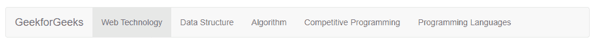
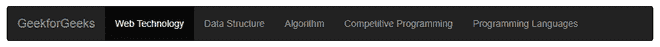
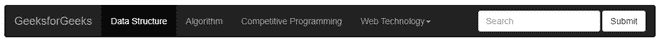

# 如何在 Bootstrap 中使用 nav bar-reverse 创建菜单？

> 原文:[https://www . geeksforgeeks . org/如何使用-nav bar-反向引导创建菜单/](https://www.geeksforgeeks.org/how-to-create-a-menu-using-navbar-inverse-in-bootstrap/)

在本文中，我们将学习如何使用 Bootstrap 中的 nav bar-reverse 来创建菜单&还将通过示例了解它的实现。在为网站制作导航栏时，菜单栏是一个非常重要的部分。我们可以使用 Bootstrap*nav bar-reverse*类创建一个菜单栏，并反转菜单栏的颜色。

Bootstrap 中的导航栏包含许多类，例如:

*   ***。nav bar-brand*****class:**此类用于您的公司、产品或项目名称，或任何品牌名称。
*   ***。navbar-nav*** **类:**该类用于全高和轻量级导航(包括支持下拉)。
*   ***。navbar-toggler*** **类**:该类用于折叠插件和其他导航切换行为。
*   ***。导航栏-文本*** **类**:该类用于添加垂直居中的文本字符串。
*   ***. collapse . navbar-collapse*****类:**该类用于通过父断点对 nav bar 内容进行分组和隐藏。
*   flex 和 spacing 实用程序类可用于任何表单控件和操作。

我们将通过示例了解上述类及其用法。让我们看看如何使用 Bootstrap 实现 navbar。

**步骤 1:** 在我们的 HTML 文件中导入引导 CDN 链接。

> <rel = "样式表"链接 href = " https://stack path . bootstracdn . com/bootstrap cdn/3 . 4 . 1/CSS/bootstrap . min . CSS "完整性= " sha 384-hsmxrtrxnn+bdg 0 jdbxykrthecokhuh 5 zcyotlsacp 1+c8 xmyte 9 gyg1 L9 a 69 PSU " cross origin = " anonymous "/>
> 
> <src = " https://stack path . bootstrap cdn . com/bootstrap/3 . 4 . 1/js/bootstrap . min . js "完整性= " sha 384-aj 21 OJ lmxnl 5 uyil/xnwtmqzerzh 2w8c5 crvpzpu 8 和 5 baptppsukhzxn 0 vxhd " cross origin = " anonymous ">

**第二步:**在你的<身体>里面添加<导航>标签，里面有导航栏和导航栏-默认类。

```html
<nav class="navbar navbar-default ">
    <!-- content  -->
</nav>
```

**第三步:**创建一个< nav >标签，类名为 *navbar navbar-default，* &在< nav >标签内部，我们将创建一个< div >，类名为“*容器-流体*”。现在，为了使用品牌标志或名称，我们将添加一个类作为 *navbar-brand，*，并在其中创建一个< ul >标签，该标签的类名为“*nav bar-nav*，后面是使用< li >标签的项目列表。

```html
<nav class="navbar navbar-default">
  <div class="container-fluid">
    <a class="navbar-brand" href="#">GeekforGeeks</a>
    <ul class="nav navbar-nav">
      <li class="active"><a href="#">Web Technology </a></li>
      <li><a href="#">Data Structure</a></li>
      <li><a href="#">Algorithm</a></li>
      <li><a href="#">Competitive Programming</a></li>
      <li><a href="#">Programming Languages</a></li>
    </ul>
  </div>
</nav>
```

在这个阶段，我们已经使用 Bootstrap 创建了一个基本的导航栏。下面的代码示例说明了 Bootstrap 中的基本 navbar。

**完整代码:**

## 超文本标记语言

```html
<!DOCTYPE html>
<html lang="en">
  <head>
    <meta charset="UTF-8" />
    <meta http-equiv="X-UA-Compatible" 
          content="IE=edge" />
    <meta
      name="viewport"
      content="width=device-width, 
               initial-scale=1.0" />
    <link rel="stylesheet"
          href=
"https://stackpath.bootstrapcdn.com/bootstrap/3.4.1/css/bootstrap.min.css"
          integrity=
"sha384-HSMxcRTRxnN+Bdg0JdbxYKrThecOKuH5zCYotlSAcp1+c8xmyTe9GYg1l9a69psu"
          crossorigin="anonymous" />

    <title>GeeksforGeeks Bootstrap Tutorial</title>
  </head>

  <body>
    <nav class="navbar navbar-default">
      <div class="container-fluid">
        <a class="navbar-brand" href="#">GeekforGeeks</a>
        <ul class="nav navbar-nav">
          <li class="active"><a href="#">Web Technology </a></li>
          <li><a href="#">Data Structure</a></li>
          <li><a href="#">Algorithm</a></li>
          <li><a href="#">Competitive Programming</a></li>
          <li><a href="#">Programming Languages</a></li>
        </ul>
      </div>
    </nav>
  </body>
</html>
```

**输出:**



引导中的简单导航栏

从上面的输出中，我们可以看到菜单栏有一个白色背景，如果我们需要将背景更改为黑色，并将其他文本内容更改为白色，我们可以简单地添加“*”。导航栏-反向<导航>标签中的*类，如下所示。

```html
<nav class="navbar navbar-default navbar-inverse">
   <!-- Content  -->
</nav>
```

**例子:**这个例子说明了*的用法。nav bar-逆*类，用于在 Bootstrap 中将背景更改为黑色。

## 超文本标记语言

```html
<!DOCTYPE html>
<html lang="en">
  <head>
    <meta charset="UTF-8" />
    <meta http-equiv="X-UA-Compatible"
          content="IE=edge" />
    <meta
      name="viewport"
      content="width=device-width, 
               initial-scale=1.0" />
    <link rel="stylesheet"
            href=
"https://stackpath.bootstrapcdn.com/bootstrap/3.4.1/css/bootstrap.min.css"
            integrity=
"sha384-HSMxcRTRxnN+Bdg0JdbxYKrThecOKuH5zCYotlSAcp1+c8xmyTe9GYg1l9a69psu"
            crossorigin="anonymous"  />
    <title>GeeksforGeeks Bootstrap Tutorial</title>
  </head>

  <body>
    <nav class="navbar navbar-default navbar-inverse">
      <div class="container-fluid">
        <a class="navbar-brand" href="#">GeekforGeeks</a>
        <ul class="nav navbar-nav">
          <li class="active"><a href="#">Web Technology </a></li>
          <li><a href="#">Data Structure</a></li>
          <li><a href="#">Algorithm</a></li>
          <li><a href="#">Competitive Programming</a></li>
          <li><a href="#">Programming Languages</a></li>
        </ul>
      </div>
    </nav>
  </body>
</html>
```

**输出:**



添加 navbar-reverse 后，nav bar 变为黑色

从上面的输出可以清楚地看到，颜色变成了黑色，字体变成了白色。因此，我们已经使用 Bootstrap 使用“*nav bar-reverse*”类成功地创建了一个基本导航栏。现在，我们还可以在导航栏中添加一些功能，如下拉菜单和搜索选项。

为了制作一个下拉菜单，我们将使用下面的代码:

```html
<div class="dropdown">
 <button
   class="btn btn-default dropdown-toggle"
   type="button"
   id="dropdownMenu1"
   data-toggle="dropdown"
   aria-haspopup="true"
   aria-expanded="true">
   Dropdown
   <span class="caret"></span>
 </button>

 <ul class="dropdown-menu" aria-labelledby="dropdownMenu1">
   <li><a href="#">Link1</a></li>
   <li><a href="#">Link2</a></li>
   <li><a href="#">Link3</a></li>
 </ul>
</div>
```

为了将搜索选项放在导航栏的右侧，我们将使用下面的代码片段:

```html
<form class="navbar-form navbar-right" role="search">
  <div class="form-group">
    <input type="text" class="form-control" 
             placeholder="Search" />
  </div>
  <button type="submit" 
          class="btn btn-default">Submit
  </button>
</form>
```

在这一点上，我们已经做出了更新后的 navbar 代码，增加了更多的功能，如下拉和搜索栏。

**完整代码:**

## 超文本标记语言

```html
<!DOCTYPE html>
<html lang="en">
  <head>
    <meta charset="UTF-8" />
    <meta http-equiv="X-UA-Compatible" content="IE=edge" />
    <meta name="viewport" 
          content="width=device-width, 
                   initial-scale=1.0" />
    <link rel="stylesheet"
            href=
"https://stackpath.bootstrapcdn.com/bootstrap/3.4.1/css/bootstrap.min.css"
            integrity=
"sha384-HSMxcRTRxnN+Bdg0JdbxYKrThecOKuH5zCYotlSAcp1+c8xmyTe9GYg1l9a69psu"
            crossorigin="anonymous" />

    <title>GeeksforGeeks Bootstrap Navbar Tutorial</title>
  </head>

  <body>
    <nav class="navbar navbar-default navbar-inverse">
      <div class="container-fluid">
        <a class="navbar-brand" href="#">GeeksforGeeks</a>
        <ul class="nav navbar-nav">
          <li class="active"><a href="#">Data Structure</a></li>
          <li><a href="#">Algorithm</a></li>
          <li><a href="#">Competitive Programming</a></li>
          <li class="dropdown">
            <a
              href="#"
              class="dropdown-toggle"
              data-toggle="dropdown"
              role="button"
              aria-haspopup="true"
              aria-expanded="false">
                  Web Technology<span class="caret"></span>
            </a>
            <ul class="dropdown-menu">
              <li>
                <a href="#">HTML</a>
              </li>
              <li>
                <a href="#">CSS</a>
              </li>
              <li>
                <a href="#">JavaScript</a>
              </li>
            </ul>
          </li>
        </ul>
        <form class="navbar-form navbar-right">
          <div class="form-group">
            <input type="text" 
                   class="form-control" 
                   placeholder="Search" />
          </div>
          <button type="submit" 
                  class="btn btn-default">Submit
          </button>
        </form>
      </div>
    </nav>
  </body>
</html>
```

**输出:**



添加下拉菜单和搜索选项等功能后的导航栏

**注:**类“*”。nav bar-reverse*”现在已经过时了。它在 bootstrap 中用于使 navbar 暗到 3.3.7 版本。现在，全班“*”。bg-dark* ”用于使当前版本 5.0.0 &中的组件变暗，而不是之前的版本 4.6.1。