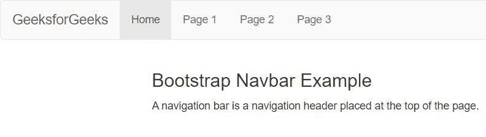

# 如何在 Bootstrap 中创建 navbar？

> 原文:[https://www . geeksforgeeks . org/如何创建自举中的 nav bar/](https://www.geeksforgeeks.org/how-to-create-a-navbar-in-bootstrap/)

[Bootstrap Navbar](https://www.geeksforgeeks.org/bootstrap-4-navigation-bar/) 是位于网页顶部的导航标题，可以根据屏幕大小进行扩展或折叠。Bootstrap Navbar 用于为我们的网站创建响应性导航。

我们可以用 *<导航条创建标准导航条。我们还可以创建不同的 navbar 变体，例如带有下拉菜单和搜索框的 navbar 和一个固定的 nav bar。下面是实现带有导航链接的简单静态 navbar 的过程。*

**在 Bootstrap 中实现 Navbar 的分步指南**

**第 1 步:**在所有其他样式表之前将 Bootstrap 和 [jQuery CDN](https://www.geeksforgeeks.org/how-to-add-jquery-code-to-html-file/) 包含到<头>标签中，以加载我们的 CSS。

> <src = " https://Ajax . Google APIs . com/Ajax/libs/jquery/3 . 5 . 1/jquery . min . js "></script><src = " https://maxcdn . bootstracdn . com/bootstrap/3 . 4 . 1/脚本

**第二步:**用*添加 [<导航>](https://www.geeksforgeeks.org/html-nav-tag/) 标签。navbar* 和*。nav bar-默认<正文>标签中的*类。

```html
<nav class="navbar navbar-default">
    <!-- Navbar content goes here -->
</nav>
```

**第三步:**添加 [< div >](https://www.geeksforgeeks.org/div-tag-html/) 类标签*容器-流体*，同时添加另一个< div >类*。导航栏-标题*给标题命名，关闭< div >标签后添加导航列表。

**注:**类*。navbar-header* 是可选的。

```html
<div class="container-fluid">
  <div class="navbar-header">
    <a class="navbar-brand" href="#">WebSiteName</a>
  </div>

  <ul class="nav navbar-nav">
    <li class="active"><a href="#">Home</a></li>
    <li><a href="#">Page 1</a></li>
    <li><a href="#">Page 2</a></li>
    <li><a href="#">Page 3</a></li>
  </ul>
</div>
```

我们已经在 Bootstrap 中成功实现了 Navbar。

**示例:**

## 超文本标记语言

```html
<!DOCTYPE html>
<html lang="en">

<head>
    <title>Bootstrap NavBar Example</title>
    <meta charset="utf-8" />
    <!-- Include bootstrap, CSS and jQuery CDN -->
    <meta name="viewport" content=
        "width=device-width, initial-scale=1" />
    <link rel="stylesheet" href=
"https://maxcdn.bootstrapcdn.com/bootstrap/3.4.1/css/bootstrap.min.css" />
    <script src=
"https://ajax.googleapis.com/ajax/libs/jquery/3.5.1/jquery.min.js">
    </script>
    <script src=
"https://maxcdn.bootstrapcdn.com/bootstrap/3.4.1/js/bootstrap.min.js">
    </script>
</head>

<body>
    <!-- Add <nav> tag with .navbar and
         .navbar-default class -->
    <nav class="navbar navbar-default">

        <!-- Add navbar content -->
        <div class="container-fluid">

            <!-- Include .navbar-header class 
                 in <div>  (optional)-->
            <div class="navbar-header">
                <a class="navbar-brand" href="#">
                    GeeksforGeeks
                </a>
            </div>

            <!-- Include navbar list -->
            <ul class="nav navbar-nav">
                <li class="active"><a href="#">
                    Home
                </a></li>
                <li><a href="#">Page 1</a></li>
                <li><a href="#">Page 2</a></li>
                <li><a href="#">Page 3</a></li>
            </ul>
        </div>
    </nav>

    <!-- Sample page content -->
    <div class="container">
        <h3>Bootstrap Navbar Example</h3>

        <p>
            A navigation bar is a navigation 
            header placed at the top of the page.
        </p>
    </div>
</body>

</html>
```

**输出:**

