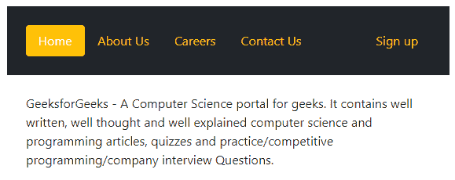
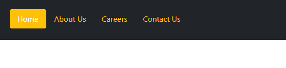
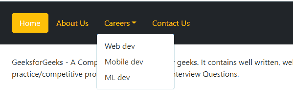
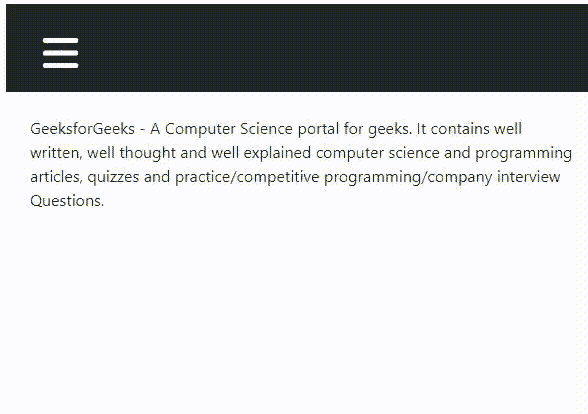

# 如何在 Bootstrap5 中创建药丸导航菜单？

> 原文:[https://www . geesforgeks . org/如何创建药丸-导航-bootstrap5 中的菜单/](https://www.geeksforgeeks.org/how-to-create-a-pills-navigation-menu-in-bootstrap5/)

在本文中，我们将学习如何在 [Bootstrap 5 中制作药丸导航菜单。](https://www.geeksforgeeks.org/bootstrap-5-introduction/)药丸是一个很好的导航风格，可以为您的网站实现，因为它增强了用户体验和您网站的导航流。创建药丸导航菜单既简单又容易，您所要做的就是包含正确的引导类，并了解这些类将执行什么功能。我们将讨论药丸导航有利于使用的所有情况。让我们一个接一个地开始。

有两种方法可以在 HTML 中应用引导:

*   通过使用引导 CDN 链接
*   从官方网站下载引导程序。

有关安装和配置过程的更多详细信息，请参考[引导介绍和安装](https://www.geeksforgeeks.org/bootstrap-part-1-introduction-and-installation/)一文。

**创建简单药丸导航菜单:**要创建简单药丸导航菜单，只需添加类**。导航药丸**和**一起到你的导航元素。nav** 类，是 bootstrap 中每个可用导航样式的基类。那个。导航类元素包裹在所有**中。导航链接**类元素。*。nav-link* 类应该赋予 navbar 中存在的所有链接元素。

**示例:**本示例展示了药丸导航菜单的基本实现。

## 超文本标记语言

```html
<!DOCTYPE html>
<html lang="en">
   <head>
      <meta charset="UTF-8" />
      <meta http-equiv="X-UA-Compatible" 
         content="IE=edge" />
      <meta name="viewport" 
         content="width=device-width, 
         initial-scale=1.0" />
      <title>Pills navigation menu</title>
      <link href=
"https://cdn.jsdelivr.net/npm/bootstrap@5.0.2/dist/css/bootstrap.min.css"
         rel="stylesheet"
         integrity=
"sha384-EVSTQN3/azprG1Anm3QDgpJLIm9Nao0Yz1ztcQTwFspd3yD65VohhpuuCOmLASjC"
         crossorigin="anonymous" />
   </head>
   <body>
      <nav class="nav nav-pills p-4 bg-dark">
         <a class="nav-link active bg-warning" 
            aria-current="true" 
            href="#">Home
         </a>
         <a class="nav-link text-warning" 
            href="#">About Us</a>
         <a class="nav-link text-warning" 
            href="#">Careers</a>
         <a class="nav-link text-warning" 
            href="#">Contact Us</a>
      </nav>
      <p class="p-4">
         GeeksforGeeks - A Computer Science portal for geeks. 
         It contains well written, well thought and well 
         explained computer science and programming
         articles, quizzes and practice/competitive 
         programming/company interview Questions.
      </p>

   </body>
</html>
```

**说明:**

*   *。p-4* 类为元素实现填充。
*   *。bg-waring* 实现了一个黄色阴影的背景颜色。
*   *。BG-深色*实现深色背景。
*   *。活动的*类描绘了用户当前对你网页的看法。
*   *。文本警告*将文本颜色设为黄色。

**输出:**


一个简单的药丸导航菜单

**创建右对齐的药丸导航:**要右对齐元素，可以使用**。ms-auto 类**到元素。

**示例:**在本例中，我们使用了*。ms-auto* 类，注册被移到右侧。

## 超文本标记语言

```html
<!DOCTYPE html>
<html lang="en">
   <head>
      <meta charset="UTF-8" />
      <meta http-equiv="X-UA-Compatible" 
         content="IE=edge" />
      <meta name="viewport" 
         content="width=device-width, 
         initial-scale=1.0" />
      <title>Pills navigation menu</title>
      <link href=
"https://cdn.jsdelivr.net/npm/bootstrap@5.0.2/dist/css/bootstrap.min.css"
         rel="stylesheet"
         integrity=
"sha384-EVSTQN3/azprG1Anm3QDgpJLIm9Nao0Yz1ztcQTwFspd3yD65VohhpuuCOmLASjC"
         crossorigin="anonymous"/>
   </head>
   <body>
      <nav class="nav nav-pills p-4 bg-dark">
         <a class="nav-link active bg-warning" 
            aria-current="true" 
            href="#">Home
         </a>
         <a class="nav-link text-warning" 
            href="#">About Us
         </a>
         <a class="nav-link text-warning" 
            href="#">Careers
         </a>
         <a class="nav-link text-warning" 
            href="#">Contact Us
         </a>
         <a class="nav-link text-warning ms-auto" 
            href="#">Sign up
         </a>
      </nav>
      <p class="p-4">
         GeeksforGeeks - A Computer Science portal for geeks.
         It contains well written, well thought and well
         explained computer science and programming
         articles, quizzes and practice/competitive
         programming/company interview Questions.
      </p>

   </body>
</html>
```

**输出:**



右对齐药丸导航

**创建横跨全屏的药丸导航:**要制作占据整个屏幕宽度的药丸，我们可以使用****。导航填充**类。这个类通过控制*的宽度来填充整个屏幕。导航链接*项。**

****示例:**在本例中，我们使用了*。nav-fill* 类将创建横跨全屏的药丸导航。**

## **超文本标记语言**

```html
<!DOCTYPE html>
<html lang="en">
   <head>
      <meta charset="UTF-8" />
      <meta http-equiv="X-UA-Compatible" 
         content="IE=edge" />
      <meta name="viewport" 
         content="width=device-width, 
         initial-scale=1.0" />
      <title>Pills navigation menu</title>
      <link href=
"https://cdn.jsdelivr.net/npm/bootstrap@5.0.2/dist/css/bootstrap.min.css"
         rel="stylesheet"
         integrity=
"sha384-EVSTQN3/azprG1Anm3QDgpJLIm9Nao0Yz1ztcQTwFspd3yD65VohhpuuCOmLASjC"
         crossorigin="anonymous" />
   </head>
   <body>
      <nav class="nav nav-pills nav-fill p-4 bg-dark">
         <a class="nav-link active bg-warning" 
            aria-current="true" 
            href="#">Home
         </a>
         <a class="nav-link text-warning" 
            href="#">About Us
         </a>
         <a class="nav-link text-warning" 
            href="#">Careers
         </a>
         <a class="nav-link text-warning" 
            href="#">Contact Us
         </a>
      </nav>
      <p class="p-4">
         GeeksforGeeks - A Computer Science portal for geeks. 
         It contains well written, well thought and well explained
         computer science and programming articles, quizzes and
          practice/competitive programming/company interview
         Questions.
      </p>

   </body>
</html>
```

****输出:****

**

全屏显示药丸导航菜单** 

****创建一个药丸导航，每个链接采用相同的宽度:**从前面的例子来看，虽然导航链接横跨整个屏幕，但每个导航链接采用不同的宽度。在这个例子中，我们将看到如何跨越整个屏幕，每个导航链接占据相等的水平宽度/空间。对于等宽，我们使用类**。导航元素中的导航对齐**，而不是*。导航填充*类。**

****示例:**本示例显示了对齐药丸导航菜单。**

## **超文本标记语言**

```html
<!DOCTYPE html>
<html lang="en">
  <head>
    <meta charset="UTF-8" />
    <meta http-equiv="X-UA-Compatible" 
          content="IE=edge" />
    <meta name="viewport" 
          content="width=device-width, 
                   initial-scale=1.0" />
    <title>Pills navigation menu</title>
    <link href=
"https://cdn.jsdelivr.net/npm/bootstrap@5.0.2/dist/css/bootstrap.min.css"
            rel="stylesheet"
          integrity=
"sha384-EVSTQN3/azprG1Anm3QDgpJLIm9Nao0Yz1ztcQTwFspd3yD65VohhpuuCOmLASjC"
          crossorigin="anonymous" />
  </head>
  <body>
    <nav class="nav nav-pills nav-justified p-4 bg-dark">
      <a class="nav-link active bg-warning" 
         aria-current="true" 
         href="#">Home
      </a>
      <a class="nav-link text-warning" 
         href="#">About Us
      </a>
      <a class="nav-link text-warning" 
         href="#">Careers
      </a>
      <a class="nav-link text-warning" 
         href="#">Contact Us
      </a>
    </nav>
    <p class="p-4">
      GeeksforGeeks - A Computer Science portal for geeks. 
      It contains well written, well thought and well explained 
      computer science and programming articles, quizzes and
      practice/competitive programming/company interview
      Questions.
    </p>

  </body>
</html>
```

****输出:****

**

对齐药丸导航菜单** 

*****提示:*** 使用 Chrome web developer 工具进行模式检查，看看区别。**

****创建固定药丸导航:**固定导航是指当您滚动时，导航条将固定在屏幕顶部。要实现此功能，请添加类**。固定顶**到导航元素。**

****示例:**该示例使用*来说明固定药丸导航条。固定顶*级。**

## **超文本标记语言**

```html
<!DOCTYPE html>
<html lang="en">
  <head>
    <meta charset="UTF-8" />
    <meta http-equiv="X-UA-Compatible" 
          content="IE=edge" />
    <meta name="viewport" 
          content="width=device-width, 
                   initial-scale=1.0" />
    <title>Pills navigation menu</title>
    <link href=
"https://cdn.jsdelivr.net/npm/bootstrap@5.0.2/dist/css/bootstrap.min.css"
          rel="stylesheet"
          integrity=
"sha384-EVSTQN3/azprG1Anm3QDgpJLIm9Nao0Yz1ztcQTwFspd3yD65VohhpuuCOmLASjC"
          crossorigin="anonymous"/>
  </head>
  <body>
    <nav class="nav nav-pills fixed-top p-4 bg-dark">
      <a class="nav-link active bg-warning" 
         aria-current="true" 
         href="#">Home
      </a>
      <a class="nav-link text-warning" 
         href="#">About Us
      </a>
      <a class="nav-link text-warning" 
         href="#">Careers
      </a>
      <a class="nav-link text-warning" 
         href="#">Contact Us
      </a>
    </nav>

    <script
      src=
"https://cdn.jsdelivr.net/npm/bootstrap@5.0.2/dist/js/bootstrap.bundle.min.js"
      integrity=
"sha384-MrcW6ZMFYlzcLA8Nl+NtUVF0sA7MsXsP1UyJoMp4YLEuNSfAP+JcXn/tWtIaxVXM"
      crossorigin="anonymous" >
    </script>
  </body>
</html>
```

****输出:****

**

固定药丸导航** 

****用下拉导航创建药丸:**要用下拉导航创建药丸，我们需要包括**。下拉类**到一个用**包装元素的 div。下拉菜单**类别和。**下拉切换**类，它被赋予一个包裹在里面的导航链接元素。**

**那个。下拉菜单类被赋予一个无序列表，该列表包含下拉菜单中出现的所有菜单内容。它还包括类**的元素。下拉项目**表示菜单中出现的每个项目。**

*****数据-bs-切换*** 属性应赋予。nav-link 元素的值为“dropdown ”,点击时，我们将切换下拉视图。还有，*的**角色**的*属性。导航链接元素应设置为“按钮”。**

****示例:**此示例说明了带有下拉功能的 navbar 药丸。**

## **超文本标记语言**

```html
<!DOCTYPE html>
<html lang="en">
  <head>
    <meta charset="UTF-8" />
    <meta http-equiv="X-UA-Compatible" 
          content="IE=edge" />
    <meta name="viewport" 
          content="width=device-width, 
                   initial-scale=1.0" />
    <title>Pills navigation menu</title>
    <link href=
"https://cdn.jsdelivr.net/npm/bootstrap@5.0.2/dist/css/bootstrap.min.css"
          rel="stylesheet"
          integrity=
"sha384-EVSTQN3/azprG1Anm3QDgpJLIm9Nao0Yz1ztcQTwFspd3yD65VohhpuuCOmLASjC"
          crossorigin="anonymous"/>
  </head>
  <body>
    <nav class="nav nav-pills p-4 bg-dark">
      <a class="nav-link active bg-warning" 
         aria-current="true" 
         href="#">Home
      </a>
      <a class="nav-link text-warning" 
         href="#">About Us
      </a>
      <div class="dropdown">
        <a
          class="nav-link text-warning"
          role="button"
          data-bs-toggle="dropdown"
          aria-expanded="false"
          href="#">Careers
        </a>
        <ul class="dropdown-menu">
          <li>
            <a class="dropdown-item" 
               href="#">Web dev</a>
          </li>
          <li>
            <a class="dropdown-item" 
               href="#">Mobile dev
            </a>
          </li>
          <li>
            <a class="dropdown-item" 
                 href="#">ML dev
            </a>
          </li>
        </ul>
      </div>
      <a class="nav-link text-warning" 
         href="#">Contact Us
      </a>
    </nav>

    <p class="p-4">
      GeeksforGeeks - A Computer Science 
      portal for geeks. It contains well
      written, well thought and well 
      explained computer science and programming
      articles, quizzes and practice/
      competitive programming/company interview
      Questions.
    </p>

    <script src=
"https://cdn.jsdelivr.net/npm/bootstrap@5.0.2/dist/js/bootstrap.bundle.min.js"
            integrity=
"sha384-MrcW6ZMFYlzcLA8Nl+NtUVF0sA7MsXsP1UyJoMp4YLEuNSfAP+JcXn/tWtIaxVXM"
            crossorigin="anonymous">
    </script>
  </body>
</html>
```

****输出:****

**

带下拉菜单的药丸导航** 

****创建可折叠药丸导航菜单:**要创建可折叠药丸导航菜单，请使用带类的按钮。 **navbar-toggler** 带属性 **data-bs-toggle 和 data-bs-target。**按钮**内跨**一个等级为**的元素。navbar-toggler-icon** 。在这里，我们还使用了 [fontawesome](https://fontawesome.com/) 来获取汉堡菜单图标。然后，包装**。导航链接**元素和类。**nav bar-塌陷和。折叠并识别 **#navbar 的**-折叠**。使用类**。折叠**作为属性**数据-bs-切换**的值，折叠 **id** 作为**数据-bs-目标**属性的值。**

****示例:**本示例说明了可折叠药丸导航菜单。**

## **超文本标记语言**

```html
<!DOCTYPE html>
<html lang="en">
  <head>
    <meta charset="UTF-8" />
    <meta http-equiv="X-UA-Compatible" 
          content="IE=edge" />
    <meta name="viewport" 
          content="width=device-width, 
                   initial-scale=1.0" />
    <title>Pills navigation menu</title>
    <link href=
"https://cdn.jsdelivr.net/npm/bootstrap@5.0.2/dist/css/bootstrap.min.css"
          rel="stylesheet"
          integrity=
"sha384-EVSTQN3/azprG1Anm3QDgpJLIm9Nao0Yz1ztcQTwFspd3yD65VohhpuuCOmLASjC"
      crossorigin="anonymous"/>
    <link rel="stylesheet"
          href=
"https://cdnjs.cloudflare.com/ajax/libs/font-awesome/6.0.0-beta2/css/all.min.css"/>
  </head>

  <body>
    <nav class="nav nav-pills p-4 bg-dark">
      <button
        class="navbar-toggler"
        type="button"
        data-bs-toggle="collapse"
        data-bs-target="#navbar-collapse">
        <span class="navbar-toggler-icon">
          <i class="fas fa-bars text-white fa-2x"></i>
        </span>
      </button>
      <div class="collapse navbar-collapse text-white" 
           id="navbar-collapse">
        <ul class="navbar-nav">
          <li class="nav-item mt-4 pl-3">
            <a class="nav-link active bg-warning" 
               aria-current="true" 
               href="#">Home
            </a>
          </li>
          <li class="nav-item">
            <a class="nav-link text-warning" 
               href="#">About Us </a>
          </li>
          <li class="nav-item">
            <a class="nav-link text-warning" 
               href="#">Careers </a>
          </li>
          <li class="nav-item">
            <a class="nav-link text-warning" 
               href="#">Contact Us </a>
          </li>
        </ul>
      </div>
    </nav>

    <p class="p-4">
      GeeksforGeeks - A Computer Science portal 
      for geeks. It contains well written, well 
      thought and well explained computer science 
      and programming articles, quizzes and 
      practice/competitive programming/company 
      interview Questions.
    </p>

    <script src=
"https://cdn.jsdelivr.net/npm/bootstrap@5.0.2/dist/js/bootstrap.bundle.min.js"
            integrity=
"sha384-MrcW6ZMFYlzcLA8Nl+NtUVF0sA7MsXsP1UyJoMp4YLEuNSfAP+JcXn/tWtIaxVXM"
            crossorigin="anonymous">
    </script>
  </body>
</html>
```

****输出:****

**

可折叠药丸导航**