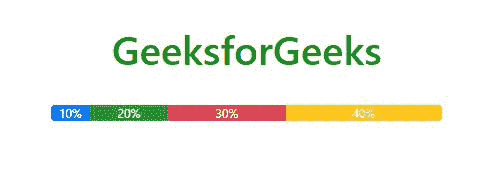
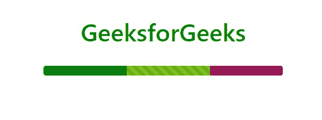

# 如何在 Bootstrap 中创建不同颜色的进度条？

> 原文:[https://www . geeksforgeeks . org/如何创建不同颜色进度条引导/](https://www.geeksforgeeks.org/how-to-create-a-progress-bar-in-different-colors-in-bootstrap/)

Bootstrap 5 是 Bootstrap 的最新主要版本，在该版本中，他们修改了用户界面并进行各种更改。进度条是描述任何目标或任务的详细信息的图形表示，即它用于表示任务或任何操作的进度，显示过程中完成了多少以及还剩多少。您可以使用预定义的引导类在网页上添加进度条。在本文中，我们将学习如何使用预定义的 Bootstrap 类创建不同颜色的进度条。

**语法:**

```html
<div class="progress">Contents<div>
```

引导中的进度条可以用不同的颜色创建。有两种方法可以改变引导中进度条的颜色。

**方法 1:** 使用 ***bg-type:***

我们可以在 progress div 中添加 bg-type 类来改变它的颜色。bootstrap5 中有 8 种颜色定制选项:

*   BG-初级
*   BG-中学
*   血糖-成功
*   BG-危险
*   BG-警告
*   BG-信息
*   bg 灯
*   BG-深色

**示例:**这个示例用不同的颜色说明了一些基本的进度条。这些进度条通过它们的背景色表示一种情绪，如成功、危险和中立。要用不同的颜色创建进度条的某个部分，只需在进度条中添加一个带有类进度条的新 div。

## 超文本标记语言

```html
<!DOCTYPE html>
<html lang="en">

<head>
    <meta charset="utf-8" />
    <meta name="viewport" content=
        "width=device-width, initial-scale=1" />
    <link rel="stylesheet" href=
"https://maxcdn.bootstrapcdn.com/bootstrap/4.3.1/css/bootstrap.min.css" />
</head>

<body>
    <center>
        <h1 style="color: green">GeeksforGeeks</h1>
        <br />
        <div class="progress" style="max-width: 60%">
            <div class="progress-bar"
                style="width: 10%">10%
            </div>
            <div class="progress-bar bg-success"
                style="width: 20%">20%
            </div>
            <div class="progress-bar bg-danger
                progress-bar-stripped" style="width: 30%">
                30%
            </div>
            <div class="progress-bar bg-warning
                progress-bar-stripped" style="width: 40%">
                40%
            </div>
        </div>
    </center>
</body>

</html>
```

**输出:**



**方法二:**利用 CSS 的**背景色**属性:

我们可以使用带有背景颜色属性的样式参数将进度条的颜色更改为任何所需的颜色。要用不同的颜色创建进度条的某个部分，只需在进度条中添加一个带有类进度条的新 div。

**示例:**这里，我们将借助进度条的十六进制代码、名称或 RGB 值，使用确定的颜色来更改进度条的颜色。

## 超文本标记语言

```html
<!DOCTYPE html>
<html lang="en">

<head>
    <meta charset="utf-8" />
    <meta name="viewport" content=
        "width=device-width, initial-scale=1" />
    <link rel="stylesheet" href=
"https://maxcdn.bootstrapcdn.com/bootstrap/4.3.1/css/bootstrap.min.css" />
</head>

<body>
    <center>
        <h1 style="color: green">GeeksforGeeks</h1>
        <br />
        <div class="progress" style="max-width: 60%">
            <div class="progress-bar"
                style="width: 80%; background-color: green">
            </div>
            <div class="progress-bar progress-bar-stripped"
                style="width: 80%; background-color: #66b400">
            </div>
            <div class="progress-bar progress-bar-stripped"
                style="width: 70%; background-color: rgb(141, 3, 72)">
            </div>
        </div>
        <br />
    </center>
</body>

</html>
```

**输出:**

