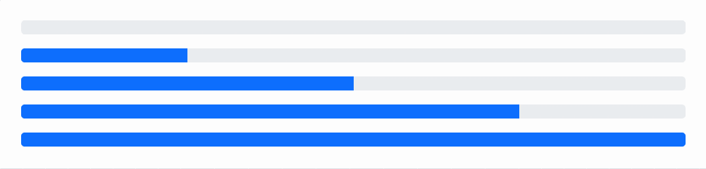
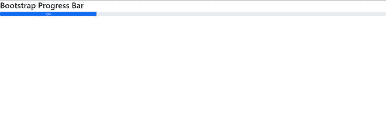
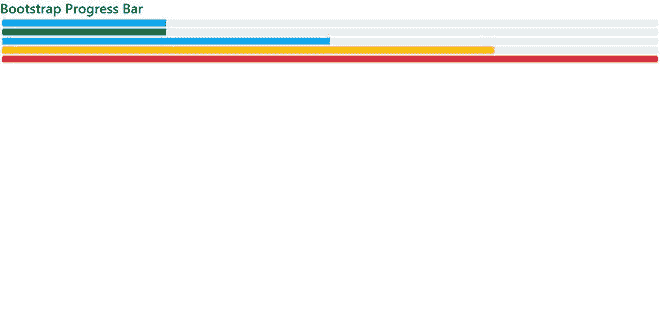
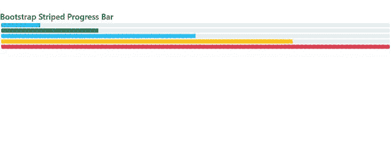
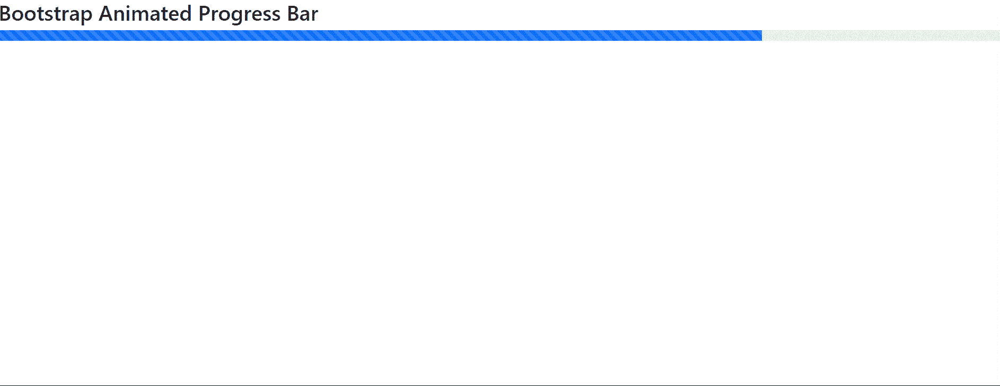

# 如何使用 bootstrap 创建进度条？

> 原文:[https://www . geeksforgeeks . org/如何使用引导程序创建进度条/](https://www.geeksforgeeks.org/how-to-create-a-progress-bar-using-bootstrap/)

Bootstrap 是一个开源框架，用于设计易于使用且高效的响应网站。它有现成的模板，可以用来在有限的时间内设计网页。

**什么是进度条？**

每当需要可视化界面来显示特定任务的进度时，都会使用进度条。假设“有多少百分比的文件被下载，或者有多少百分比的学生通过了考试”。

为此，Bootstrap 有一个进度条组件，可以在网页上使用。所有版本的引导程序都支持进度条组件。

**如何使用 bootstrap 添加进度条？**

1.  在这里访问 Bootstrap [的官方页面。在右侧，可以根据要求选择合适的引导版本。但建议使用最新版本，因为它内置了新功能。](https://getbootstrap.com/docs/5.0/getting-started/introduction/)
2.  在左侧面板的组件部分下，可以看到进度选项卡。在进度选项卡下，可以看到进度条组件。
3.  现在模板已经可以直接使用了。这可以通过将模板放在 html 页面的主体部分来完成。

**示例 1:** 可以使用自举的文档选项卡中的起始模板。

## 超文本标记语言

```html
<!doctype html>
<html lang="en">

<head>
    <!-- Bootstrap CSS and JS -->
    <link href=
"https://cdn.jsdelivr.net/npm/bootstrap@5.0.2/dist/css/bootstrap.min.css"
          rel="stylesheet"
          crossorigin="anonymous">

    <script src=
"https://cdn.jsdelivr.net/npm/bootstrap@5.0.2/dist/js/bootstrap.bundle.min.js"
            crossorigin="anonymous">
      </script>
</head>

<body>
    <div class="progress">
        <div class="progress-bar" role="progressbar"
            aria-valuenow="0" aria-valuemin="0"
            aria-valuemax="100">
        </div>
    </div>
    <div class="progress">
        <div class="progress-bar" role="progressbar"
            style="width: 25%" aria-valuenow="25"
            aria-valuemin="0"
            aria-valuemax="100">
        </div>
    </div>
    <div class="progress">
        <div class="progress-bar" role="progressbar"
            style="width: 50%" aria-valuenow="50"
            aria-valuemin="0"
            aria-valuemax="100">
        </div>
    </div>
    <div class="progress">
        <div class="progress-bar" role="progressbar"
            style="width: 75%" aria-valuenow="75"
            aria-valuemin="0"
            aria-valuemax="100">
        </div>
    </div>
    <div class="progress">
        <div class="progress-bar" role="progressbar"
            style="width: 100%" aria-valuenow="100"
            aria-valuemin="0"
            aria-valuemax="100">
        </div>
    </div>
</body>

</html>
```

**输出:**在网页上可以看到如下进度条。



**例 2:** 我们可以通过在进度条的 div 之间写入来显示进度条的百分比。

#### 语法:

```html
<div class="progress">
  <div class="progress-bar" role="progressbar" style="width: 25%;" aria-valuenow="25" aria-valuemin="0" aria-valuemax="100">25%</div>
</div>
```

#### 代码:

## 超文本标记语言

```html
<!doctype html>
<html lang="en">

<head>
    <!-- Bootstrap CSS and JS -->
    <link href="https://cdn.jsdelivr.net/npm/bootstrap@5.0.2/dist/css/bootstrap.min.css" rel="stylesheet"
        crossorigin="anonymous">

    <script src="https://cdn.jsdelivr.net/npm/bootstrap@5.0.2/dist/js/bootstrap.bundle.min.js" crossorigin="anonymous">
    </script>
</head>

<body>
    <h2>Bootstrap Progress Bar</h2>
    <div class="progress">
        <div class="progress-bar" role="progressbar" style="width: 25%;" aria-valuenow="25" aria-valuemin="0" aria-valuemax="100">25%</div>
      </div>
</body>

</html>
```

#### **输出:**



**注:**进度值可根据需要在代码中更改。

### 出现

我们可以使用引导后台实用程序类来更改进度条的外观，如**【BG-info】****【BG-success】****【BG-warning】**等。

#### 语法:

```html
<div class="progress">
  <div class="progress-bar bg-success" role="progressbar" style="width: 25%" aria-valuenow="25" aria-valuemin="0" aria-valuemax="100"></div>
</div>
```

下面是一个代码示例，其中我们使用不同的背景实用程序类制作了不同颜色的进度条。

#### 代码:

## 超文本标记语言

```html
<!doctype html>
<html lang="en">

<head>
    <!-- Bootstrap CSS and JS -->
    <link href="https://cdn.jsdelivr.net/npm/bootstrap@5.0.2/dist/css/bootstrap.min.css" rel="stylesheet"
        crossorigin="anonymous">

    <script src="https://cdn.jsdelivr.net/npm/bootstrap@5.0.2/dist/js/bootstrap.bundle.min.js" crossorigin="anonymous">
    </script>
</head>

<body>
    <h2>Bootstrap Progress Bar</h2>
    <div class="progress" style="margin: 5px;">
        <div class="progress-bar" role="progressbar" style="width: 25%" aria-valuenow="20" aria-valuemin="0"
            aria-valuemax="100">
        </div>
    </div>

    <div class="progress" style="margin: 5px;">
        <div class="progress-bar bg-success" role="progressbar" style="width: 25%" aria-valuenow="25" aria-valuemin="0"
            aria-valuemax="100"></div>
    </div>
    <div class="progress" style="margin: 5px;">
        <div class="progress-bar bg-info" role="progressbar" style="width: 50%" aria-valuenow="50" aria-valuemin="0"
            aria-valuemax="100"></div>
    </div>
    <div class="progress" style="margin: 5px;">
        <div class="progress-bar bg-warning" role="progressbar" style="width: 75%" aria-valuenow="75" aria-valuemin="0"
            aria-valuemax="100"></div>
    </div>
    <div class="progress" style="margin: 5px;">
        <div class="progress-bar bg-danger" role="progressbar" style="width: 100%" aria-valuenow="100" aria-valuemin="0"
            aria-valuemax="100"></div>
    </div>

</body>

</html>
```

#### 输出:



不同外观的引导进度条

### 条纹进度条

我们可以使用组件中的类**“进度条分条”**和“进度条”类来制作分条进度条。

#### 语法:

```html
<div class="progress">
  <div class="progress-bar progress-bar-striped" role="progressbar" style="width: 25%" aria-valuenow="25" aria-valuemin="0" aria-valuemax="100"></div>
</div>
```

#### 代码:

## 超文本标记语言

```html
<!doctype html>
<html lang="en">

<head>
    <!-- Bootstrap CSS and JS -->
    <link href="https://cdn.jsdelivr.net/npm/bootstrap@5.0.2/dist/css/bootstrap.min.css" rel="stylesheet"
        crossorigin="anonymous">

    <script src="https://cdn.jsdelivr.net/npm/bootstrap@5.0.2/dist/js/bootstrap.bundle.min.js" crossorigin="anonymous">
    </script>
</head>

<body>
    <h2>Bootstrap Striped Progress Bar</h2>

    <div class="progress" style="margin: 5px;">
        <div class="progress-bar progress-bar-striped" role="progressbar" style="width: 10%" aria-valuenow="10" aria-valuemin="0" aria-valuemax="100"></div>
      </div>
      <div class="progress" style="margin: 5px;">
        <div class="progress-bar progress-bar-striped bg-success" role="progressbar" style="width: 25%" aria-valuenow="25" aria-valuemin="0" aria-valuemax="100"></div>
      </div>
      <div class="progress" style="margin: 5px;">
        <div class="progress-bar progress-bar-striped bg-info" role="progressbar" style="width: 50%" aria-valuenow="50" aria-valuemin="0" aria-valuemax="100"></div>
      </div>
      <div class="progress" style="margin: 5px;">
        <div class="progress-bar progress-bar-striped bg-warning" role="progressbar" style="width: 75%" aria-valuenow="75" aria-valuemin="0" aria-valuemax="100"></div>
      </div>
      <div class="progress" style="margin: 5px;">
        <div class="progress-bar progress-bar-striped bg-danger" role="progressbar" style="width: 100%" aria-valuenow="100" aria-valuemin="0" aria-valuemax="100"></div>
      </div>

</body>

</html>
```

#### 输出:



引导分条进度条

### 动画进度条

我们可以使用组件中的“进度条动画”类和“进度条”类制作动画进度条。

#### 语法:

```html
<div class="progress">
  <div class="progress-bar progress-bar-striped progress-bar-animated" role="progressbar" aria-valuenow="75" aria-valuemin="0" aria-valuemax="100" style="width: 75%"></div>
</div>
```

#### 代码:

## 超文本标记语言

```html
<!doctype html>
<html lang="en">

<head>
    <!-- Bootstrap CSS and JS -->
    <link href="https://cdn.jsdelivr.net/npm/bootstrap@5.0.2/dist/css/bootstrap.min.css" rel="stylesheet"
        crossorigin="anonymous">

    <script src="https://cdn.jsdelivr.net/npm/bootstrap@5.0.2/dist/js/bootstrap.bundle.min.js" crossorigin="anonymous">
    </script>
</head>

<body>
    <h2>Bootstrap Animated Progress Bar</h2>
    <div class="progress">
        <div class="progress-bar progress-bar-striped progress-bar-animated" role="progressbar" aria-valuenow="75" aria-valuemin="0" aria-valuemax="100" style="width: 75%"></div>
      </div>

</body>

</html>
```

#### 输出:



引导动画进度条

#### 支持的浏览器:

*   谷歌 Chrome
*   歌剧
*   旅行队
*   Mozilla Firefox
*   勇敢的浏览器