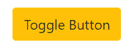
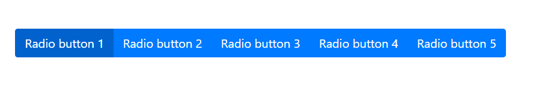
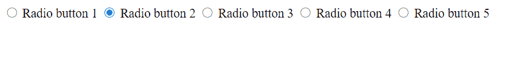
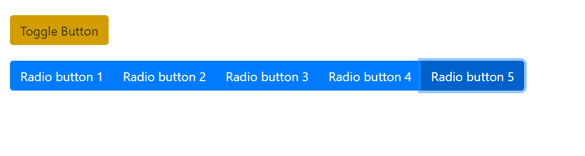

# 如何使用 Bootstrap 创建类似于切换按钮的单选按钮？

> 原文:[https://www . geeksforgeeks . org/如何使用引导程序创建类似于切换按钮的单选按钮/](https://www.geeksforgeeks.org/how-to-create-a-radio-button-similar-to-toggle-button-using-bootstrap/)

**切换按钮:**可以从一种状态切换到另一种状态，即可以从开启状态切换到关闭状态，反之亦然的按钮称为**切换按钮**。例如:

*   我们家的某个开关可以开也可以关。这是现实生活中拨动开关的一个很好的例子。
*   我们手机中的 WiFi 或蓝牙选项是另一个例子，可以打开或关闭。



**单选按钮:**顾名思义，它是收音机中按钮的概念，其中对于第一个电台，我们选择第一个按钮，对于第二个电台，我们选择第二个按钮，以此类推。这就像一个选择题，一次只有一个按钮是活动的。这里我们从选项列表中进行选择。例如:

*   调频收音机中的按钮。
*   考试中的选择题。



**示例:**使用 Bootstrap 创建单选按钮。

## 超文本标记语言

```html
<!DOCTYPE html>
<html lang="en">

<head>
    <meta charset="UTF-8">
    <meta name="viewport" content=
        "width=device-width, initial-scale=1.0">

    <title>Radio Button</title>
</head>

<body>
    <div class="radio">
        <div class="btn-group btn-group-toggle" 
            data-toggle="buttons">
            <label class="btn btn-primary">
                <input type="radio" name="button" 
                    id="button1" autocomplete="off" 
                    checked> Radio button 1
            </label>

            <label class="btn btn-primary active">
                <input type="radio" name="button" 
                id="button2" autocomplete="off">
                Radio button 2
            </label>

            <label class="btn btn-primary">
                <input type="radio" name="button" 
                id="button3" autocomplete="off">
                Radio button 3
            </label>

            <label class="btn btn-primary">
                <input type="radio" name="button" 
                id="button4" autocomplete="off">
                Radio button 4
            </label>

            <label class="btn btn-primary">
                <input type="radio" name="button" 
                id="button5" autocomplete="off">
                Radio button 5
            </label>
        </div>
    </div>
</body>

</html>
```



**要点:**

*   我们必须在任何一个单选按钮上添加一个**选中的**属性，以便在页面加载时进行预选。它是一个布尔属性。
*   必须为所有元素集指定相同的**名称**。

**例 2:** 下面的代码将帮助我们理解设计一个拨动开关和一个单选按钮的区别(在代码中)。

## 超文本标记语言

```html
<!DOCTYPE html>
<html>

<head>

    <!-- Latest compiled and minified CSS -->
    <link rel="stylesheet" href=
"https://maxcdn.bootstrapcdn.com/bootstrap/4.5.0/css/bootstrap.min.css">

    <!-- jQuery library -->
    <script src=
"https://ajax.googleapis.com/ajax/libs/jquery/3.5.1/jquery.min.js">
    </script>

    <!-- Popper JS -->
    <script src=
"https://cdnjs.cloudflare.com/ajax/libs/popper.js/1.16.0/umd/popper.min.js">
    </script>

    <!-- Latest compiled JavaScript -->
    <script src=
"https://maxcdn.bootstrapcdn.com/bootstrap/4.5.0/js/bootstrap.min.js">
    </script>

    <meta name="viewport" content=
        "width=device-width, initial-scale=1">

    <link rel="stylesheet" type="text/css" 
        href="style.css">

    <link href=
"https://stackpath.bootstrapcdn.com/font-awesome/4.7.0/css/font-awesome.min.css"
    rel="stylesheet">

    <link href=
"https://fonts.googleapis.com/css2?family=Lato:ital,wght@0,100;0,300;0,400;1,300&display=swap"
            rel="stylesheet">
    <script src=
"https://cdn.jsdelivr.net/npm/gijgo@1.8.1/combined/js/gijgo.min.js" 
        type="text/javascript">
    </script>

    <link href=
"https://cdn.jsdelivr.net/npm/gijgo@1.8.1/combined/css/gijgo.min.js"
        rel="stylesheet" type="text/css">

    <link rel="stylesheet" type="text/css" 
            href="css/lightbox.min.css">

    <script type="text/javascript" src=
        "js/lightbox-plus-jquery.min.js">
    </script>

    <title>Buttons</title>

    <style>
        .toggle,
        .radio {
            margin: 20px;
        }
    </style>
</head>

<body>
    <div class="toggle">
        <button type="button" 
            class="btn btn-warning" 
            data-toggle="button" 
            autocomplete="off">
            Toggle Button
        </button>
    </div>

    <div class="radio">
        <div class="btn-group btn-group-toggle" 
            data-toggle="buttons">
            <label class="btn btn-primary">
                <input type="radio" name="button" 
                    id="button1" autocomplete="off"
                    checked> Radio button 1
            </label>

            <label class="btn btn-primary active">
                <input type="radio" name="button" 
                    id="button2" autocomplete="off"> 
                    Radio button 2
            </label>

            <label class="btn btn-primary">
                <input type="radio" name="button" 
                    id="button3" autocomplete="off"> 
                    Radio button 3
            </label>

            <label class="btn btn-primary">
                <input type="radio" name="button" 
                    id="button4" autocomplete="off">
                    Radio button 4
            </label>

            <label class="btn btn-primary">
                <input type="radio" name="button" 
                    id="button5" autocomplete="off"> 
                    Radio button 5
            </label>
        </div>
    </div>
</body>

</html>
```

**输出:**

