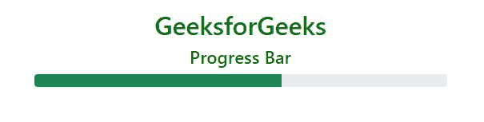

# 如何使用 Bootstrap 5 创建堆叠进度条？

> 原文:[https://www . geeksforgeeks . org/如何创建堆叠进度条-使用-bootstrap-5/](https://www.geeksforgeeks.org/how-to-create-a-stacked-progress-bar-using-bootstrap-5/)

在本文中，我们将了解如何使用 Bootstrap 创建带有标签的堆叠进度条。 [Bootstrap 5](https://www.geeksforgeeks.org/bootstrap-5-introduction/) 是 Bootstrap 最新的一个主要版本，在这个版本中，他们修改了 UI 并做了各种改变。一个[进度条](https://www.geeksforgeeks.org/bootstrap5-progress/)用来在电脑上显示一个进程的进度。进度条显示流程完成了多少，还剩下多少。我们可以使用预定义的引导类在网页上添加进度条。Bootstrap 提供了许多类型的进度条&还支持几个自定义进度条，包括堆叠进度条和动画进度条。

通过使用引导进度条，用户可以快速识别为特定进程执行的任务的状态。例如，如果用户正在下载某个东西，进度条将显示完成状态或正在进行的下载进度。类似的情况可以考虑上传等。

**语法:**

```html
<div class="progress"> Contents <div>
```

**方法:**要创建进度条:

*   在 div 类中使用类**进度**。
*   在已经制作好的 div 类中，添加另一个带有类**的 div 标签。进度条**。这里，bg-success 用于显示进度。
*   使用宽度作为百分比，在样式属性下提及栏的进度。对于 eg- style= "宽度:50%

**示例 1:** 此示例说明了 Bootstrap 中的默认进度条。

## 超文本标记语言

```html
<!DOCTYPE html>
<html>

<head>

    <!-- Load Bootstrap -->
    <link href=
"https://cdn.jsdelivr.net/npm/bootstrap@5.0.2/dist/css/bootstrap.min.css"
        rel="stylesheet" integrity=
"sha384-EVSTQN3/azprG1Anm3QDgpJLIm9Nao0Yz1ztcQTwFspd3yD65VohhpuuCOmLASjC"
        crossorigin="anonymous" />
</head>

<body style="text-align: center">
    <div class="container mt-3" style="width: 700px">
        <h1 style="color: green">
            GeeksforGeeks
        </h1>

        <h4>Progress Bar</h4>

        <div class="progress">
            <div class="progress-bar bg-success" 
                style="width: 60%">
            </div>
        </div>
    </div>
</body>

</html>
```

**输出:**



现在，我们将按照以下步骤来构建我们的堆叠进度条。

**第一步:**下载 [Bootstrap 的](https://getbootstrap.com/docs/5.0/getting-started/download/)最新版本或者我们可以直接将 Bootstrap CDN 链接加入<头>标签。

> <链接 href = " https://cdn . jsdelivr . net/NPM/bootstrap @ 5 . 0 . 2/dist/CSS/bootstrap . min . CSS " rel = " style sheet "完整性= " sha 384-evstqn 3/azprg 1 anm 3 qdgpjlim 9 no 0 yz 1 ztcqtwfspd 3y 65 vohhpupuucomjc " cross origin = " anonymous ">
> 
> <src = " https://cdn . jsdelivr . net/NPM/bootstrap @ 5 . 0 . 2/dist/js/bootstrap . bundle . min . js "完整性= " sha 384-mrcw 6 zmfylzcla 8 nl+ntuvf 0 sa 7 msxsp 1 uyojoump 4 和 unsfap+jcxn/twtiaxvxm " cross origin = " anonymous ">

**步骤 2:** 将类声明为容器，值为*。进展*在外<区>。

```html
<div class="progress">
    <div></div>
    <div></div>
</div>
```

**第三步:**添加*。进度条*类到内部< div >容器。要指定进度条的宽度，我们可以使用预定义的引导类来设置进度条的宽度。例如 *w-25 p-3* 将设置 25%的宽度， *w-50 p-3* 将设置 50%的宽度&以此类推。

```html
<div class="progress">
    <div class="progress-bar bg-success w-25 p-3">
        Progress 1
    </div>

    <div class="progress-bar bg-success w-50 p-3">
        Progress 2
    </div>
</div>
```

**第 4 步:**对于标记堆叠进度条，堆叠进度条内的文本将以百分比显示多任务完成情况。

**示例 2:** 该示例使用 Bootstrap v5.0 说明了标记堆叠进度条

## 超文本标记语言

```html
<!DOCTYPE html>
<html lang="en">

<head>
    <title>
        Bootstrap 5 Labelled Stacked Progress Bar
    </title>
    <meta charset="utf-8" />
    <meta name="viewport" content=
        "width=device-width, initial-scale=1" />
    <link rel="stylesheet" href=
"https://stackpath.bootstrapcdn.com/bootstrap/5.0.0-alpha1/css/bootstrap.min.css"
        integrity=
"sha384-r4NyP46KrjDleawBgD5tp8Y7UzmLA05oM1iAEQ17CSuDqnUK2+k9luXQOfXJCJ4I"
        crossorigin="anonymous" />
</head>

<body style="text-align: center">
    <div class="container mt-5">
        <h1 class="text-success">GeeksforGeeks</h1>
        <h3 class="text-secondary">
            Labelled Stacked Progress Bar
        </h3>
        <br />

        <div class="progress" style="height: 30px">
            <div class="progress-bar bg-primary w-25 p-3">
                Progress 15%
            </div>
            <div class="progress-bar bg-info w-50 p-3">
                Progress 35%
            </div>
            <div class="progress-bar bg-secondary w-25 p-3">
                Progress 12%
            </div>
            <div class="progress-bar bg-success w-50 p-3" role="">
                Progress 38%
            </div>
        </div>
    </div>
</body>

</html>
```

**输出:**

