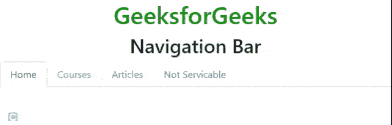
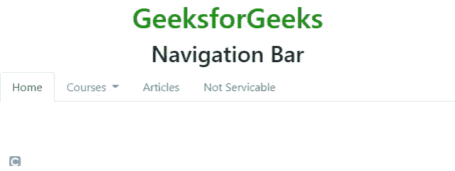

# 如何在 Bootstrap 中创建选项卡式导航菜单？

> 原文:[https://www . geeksforgeeks . org/如何创建选项卡式导航引导菜单/](https://www.geeksforgeeks.org/how-to-create-a-tabbed-navigation-menu-in-bootstrap/)

每个网站都使用导航栏，以使其更加用户友好，从而使网站导航变得容易，用户可以直接搜索他们感兴趣的主题。导航栏位于页面的顶部。

基于选项卡的导航是使用选项卡式部分在单个网页上显示大量内容的最有效方法之一。用户可以通过在窗格之间切换来快速访问内容，而无需离开页面。

**方法:**创建选项卡式导航菜单，创建一个基本的[无序列表](https://www.geeksforgeeks.org/html-lists/)，列表项作为链接。然后将引导的[类](https://www.geeksforgeeks.org/bootstrap-4-navs/) *导航*和*导航标签*添加到无序列表中，将*导航项目*类添加到列表项目中。

**例 1:**

## 超文本标记语言

```html
<!DOCTYPE html>
<html lang="en">
  <head>
    <meta charset="utf-8" />
    <meta name="viewport" content="width=device-width, initial-scale=1" />

    <link
      rel="stylesheet"
      href=
"https://maxcdn.bootstrapcdn.com/bootstrap/4.3.1/css/bootstrap.min.css"/>

    <script src=
"https://ajax.googleapis.com/ajax/libs/jquery/3.3.1/jquery.min.js">
    </script>
    <script src=
"https://cdnjs.cloudflare.com/ajax/libs/popper.js/1.14.7/umd/popper.min.js">
    </script>
    <script src=
"https://maxcdn.bootstrapcdn.com/bootstrap/4.3.1/js/bootstrap.min.js">
    </script>
  </head>
  <body>
    <center>
      <h1 style="color: green">GeeksforGeeks</h1>
      <h2>Navigation Bar</h2>
    </center>
    <ul class="nav nav-tabs">
      <li class="nav-item">
        <a class="nav-link active" 
           aria-current="page" href="#">Home</a>
      </li>
      <li class="nav-item">
        <a class="nav-link" href="#">Courses</a>
      </li>
      <li class="nav-item">
        <a class="nav-link" href="#">Articles</a>
      </li>
      <li class="nav-item">
        <a
          class="nav-link disabled"
          href="#"
          tabindex="-1"
          aria-disabled="true">
          Not Servicable
        </a>
      </li>
    </ul>
  </body>
</html>
```

**输出:**



导航选项卡

**示例 2:** 以下代码显示了一个导航选项卡中的下拉列表。

## 超文本标记语言

```html
<!DOCTYPE html>
<html lang="en">
  <head>
    <title>Navigation Bar</title>

    <meta charset="utf-8" />
    <meta name="viewport" content="width=device-width, initial-scale=1" />

    <link
      rel="stylesheet"
      href=
"https://maxcdn.bootstrapcdn.com/bootstrap/4.3.1/css/bootstrap.min.css"/>

    <script
      src=
"https://cdn.jsdelivr.net/npm/bootstrap@5.0.2/dist/js/bootstrap.bundle.min.js"
      integrity=
"sha384-MrcW6ZMFYlzcLA8Nl+NtUVF0sA7MsXsP1UyJoMp4YLEuNSfAP+JcXn/tWtIaxVXM"
      crossorigin="anonymous">
     </script>
  </head>
  <body>
    <center>
      <h1 style="color: green">GeeksforGeeks</h1>
      <h2>Navigation Bar</h2>
    </center>
    <ul class="nav nav-tabs">
      <li class="nav-item">
        <a class="nav-link active" aria-current="page" href="#"> Home </a>
      </li>
      <li class="nav-item dropdown">
        <a
          class="nav-link dropdown-toggle"
          data-bs-toggle="dropdown"
          href="#"
          role="button"
          aria-expanded="false">
          Courses
        </a>
        <ul class="dropdown-menu">
          <li><a class="dropdown-item" href="#">for 10</a></li>
          <li><a class="dropdown-item" href="#">for 12</a></li>
          <li><a class="dropdown-item" href="#">Graduation</a></li>
        </ul>
      </li>
      <li class="nav-item">
        <a class="nav-link" href="#">Articles</a>
      </li>
      <li class="nav-item">
        <a class="nav-link disabled" href="#"> Not Servicable </a>
      </li>
    </ul>
  </body>
</html>
```

**输出:**

