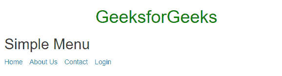

# 如何在 Bootstrap 中创建选项卡式药丸和垂直药丸导航菜单？

> 原文:[https://www . geeksforgeeks . org/如何创建标签药丸和垂直药丸导航引导菜单/](https://www.geeksforgeeks.org/how-to-create-a-tabbed-pills-and-vertical-pills-navigation-menu-in-bootstrap/)

在本文中，我们将了解 Bootstrap 中的选项卡式药丸和垂直药丸导航菜单，并将通过示例了解它们的实现。这些类型的导航菜单用于以不同的方式用特定的独特导航风格来装饰导航栏，以增强用户体验和网站的导航流程，并帮助使用 Bootstrap 预定义的类创建简单易行的导航菜单。我们将依次讨论每种导航风格。让我们从创建一个简单的菜单开始。

**简单菜单:**此菜单用于导航栏，将许多其他页面链接到当前页面。为了创建简单的导航栏，我们可以使用 *list-inline* 类来列出项目。

**语法:**

```html
<ul class="list-inline">
    <li><a href="#">Element 1</a></li>
    <li><a href="#">Element 2</a></li>
</ul>
```

**示例:**在本例中，我们创建了一个简单的菜单。

## 超文本标记语言

```html
<!DOCTYPE html>
<html lang="en">

<head>
    <link rel="stylesheet"
          href=
"https://maxcdn.bootstrapcdn.com/bootstrap/3.4.1/css/bootstrap.min.css">
</head>

<body>
    <div class="container">
        <center>
            <h1 class="text-success">
              GeeksforGeeks
            </h1>
        </center>
        <h2>Simple Menu</h2>
        <ul class="list-inline">
            <li><a href="#">Home</a></li>
            <li><a href="#">About Us</a></li>
            <li><a href="#">Contact</a></li>
            <li><a href="#">Login</a></li>
        </ul>
    </div>
</body>

</html>
```

**输出:**



**标签:**为了创建标签菜单，我们将使用。*导航标签*类生成标签界面，同时使用*激活*类激活当前标签。

**语法:**

```html
<ul class="nav nav-tabs">
   <li class="active"><a href="#">Element 1</a></li>
   <li><a href="#">Element 2</a></li>
   <li><a href="#">Element 3</a></li>
</ul>
```

**示例:**本示例描述了引导选项卡菜单。

## 超文本标记语言

```html
<!DOCTYPE html>
<html lang="en">

<head>
    <link rel="stylesheet"
          href=
"https://maxcdn.bootstrapcdn.com/bootstrap/3.4.1/css/bootstrap.min.css">
</head>

<body>
    <div class="container">
        <center>
            <h1 class="text-success">
              GeeksforGeeks
            </h1>
        </center>
        <h3>Tabbed Menu</h3>
        <ul class="nav nav-tabs">
            <li class="active"><a href="#">Home</a></li>
            <li><a href="#">About Us</a></li>
            <li><a href="#">Contact</a></li>
            <li><a href="#">Login</a></li>
        </ul>
    </div>
</body>

</html>
```