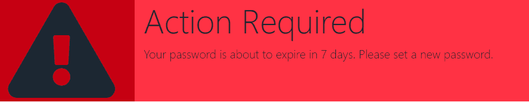
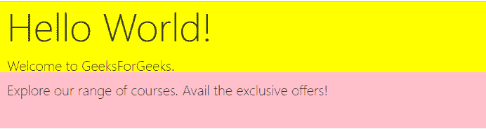

# 如何在 bootstrap 中创建双音横幅？

> 原文:[https://www . geesforgeks . org/如何创建双音自举横幅/](https://www.geeksforgeeks.org/how-to-create-a-two-tone-banner-in-bootstrap/)

Bootstrap 是一个用来设计网页的 CSS 框架。由于它的简单性和易于实现，它是全世界使用最广泛的 CSS 框架。引导程序与 HTML 和 JavaScript 一起使用，使网页具有交互性。横幅是网页中需要额外关注的部分。网页中可以有多个横幅，并且可以放置在网页中的任何位置。Bootstrap 中的横幅由 jumbotron 类表示。大屏幕有预定义的样式，可以用作横幅。创建横幅的另一种方法是自定义样式的容器。Bootstrap 的容器类也可以用来创建任何高度和宽度的横幅。本文讨论了双色横幅的创建，这意味着横幅由两种不同的颜色组成。以下示例显示了如何创建双色横幅。

**示例 1:** 在本例中，我们使用定制样式的容器类创建了横幅。容器类进一步分为行和列。该行由大小分别为 2 个单位和 10 个单位的两列组成。尺寸为 2 个单位的列被赋予一种颜色，而另一列被赋予不同的背景颜色。第一列中会添加一个图标，第二列中会显示一条警告消息。在这个例子中，我们使用内联 CSS。这是一个垂直双色横幅的例子。

**代码实现:**

## 超文本标记语言

```html
<!DOCTYPE html>
<html>

<head>
    <title>Banner</title>
    <link rel="stylesheet" href=
"https://maxcdn.bootstrapcdn.com/bootstrap/4.0.0/css/bootstrap.min.css"
        integrity=
"sha384-Gn5384xqQ1aoWXA+058RXPxPg6fy4IWvTNh0E263XmFcJlSAwiGgFAW/dAiS6JXm"
        crossorigin="anonymous">

    <script src="https://kit.fontawesome.com/136b4fde49.js" 
        crossorigin="anonymous">
    </script>
</head>

<body>
    <div class="container-fluid" style=
        "background:#FF3244;height: 170px;">

        <div class="row">
            <div class="col-2" style=
                "background:#C60012;height:170px;">
                <i class="fas fa-exclamation-triangle 
                    fa-10x py-1" style="color: #1C2833;">
                </i>
            </div>

            <div class="col-10">
                <h1 class="display-4">Action Required</h1>
                <p class="lead">
                    Your password is about to expire in 
                    7 days. Please set a new password.
                </p>

            </div>
        </div>
    </div>

    <script src="https://code.jquery.com/jquery-3.2.1.slim.min.js"
        integrity=
"sha384-KJ3o2DKtIkvYIK3UENzmM7KCkRr/rE9/Qpg6aAZGJwFDMVNA/GpGFF93hXpG5KkN"
        crossorigin="anonymous">
    </script>

    <script src=
"https://cdnjs.cloudflare.com/ajax/libs/popper.js/1.12.9/umd/popper.min.js"
        integrity=
"sha384-ApNbgh9B+Y1QKtv3Rn7W3mgPxhU9K/ScQsAP7hUibX39j7fakFPskvXusvfa0b4Q"
        crossorigin="anonymous">
    </script>

    <script src=
"https://maxcdn.bootstrapcdn.com/bootstrap/4.0.0/js/bootstrap.min.js"
        integrity=
"sha384-JZR6Spejh4U02d8jOt6vLEHfe/JQGiRRSQQxSfFWpi1MquVdAyjUar5+76PVCmYl"
        crossorigin="anonymous">
    </script>
</body>

</html>
```

**输出:**



**示例 2:** 在第二个示例中，我们使用了一个 jumbotron 类。横幅的高度和宽度相当于大屏幕。大屏幕被分成两个容器。这些集装箱高度不同，但宽度相同。与下部容器相比，上部容器具有不同的颜色。对于这个例子，我们已经在 HTML 文档头部的<样式>标签中定义了 CSS 样式。这是一个横向双色横幅的例子。

**代码实现**

## 超文本标记语言

```html
<!DOCTYPE html>
<html>

<head>
    <link rel="stylesheet" href=
"https://maxcdn.bootstrapcdn.com/bootstrap/4.0.0/css/bootstrap.min.css"
        integrity=
"sha384-Gn5384xqQ1aoWXA+058RXPxPg6fy4IWvTNh0E263XmFcJlSAwiGgFAW/dAiS6JXm"
        crossorigin="anonymous">

    <style type="text/css">
        #upper {
            background-color: yellow;
            height: 100px;
            padding-bottom: 20px;
            padding-left: 10px;
        }

        #lower {
            background-color: pink;
            height: 80px;
            padding: 10px;
        }
    </style>
</head>

<body>
    <div class="jumbotron-fluid">
        <div class="container-fluid" id="upper">
            <h2 class="display-4">Hello World!</h2>
            <p class="lead" id="upper_lead">
                Welcome to GeeksForGeeks.
            </p>

        </div>

        <div class="container-fluid" id="lower">
            <p class="lead">
                Explore our range of courses. 
                Avail the exclusive offers!
            </p>

        </div>
    </div>
</body>

</html>
```

**输出:**

