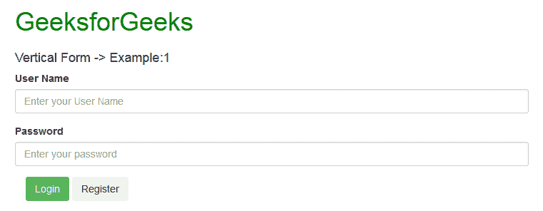
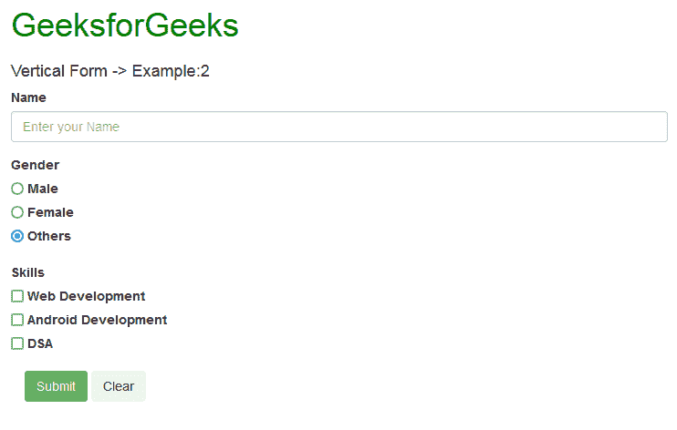

# 如何使用 Bootstrap 创建垂直或基本形态？

> 原文:[https://www . geeksforgeeks . org/如何使用引导程序创建垂直或基本表单/](https://www.geeksforgeeks.org/how-to-create-a-vertical-or-basic-form-using-bootstrap/)

**表单**几乎在你访问的每一个网站中都有使用。它通常用于从用户那里收集数据。它由各种交互控件组成，使用户能够输入数据。这些控件被包装在<表单>标签中，也可以根据需要通过将控件的不同属性设置为不同的值来设计或设置样式。

一些主要的表单控件包括:

*   **文本字段:**为单行字段，只允许输入单行文本。
*   **密码字段:**它们是特殊的文本字段，代表星号或项目符号等特殊字符，而不是用户键入的内容。
*   **文本区:**是多行字段，允许输入多行文本。
*   **复选框:**复选框允许从多个选项中选择多个选项。
*   **单选按钮:**单选按钮也用于从多个选项中进行选择，但在这里，一次只能选择一个按钮。
*   **提交按钮:**是用于提交表单数据的按钮，由用户输入。

它们可以按照要求整合到表格中。

[Bootstrap](https://www.geeksforgeeks.org/bootstrap-tutorials/) 提供以下 **3 种类型的**表单布局:

1.  垂直表单(默认)
2.  水平形式
3.  内嵌表单

在本文中，我们将学习创建基本的垂直表单。

**如何在 bootstrap 中创建垂直或基本形态？**

*   要通过使用 bootstrap 将这个表单包含到您的网站中，您只需要将以下 jquery 和 bootstrap 库作为脚本包含在您的 HTML 代码中。

> <脚本 src = " https://maxcdn . bootstrapcdn . com/bootstrap/3 . 4 . 0/js/bootstrap . min . js "></脚本>

*   在 HTML 文档的头部包含如下引导的样式表链接，这将使我们能够使用各种类型的引导来设计表单及其控件的样式。

> <link rel="”stylesheet”" href="”https://maxcdn.bootstrapcdn.com/bootstrap/3.4.0/css/bootstrap.min.css”">

*   在代码主体中包含

    <form>标签，用于创建表单并包装您想要包含在表单中的所有表单控件。</form>

```html
<form>
    <div class="form-group">
        <label>User Name</label>
        <input class="form-control" 
            type="text" 
            placeholder="Enter your User Name">
    </div>

    <div class="form-group">
        <label>Password</label>
        <input class="form-control" 
            type="password" 
            placeholder="Enter your password">
    </div>
</form>
```

在这里，

*   **<标签>** 标签用于包含表单控件的标签。
*   **class="form-group"** 用于调整各种表单控件之间的间距。
*   **class="form-control"** 用于设置表单控件的样式，就像它们的外观一样。

**例 1:**

## 超文本标记语言

```html
<!DOCTYPE html>
<html>

<head>
    <title>Vertical forms Example</title>
    <link rel="stylesheet" href=
"https://maxcdn.bootstrapcdn.com/bootstrap/3.4.0/css/bootstrap.min.css">
    <script src=
"https://ajax.googleapis.com/ajax/libs/jquery/3.4.0/jquery.min.js">
    </script>
    <script src=
"https://maxcdn.bootstrapcdn.com/bootstrap/3.4.0/js/bootstrap.min.js">
    </script>
</head>

<body>
    <div class="container" style="color:green">
        <h1>GeeksforGeeks</h1>
    </div>
    <div class="container">
        <h4>Vertical Form -> Example:1</h4>
        <form>
            <div class="form-group">
                <label>User Name</label>
                <input class="form-control"
                    type="text"
                    placeholder="Enter your User Name">
            </div>

            <div class="form-group">
                <label>Password</label>
                <input class="form-control"
                    type="password"
                    placeholder="Enter your password">
            </div>

            <div class="container">
                <button type="button"
                    class="btn btn-success">
                    Login
                </button>

                <button type="button"
                    class="btn btn-secondary">
                    Register
                </button>
            </div>
        </form>
    </div>

</body>

</html>
```

**输出:**



在**输出**中可以看到，创建了一个基本表单，具有交互表单控件，即两个标签、一个文本字段和一个密码字段来输入数据，即姓名和密码，以及两个按钮，即登录和注册。

**例 2:**

## 超文本标记语言

```html
<!DOCTYPE html>
<html>

<head>
    <title>Vertical forms Example</title>
    <link rel="stylesheet" href=
"https://maxcdn.bootstrapcdn.com/bootstrap/3.4.0/css/bootstrap.min.css">
    <script src=
"https://ajax.googleapis.com/ajax/libs/jquery/3.4.0/jquery.min.js">
    </script>
    <script src=
"https://maxcdn.bootstrapcdn.com/bootstrap/3.4.0/js/bootstrap.min.js">
    </script>
</head>

<body>
    <div class="container" style="color:green">
        <h1>GeeksforGeeks</h1>
    </div>
    <div class="container">
        <h4>Vertical Form -> Example:2</h4>
        <form>
            <div class="form-group">
                <label>Name</label>
                <input class="form-control"
                    type="text"
                    placeholder="Enter your Name">
            </div>

            <div class="form-group">
                <label>Gender</label>

                <div class="form-check">
                    <input class="form-check-input"
                        type="radio" name="exampleRadios"
                        id="exampleRadios1"
                        value="option1" checked>

                    <label class="form-check-label"
                        for="exampleRadios1">
                        Male
                    </label>
                </div>

                <div class="form-check">
                    <input class="form-check-input"
                        type="radio" name="exampleRadios"
                        id="exampleRadios1"
                        value="option1" checked>

                    <label class="form-check-label"
                        for="exampleRadios1">
                        Female
                    </label>
                </div>

                <div class="form-check">
                    <input class="form-check-input"
                        type="radio" name="exampleRadios"
                        id="exampleRadios1"
                        value="option1" checked>

                    <label class="form-check-label"
                        for="exampleRadios1">
                        Others
                    </label>
                </div>
            </div>

            <div class="form-group">
                <label>Skills</label>

                <div class="form-check">
                    <input class="form-check-input"
                        type="checkbox" value=""
                        id="defaultCheck1">

                    <label class="form-check-label"
                        for="defaultCheck1">
                        Web Development
                    </label>
                </div>

                <div class="form-check">
                    <input class="form-check-input"
                        type="checkbox" value=""
                        id="defaultCheck1">
                    <label class="form-check-label"
                        for="defaultCheck1">
                        Android Development
                    </label>
                </div>

                <div class="form-check">
                    <input class="form-check-input"
                        type="checkbox" value=""
                        id="defaultCheck1">

                    <label class="form-check-label"
                        for="defaultCheck1">
                        DSA
                    </label>
                </div>
            </div>

            <div class="container">
                <button type="button"
                    class="btn btn-success">
                    Submit
                </button>

                <button type="button"
                    class="btn btn-secondary">
                    Clear
                </button>
            </div>
        </form>
    </div>
</body>

</html>
```

**输出:**



在这个**输出表单中，包含单选按钮**，允许或强制用户从列表中只选择一个性别选项，并且还引入了**复选框**，允许用户以垂直形式选择多个技能。