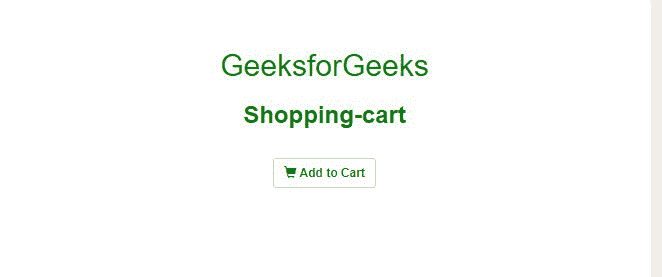

# 如何在 Bootstrap 中创建“添加到购物车”按钮？

> 原文:[https://www . geesforgeks . org/如何创建-添加到购物车-引导中的按钮/](https://www.geeksforgeeks.org/how-to-create-add-to-cart-button-in-bootstrap/)

[Bootstrap](https://www.geeksforgeeks.org/bootstrap-tutorials/) 包括各种各样的按钮样式，每个按钮样式都有一些共同的属性和一些不同的属性。“添加到购物车”按钮充当一个容器，就像购物中心中典型的**购物车**一样，您可以在其中收集想要购买的物品。“添加到购物车”按钮通常在电子商务网站上提供，也在包括购买产品的其他网站上使用。

**引导 CDN 链接:**

*   在编写代码之前，您只需要包含以下库或脚本，用于在应用程序中添加“添加到购物车”按钮。

    > <脚本 src = " https://maxcdn . bootstrapcdn . com/bootstrap/3 . 4 . 0/js/bootstrap . min . js "></脚本>

*   为了包含我们在下面的例子中使用的小的**购物车图标**，您只需要将这个样式表添加到您的程序中。

    > <link rel="”stylesheet”" href="”https://maxcdn.bootstrapcdn.com/bootstrap/3.4.0/css/bootstrap.min.css”">

*   您还需要在任何想要显示购物车图标的地方包含以下类。

**示例:**

## 超文本标记语言

```
<!DOCTYPE html>
<html>

<head>
    <title>Bootstrap Shopping Cart</title>
    <meta name="viewport" content=
        "width=device-width, initial-scale=1" />

    <!-- CSS only -->
    <link rel="stylesheet" href=
"https://maxcdn.bootstrapcdn.com/bootstrap/3.4.0/css/bootstrap.min.css" />

    <!-- JavaScript Bundle with Popper -->
    <script src=
"https://ajax.googleapis.com/ajax/libs/jquery/3.5.1/jquery.min.js">
    </script>

    <script src=
"https://maxcdn.bootstrapcdn.com/bootstrap/3.4.0/js/bootstrap.min.js">
    </script>

    <!--CSS Code-->
    <style>
        .container {
            margin-top: 30px;
            color: green;
        }

        span {
            color: green;
        }
    </style>
</head>

<!--Body tag-->
<body>
    <div class="container" align="center">
        <h2>GeeksforGeeks</h2>
        <h3>Shopping-cart</h3>
        <p>
            <button type="button" 
                class="btn btn-default btn-sm">
                <span class="glyphicon 
                    glyphicon-shopping-cart">
                </span>
                <b> Add to Cart </b>
            </button>
        </p>
    </div>
</body>

</html>
```

**输出:**现在，正如您在**输出**中看到的，我们已经在 HTML 正文中包含了**添加到购物车**按钮，上面有一个小购物车图标。

