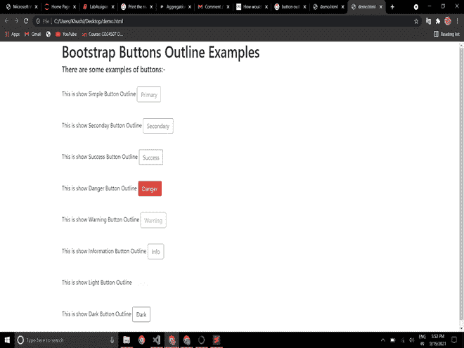
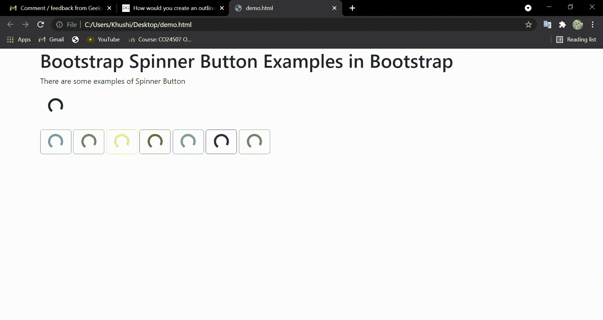
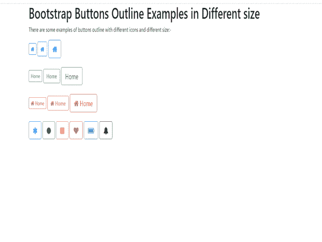

# 如何在 Bootstrap 4 中创建轮廓按钮？

> 原文:[https://www . geeksforgeeks . org/如何创建轮廓-引导按钮-4/](https://www.geeksforgeeks.org/how-to-create-an-outline-button-in-bootstrap-4/)

在执行引导程序的轮廓类之前，只需了解一点点按钮轮廓。按钮上的轮廓意味着在按钮周围给出轮廓。这个。“btn-outline”类删除了按钮上的所有背景颜色或样式，使按钮外部看起来更有效、更亮、更醒目。基本上，轮廓按钮负责在按钮周围绘制突出显示的边框。

**按钮的轮廓有多种用途，例如–**

*   有效地查看按钮。
*   表示超出当前工作机制的行动。
*   在按钮周围绘制高亮轮廓，以赋予按钮不同于普通按钮的外观。
*   做一个“突出”的按钮。
*   为窗体和对话框中的动作赋予不同的风格。

**方法:**在 Bootstrap 4 中有默认的上下文类或带有 ***的预定义类。BTN-outline“***类，在 bootstrap 4 中有一些内置的彩色按钮来概述类，bootstrap 4 用于不同的目的。

按钮轮廓类有:

*   。BTN-大纲-主要
*   。BTN-大纲-二级
*   。BTN-大纲-成功
*   。BTN-大纲-危险
*   。BTN-轮廓-警告
*   。BTN-大纲-信息
*   。BTN-轮廓灯
*   。BTN-轮廓-深色

在所有其他样式表之前将 Bootstrap4 和 jQuery CDN 包含到标签中，以加载我们的 CSS。

> 【rel= "样式表"链接 href = " https://maxcdn . bootstracdn . com/bootstrap cdn/4 . 0 . 0/CSS/bootstrap . min . CSS "完整性= " sha 384-gn 5384 xq1 aowx a+058 r xpg 6 if4iwvtnh 0 e 263 xmfcjlsawigfaw/dais 6 jxm " cross origin = " anonymous ">

**示例 1:** 在这个示例中，我们可以在 bootstrap 中看到所有类型的按钮轮廓上下文类，并知道它在网页中是如何使用的。

## 超文本标记语言

```html
<!DOCTYPE html>
<html>

<head>
    <meta name="viewport" content
        ="width=device-width, initial-scale=1">
    <link rel="stylesheet" href=
"https://maxcdn.bootstrapcdn.com/bootstrap/4.0.0/css/bootstrap.min.css"
        integrity=
"sha384-Gn5384xqQ1aoWXA+058RXPxPg6fy4IWvTNh0E263XmFcJlSAwiGgFAW/dAiS6JXm"
        crossorigin="anonymous">

    <script src="https://code.jquery.com/jquery-3.2.1.slim.min.js"
        integrity=
"sha384-KJ3o2DKtIkvYIK3UENzmM7KCkRr/rE9/Qpg6aAZGJwFDMVNA/GpGFF93hXpG5KkN"
        crossorigin="anonymous">
    </script>

    <script src=
"https://cdnjs.cloudflare.com/ajax/libs/popper.js/1.12.9/umd/popper.min.js"
        integrity=
"sha384-ApNbgh9B+Y1QKtv3Rn7W3mgPxhU9K/ScQsAP7hUibX39j7fakFPskvXusvfa0b4Q"
        crossorigin="anonymous">
    </script>

    <script src=
"https://maxcdn.bootstrapcdn.com/bootstrap/4.0.0/js/bootstrap.min.js"
        integrity=
"sha384-JZR6Spejh4U02d8jOt6vLEHfe/JQGiRRSQQxSfFWpi1MquVdAyjUar5+76PVCmYl"
        crossorigin="anonymous">
    </script>
</head>

<body>
    <div class="container">
        <h1>Bootstrap Buttons Outline Examples</h1>
        <h5>There are some examples of buttons:-</h5>
        <br>
        <p>
            This is show Simple Button Outline<span>
                <button type="button" 
                    class="btn btn-outline-primary">
                    Primary
                </button>
            </span>
        </p>

        <br>
        <p>
            This is show Seconday Button Outline<span>
                <button type="button" 
                    class="btn btn-outline-secondary">
                    Secondary
                </button>
            </span>
        </p>

        <br>
        <p>
            This is show Success Button Outline<span>
                <button type="button" 
                    class="btn btn-outline-success">
                    Success
                </button>
            </span>
        </p>

        <br>
        <p>
            This is show Danger Button Outline<span>
                <button type="button" 
                    class="btn btn-outline-danger">
                    Danger
                </button>
            </span>
        </p>

        <br>
        <p>
            This is show Warning Button Outline<span>
                <button type="button" 
                    class="btn btn-outline-warning">
                    Warning
                </button>
            </span>
        </p>

        <br>

        <p> 
            This is show Information Button Outline<span>
                <button type="button" 
                    class="btn btn-outline-info">
                    Info
                </button>
            </span>
        </p>
        <br>

        <p>
            This is show Light Button Outline<span>
                <button type="button" 
                    class="btn btn-outline-light">
                    Light
                </button>
            </span>
        </p>
        <br>

        <p>
            This is show Dark Button Outline<span>
                <button type="button" 
                    class="btn btn-outline-dark">
                    Dark
                </button>
            </span>
        </p>
        <br>
    </div>
</body>

</html>
```

**输出:**



**bootstrap 4 中的按钮轮廓类型**

**示例 2:** 在本例中，我们在轮廓按钮中使用了一个微调器，其中的按钮表示当前正在处理或发生的动作。

## 超文本标记语言

```html
<!DOCTYPE html>
<html>

<head>
    <meta name="viewport" content
        ="width=device-width, initial-scale=1">
    <link rel="stylesheet" href=
"https://maxcdn.bootstrapcdn.com/bootstrap/4.5.2/css/bootstrap.min.css">
    <script src=
"https://ajax.googleapis.com/ajax/libs/jquery/3.5.1/jquery.min.js">
    </script>
    <script src=
"https://cdnjs.cloudflare.com/ajax/libs/popper.js/1.16.0/umd/popper.min.js">
    </script>
    <script src=
"https://maxcdn.bootstrapcdn.com/bootstrap/4.5.2/js/bootstrap.min.js">
    </script>
</head>

<body>
    <div class="container">
        <h1>
            Bootstrap Spinner Button Examples in Bootstrap
        </h1>

<p>There are some examples of Spinner Button </p>

        <button type="button" class="btn btn-lg btn-outline">
            <div class="spinner-border">
            </div>
        </button>
        <br><br>
        <button type="button" class="btn btn-lg btn-outline-primary">
            <div class="spinner-border">
            </div>
        </button>
        <button type="button" class="btn btn-lg btn-outline-success">
            <div class="spinner-border">
            </div>
        </button>
        <button type="button" class="btn btn-lg btn-outline-warning">
            <div class="spinner-border">
            </div>
        </button>
        <button type="button" class="btn btn-lg btn-outline-danger">
            <div class="spinner-border">
            </div>
        </button>
        <button type="button" class="btn btn-lg btn-outline-info">
            <div class="spinner-border">
            </div>
        </button>
        <button type="button" class="btn btn-lg btn-outline-dark">
            <div class="spinner-border">
            </div>
        </button>
        <button type="button" class="btn btn-lg btn-outline-success">
            <div class="spinner-border">
            </div>
        </button>
    </div>
</body>

</html>
```

### **输出:**



**按钮内的引导旋转器**

**示例 3:** 在这个示例中，我们可以看到不同字形和大小的按钮轮廓上下文类。

## 超文本标记语言

```html
<!DOCTYPE html>
<html>

<head>
    <meta name="viewport" content=
        "width=device-width, initial-scale=1">
    <link rel="stylesheet" href=
"https://maxcdn.bootstrapcdn.com/bootstrap/4.0.0/css/bootstrap.min.css"
        integrity=
"sha384-Gn5384xqQ1aoWXA+058RXPxPg6fy4IWvTNh0E263XmFcJlSAwiGgFAW/dAiS6JXm"
        crossorigin="anonymous">

    <script src=
"https://ajax.googleapis.com/ajax/libs/jquery/3.5.1/jquery.min.js">
    </script>

    <script src=
"https://maxcdn.bootstrapcdn.com/bootstrap/3.4.0/js/bootstrap.min.js">
    </script>

    <script src="https://code.jquery.com/jquery-3.2.1.slim.min.js"
        integrity=
"sha384-KJ3o2DKtIkvYIK3UENzmM7KCkRr/rE9/Qpg6aAZGJwFDMVNA/GpGFF93hXpG5KkN"
        crossorigin="anonymous">
    </script>

    <link rel="stylesheet" href=
"https://cdnjs.cloudflare.com/ajax/libs/font-awesome/4.7.0/css/font-awesome.min.css">
</head>

<body>
    <div class="container">
        <h1>
            Bootstrap Buttons Outline 
            Examples in Different size 
        </h1>

        <p>
            There are some examples of buttons 
            outline with different icons and 
            different size:-
        </p>

        <button type="button" class
            ="btn btn-sm btn-outline-primary">
            <i class="fa fa-home"></i>
        </button>

        <button type="button" class
            ="btn btn-md btn-outline-primary">
            <i class="fa fa-home"></i>
        </button>

        <button type="button" class=
            "btn btn-lg btn-outline-primary">
            <i class="fa fa-home"></i>
        </button><br><br>

        <button type="button" class=
            "btn btn-sm btn-outline-success"> 
            Home
        </button>

        <button type="button" class=
            "btn btn-md btn-outline-success"> 
            Home
        </button>

        <button type="button" class=
            "btn btn-lg btn-outline-success"> 
            Home
        </button>
        <br><br>

        <button type="button" class=
            "btn btn-sm btn-outline-danger">
            <i class="fa fa-home"></i> 
            Home
        </button>

        <button type="button" class=
            "btn btn-md btn-outline-danger">
            <i class="fa fa-home"></i> 
            Home
        </button>

        <button type="button" class=
            "btn btn-lg btn-outline-danger">
            <i class="fa fa-home"></i> 
            Home
        </button><br><br>

        <button type="button" class=
            "btn btn-lg btn-outline-primary">
            <i class="fa fa-asterisk"></i>
        </button>

        <button type="button" class=
            "btn btn-lg btn-outline-success">
            <i class="fa fa-circle"></i>
        </button>

        <button type="button" class=
            "btn btn-lg btn-outline-warning">
            <i class="fa fa-square"></i>
        </button>

        <button type="button" class=
            "btn btn-lg btn-outline-danger">
            <i class="fa fa-heart"></i>
        </button>

        <button type="button" class=
            "btn btn-lg btn-outline-info">
            <i class="fa fa-battery"></i>
        </button>

        <button type="button" class=    
            "btn btn-lg btn-outline-dark">
            <i class="fa fa-bell"></i>
        </button>
    </div>
</body>

</html>
```

#### 输出:



**Bootstrap 中有不同大小和图标的 Bootstrap 轮廓按钮。**