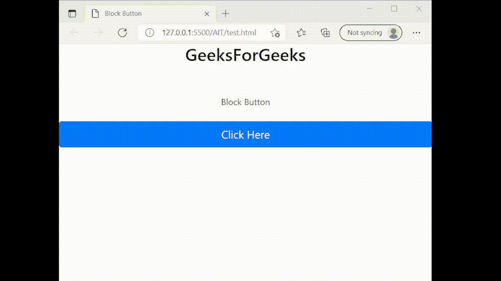

# 如何在 Bootstrap 中创建块级按钮？

> 原文:[https://www . geesforgeks . org/如何创建块级引导按钮/](https://www.geeksforgeeks.org/how-to-create-block-level-buttons-in-bootstrap/)

在许多网站中，我们注意到当用户点击它们时，有大的块级按钮用来执行一些工作。这用于触发某些功能或将用户重定向到不同的链接。块按钮是全宽按钮的响应堆栈。我们将使用下面的方法来创建这些类型的按钮。

**方法:***BTN*类后跟上下文类用于在网站上创建按钮。部分 *btn* 类有 *btn-block、btn-lg、btn-primary、btn-success、btn-warning* 等。 *btn-block* 用于块级按钮， *btn-success、**BTN-warning***BTN-primary*用于按钮的绿、黄、蓝颜色。*

*下面是在引导程序中实现简单块按钮的过程。*

***第一步:**在所有其他样式表加载我们的 CSS 之前，将 Bootstrap 和 jQuery CDN 包含到 [<头>标签](https://www.geeksforgeeks.org/html-head-tag/)中。*

> *<src 脚本= " https://Ajax . Google APIs . com/Ajax/libs/jquery/3 . 5 . 1/jquery . min . js "></script><src 脚本= " https://cdnjs . cloudflare . com/Ajax/libs/popper . js*

***第二步:**我们将添加类型为*按钮*并添加类 *btn、btn-primary、btn-lg* 和 *btn-block* 。然后我们将写下按钮上的文字。*

```html
*<button type="button" class="btn 
    btn-primary btn-lg btn-block">
  Click Here
</button>*
```

***示例:***

## *超文本标记语言*

```html
*<!DOCTYPE html>
<html>

<head>
    <link rel="stylesheet" href=
"https://maxcdn.bootstrapcdn.com/bootstrap/4.1.3/css/bootstrap.min.css" />
    <script src=
"https://ajax.googleapis.com/ajax/libs/jquery/3.3.1/jquery.min.js">
    </script>
    <script src=
"https://maxcdn.bootstrapcdn.com/bootstrap/4.1.3/js/bootstrap.min.js">
    </script>
</head>

<body>
    <h2 class="text-center">GeeksForGeeks</h2>
    <br><br>
    <div class="text-center">Block Button</div>
    <br><br>
    <button type="button" class="btn btn-primary 
                   btn-lg btn-block">
        Click Here
    </button>
</body>

</html>*
```

***输出:***

**